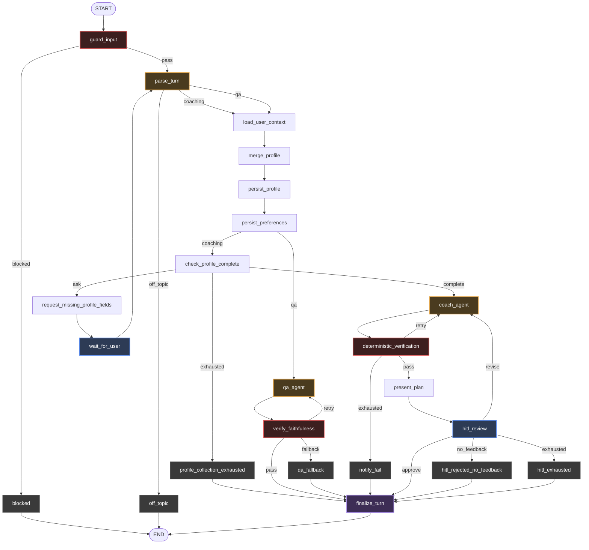
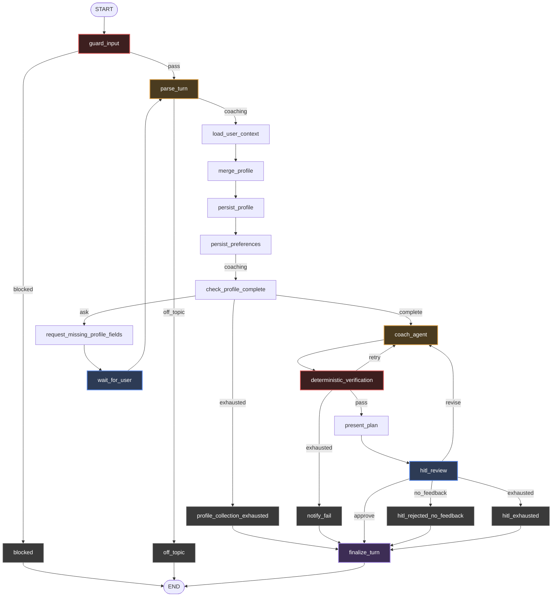
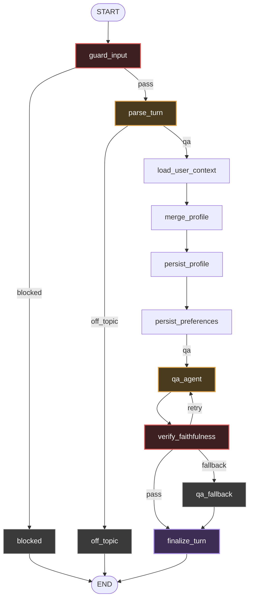

# Implementation Detail — Custom Graph Architecture

Source of truth for this project. Transcribed from
[`generative-ai-training-plan.pdf`](generative-ai-training-plan.pdf) (Agility IO, Aug 18 2026).
Task breakdown and progress live in [`estimation.md`](estimation.md).

Engineering conventions for `src/` come from the `langgraph-agent-arch` skill
(`.claude/skills/langgraph-agent-arch/`). This document says *what* to build; the skill says *how*.

---

## 1. Node design

Node names and branch labels are each defined once, in `src/enums/` — `Node` in `graph.py`, the
routers' answers in `routes.py` — and the route tables that map one to the other live in
`src/constants/routes.py`. `graph.py`, the route functions and the tests reference those rather
than repeating strings.

| Node | Purpose |
|---|---|
| `guard_input` | Scan input (llm-guard scanners, run locally — no LLM call) |
| `blocked` | Return message for user and stop immediately |
| `parse_turn` | One LLM call: classify intent **and** extract the profile facts the message states |
| `off_topic` | Return reject message for off topic |
| `load_user_context` | Load profile and plan of user from long-term memory |
| `merge_profile` | Deterministic: merge stated fields, upsert injuries by body part — the only writer of `profile` |
| `persist_profile` | Write the merged profile to the store before either branch reads it back |
| `check_profile_complete` | Identify missing fields required to create a plan |
| `request_missing_profile_fields` | Ask user to provide missing fields |
| `wait_for_user` | `interrupt()` — pause graph and wait for user to provide data |
| `profile_collection_exhausted` | Stop and tell the user no plan can be built without their details |
| `coach_agent` | Agent that creates the plan |
| `deterministic_verification` | Check schema / macro / volume / safety by fixed rule, no LLM |
| `notify_fail` | Notify user when verification fails more than 3 times |
| `hitl_review` | `interrupt()` — wait for approve/reject |
| `hitl_rejected_no_feedback` | Handle reject-with-no-feedback case, stop immediately |
| `hitl_exhausted` | Reject with feedback but attempted over 3 times — inform and stop |
| `qa_agent` | Agent that answers knowledge questions |
| `verify_faithfulness` | Validate faithfulness >= 0.9 (RAGAS is the implementation, not the contract) |
| `qa_fallback` | Fallback when faithfulness fails 3 times — tell user the data is untrusted |
| `finalize_turn` | The single convergence point: persist an approved plan, settle `final_message` |

### Deviations from the PDF spec, and why

| Spec | Built | Reason |
|---|---|---|
| `llm_guard` | `guard_input` | The library is `llm-guard`; the node makes no LLM call, and the old name said it did |
| `classify_intent` + `determine_context` + `save_user_data` | `parse_turn` + `merge_profile` + `persist_profile` | Classification and extraction are one structured read of one message, so they are one call. Merging is deterministic and belongs in its own testable node; the write is a third, separate concern |
| `load_context` | `load_user_context` | It reads user-scoped long-term memory, not thread state — thread state is the checkpointer |
| `request_missing_info` / `user_info_exhausted` | `request_missing_profile_fields` / `profile_collection_exhausted` | Say which data |
| `ragas_verification` | `verify_faithfulness` | Do not name a node after the library that happens to implement it |
| `write_todo` | *(removed)* | Never wired into the graph, and `GraphState` had no `todo` key, so every write was silently dropped. The coach agent's own prompt already sequences the work |
| `hitl_review` approve → `END` | approve → `finalize_turn` → `END` | The spec has no node that persists an approved plan, so `recall_plan` had no writer and `load_user_context` always returned `plan: None` |

## 2. Edge / routing design

| From | Condition | To |
|---|---|---|
| `guard_input` | blocked | `blocked` |
| `guard_input` | pass | `parse_turn` |
| `parse_turn` | coaching | `load_user_context` |
| `parse_turn` | qa | `load_user_context` |
| `parse_turn` | off_topic | `off_topic` |
| `load_user_context` | — | `merge_profile` |
| `merge_profile` | — | `persist_profile` |
| `persist_profile` | coaching | `check_profile_complete` |
| `persist_profile` | qa | `qa_agent` |
| `check_profile_complete` | context complete | `coach_agent` |
| `check_profile_complete` | missing fields & retry < 3 | `request_missing_profile_fields` |
| `check_profile_complete` | retry >= 3 | `profile_collection_exhausted` |
| `request_missing_profile_fields` | — | `wait_for_user` |
| `wait_for_user` | user replied | `parse_turn` |
| `coach_agent` | success | `deterministic_verification` |
| `deterministic_verification` | pass | `hitl_review` |
| `deterministic_verification` | fail & retry < 3 | `coach_agent` |
| `deterministic_verification` | fail & retry >= 3 | `notify_fail` |
| `hitl_review` | approve | `finalize_turn` |
| `hitl_review` | reject + feedback | `coach_agent` |
| `hitl_review` | reject + no feedback | `hitl_rejected_no_feedback` |
| `hitl_review` | reject + retry >= 3 | `hitl_exhausted` |
| `qa_agent` | answer generated | `verify_faithfulness` |
| `verify_faithfulness` | >= 0.9 faithfulness | `finalize_turn` |
| `verify_faithfulness` | < 0.9 & retry < 3 | `qa_agent` |
| `verify_faithfulness` | < 0.9 & retry >= 3 | `qa_fallback` |
| `blocked`, `off_topic` | — | `END` |
| `profile_collection_exhausted`, `notify_fail`, `hitl_rejected_no_feedback`, `hitl_exhausted`, `qa_fallback` | — | `finalize_turn` |
| `finalize_turn` | — | `END` |

`request_missing_profile_fields → wait_for_user → parse_turn` is the interrupt loop. The resume
routes back through `parse_turn` rather than into the completeness check, because that is where
the reply is read: routing it anywhere later leaves the answer unparsed and the loop asks the same
question until it exhausts. Re-entering `parse_turn` also lets the user change the subject
mid-collection — bounded by *sticky intent*: while `missing_fields` is non-empty, a message that
states at least one profile field keeps the intent that opened the loop, so `"34, male, 4 days"` is
never reclassified as a new question.

The loop is bounded by `user_info_retry_count`: after `USER_INFO_MAX_RETRIES` questions with the
profile still incomplete, the run stops at `profile_collection_exhausted`.

Both working branches share `load_user_context → merge_profile → persist_profile`. The QA branch
gets the fresh profile and the current plan for free — the extraction it rides on is the same call
that routed it, so the shared path costs the QA turn nothing.

All three pictures below are generated from `build_graph()` by
`scripts/export_graph_diagrams.py`, which also writes `docs/diagrams/*.mmd`; add `--format png`
for `docs/diagrams/*.png`, rendered through `langchain_core`'s own `draw_mermaid_png`.
Regenerate them rather than editing them — a hand-edited diagram is one that can disagree with
the wiring, and `tests/test_graph_diagrams.py` fails when they do.

### Whole workflow

<!-- workflow:start -->



<!-- workflow:end -->

### Coaching flow

<!-- coaching-flow:start -->



<!-- coaching-flow:end -->

### QA flow

<!-- qa-flow:start -->



<!-- qa-flow:end -->

## 3. State design

See [`state-design.md`](state-design.md) for the literal schema from the spec.

## 4. Agent design

### Coach agent

Generate or modify a personalized training plan based on the user's profile, goal, constraints and
todo list.

Input: `user_query`, `profile`, `plan` (if an existing plan is available), `messages`.
Output: training plan — goal, calories, macro, training days, exercises.

| Tool | Purpose |
|---|---|
| `load_template` | Retrieve a suitable training plan template |
| `load_exercise` | Retrieve exercises matching training requirements and constraints |
| `recall_memory` | Retrieve the user's stored preferences and accumulated knowledge |
| `calc_macro` | Calculate calorie and macro targets |

### QA agent

Answer nutrition and injury-related knowledge questions using the retrieved local knowledge base.

Input: `user_query`, `profile` (when relevant), `messages`. Output: `answer`.

| Tool | Purpose |
|---|---|
| `search_knowledge` | Retrieve relevant passages from the local knowledge base |
| `calc_macro` | Calculate calorie and macro targets to answer a question relative to the user |

## 5. Verification design

### Deterministic verification

Validate the training plan using fixed rules, without an LLM. Checks:

- Schema completeness
- Macro consistency
- Training volume
- Training schedule
- Exercise availability
- User constraints
- Safety constraints

Threshold: fail and `coach_retry_count < 3` → return the validation errors to `coach_agent` for
revision. Fail after 3 attempts → route to `notify_fail`.

### RAGAS verification

Validate QA answer faithfulness against retrieved context.

- `ragas_score >= 0.9` → pass
- `ragas_score < 0.9` → retry QA agent; still below 0.9 after 3 attempts → `qa_fallback`

## 6. HITL design

```
Generated Plan
     ↓
Deterministic Verification
     ↓
  hitl_review
     ↓
┌────┴────┐
approve   reject
   ↓         ↓
finalize   feedback?
_turn       /     \
   ↓      yes      no
  end      ↓        ↓
      coach_agent  stop
```

- **Approve** — `finalize_turn` writes the plan to the `plan` namespace and confirms it to the user.
- **Reject with feedback** — pass `hitl_feedback` to `coach_agent`, regenerate/revise the plan,
  increment `hitl_retry_count`.
- **Reject without feedback** — route to `hitl_rejected_no_feedback` and stop.
- **Retry limit** — more than 3 rejects with feedback → `hitl_exhausted`, stop.
- `hitl_review` uses `interrupt()`; the checkpoint preserves `GraphState` so the graph resumes after
  the user responds.

## 7. Memory & persistence design

### Short-term memory

Checkpointer: `AsyncPostgresSaver`.

- Store graph checkpoints in PostgreSQL.
- Preserve `GraphState` during graph execution.
- Support graph resume after `interrupt()`.

Short-term memory is for the **current workflow execution**, not persistent user knowledge.

### Long-term memory

**pgvector** — `knowledge_chunks` stores embedded knowledge from nutrition and injury documents.

**PostgresStore** — structured user-specific information:

- *User preferences*: preferred workout schedule, favorite exercises, dietary preferences,
  preferred response style.
- *Accumulated knowledge*: behavioral patterns learned over time, e.g. tendency to skip workouts
  longer than 60 minutes, or better adherence to 4-day plans.
- *Facts*: name, age, weight, sex, activity level, goal, equipment, injury.

All three are addressed as `("users", user_id, scope)` and reached through `src/services/memory.py`
— the one gateway to the store. Facts are what `load_user_context` reads and `persist_profile` writes;
preferences and accumulated knowledge reach the coach agent through the `recall_memory` tool.

## 8. RAG design


### Retrieval

- Embedding model: `text-embedding-3-small`
- Similarity: cosine similarity
- `top_k = 4`
- Filter using a tuned similarity threshold
- Remove duplicate or highly overlapping chunks

Retrieval output:

```python
{"text": str, "source": str, "score": float}
```

Return `[]` when no passage meets the configured threshold.

### No relevant context

If no relevant passage is retrieved, the QA agent must **not** answer using unsupported knowledge.
Return a fallback response indicating that sufficient trusted information is unavailable.

### Evaluation

Offline: context precision, faithfulness — used to tune the retrieval threshold.
Online: RAGAS faithfulness >= 0.9 is required before returning the QA answer.

## 9. Error handling

| Error | Handling |
|---|---|
| LLM failure | Retry according to agent retry policy |
| Tool failure | Retry agent/tool call |
| Invalid agent output | Retry agent with validation error |
| Guard failure | Block request |
| Deterministic verification failure | Retry coach agent up to 3 times |
| RAGAS failure | Retry QA agent up to 3 times |
| HITL rejection with feedback | Revise plan |
| HITL rejection without feedback | Stop workflow |
| HITL retry exhausted | Stop workflow and notify user |
| User info retry exhausted | Stop workflow and tell the user no plan was built |
| No relevant RAG context | Return untrusted/insufficient-context response |

All retry limits are controlled by the corresponding retry counter in `GraphState`.

## 10. Observability

Use Langfuse to trace each graph execution and major workflow step. Track: `run_id`, `user_id`,
`intent`, node execution, agent execution, tool calls, retrieved chunks and similarity scores,
retry counts, verification results, RAGAS score, latency, final result.

## 11. Pydantic data models

See [`data-models.md`](data-models.md) for the full enum and schema specification.
