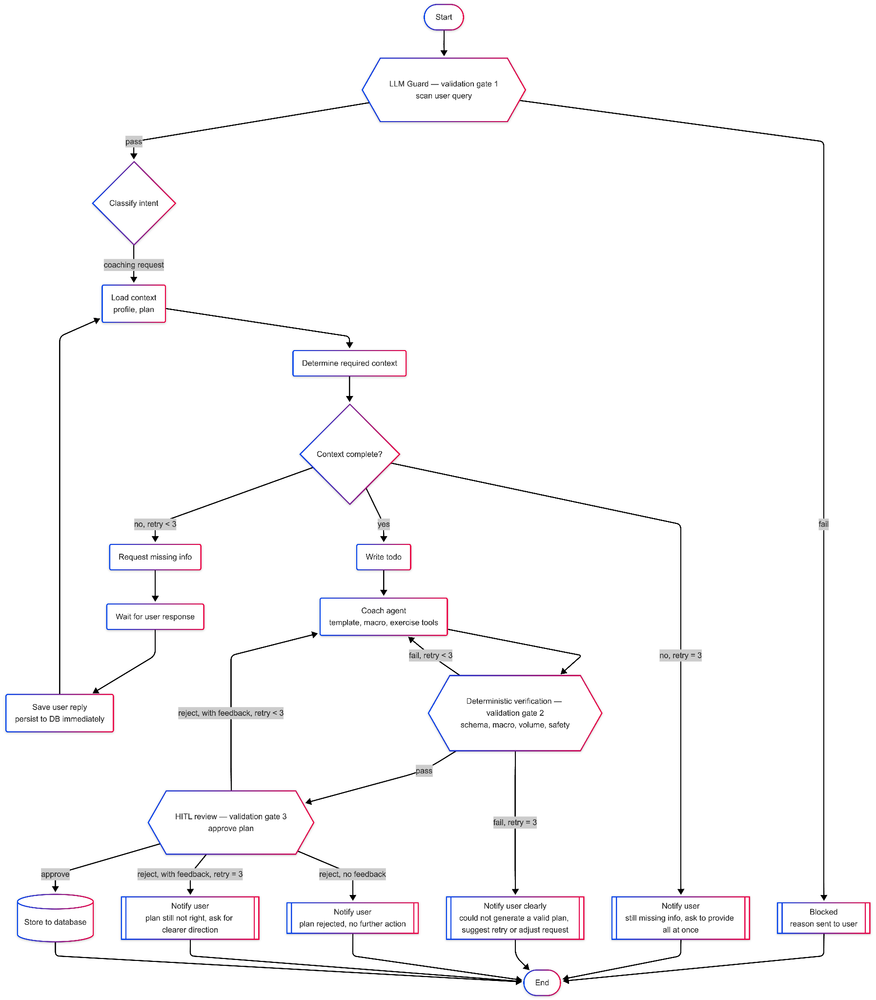
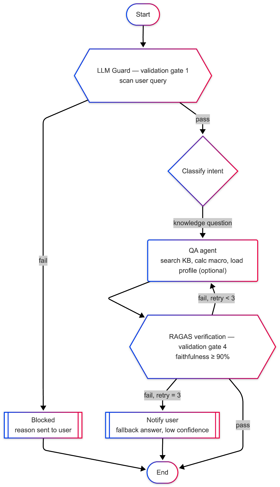
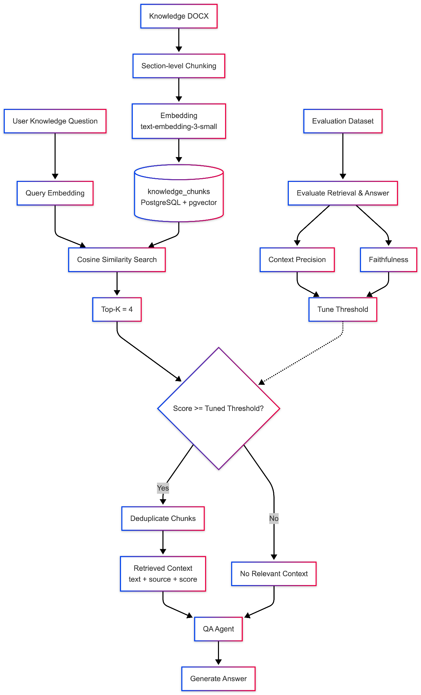

# Implementation Detail — Custom Graph Architecture

Source of truth for this project. Transcribed from
[`generative-ai-training-plan.pdf`](generative-ai-training-plan.pdf) (Agility IO, Aug 18 2026).
Task breakdown and progress live in [`estimation.md`](estimation.md).

Engineering conventions for `app/` come from the `langgraph-agent-arch` skill
(`.claude/skills/langgraph-agent-arch/`). This document says *what* to build; the skill says *how*.

---

## 1. Node design

| Node | Purpose |
|---|---|
| `llm_guard` | Scan input |
| `blocked` | Return message for user and stop immediately |
| `classify_intent` | Classify user into three main intents: `coaching`, `qa`, `off_topic` |
| `off_topic_response` | Return reject message for off topic |
| `load_context` | Load profile and plan of user |
| `determine_context` | Identify missing fields required to create a plan |
| `request_missing_info` | Ask user to provide missing fields |
| `wait_for_user` | `interrupt()` — pause graph and wait for user to provide data |
| `save_user_data` | Save user info after the reply arrives |
| `write_todo` | Write a todo list for the coach agent |
| `coach_agent` | Agent that creates the plan |
| `deterministic_verification` | Check schema / macro / volume / safety by fixed rule, no LLM |
| `notify_fail` | Notify user when verification fails more than 3 times |
| `hitl_review` | `interrupt()` — wait for approve/reject |
| `hitl_rejected_no_feedback` | Handle reject-with-no-feedback case, stop immediately |
| `hitl_exhausted` | Reject with feedback but attempted over 3 times — inform and stop |
| `qa_agent` | Agent that answers knowledge questions |
| `ragas_verification` | Validate faithfulness >= 90% |
| `qa_fallback` | Fallback when faithfulness fails 3 times — tell user the data is untrusted |

## 2. Edge / routing design

| From | Condition | To |
|---|---|---|
| `llm_guard` | blocked | `blocked` |
| `llm_guard` | pass | `classify_intent` |
| `classify_intent` | qa | `qa_agent` |
| `classify_intent` | coaching | `load_context` |
| `classify_intent` | off_topic | `off_topic_response` |
| `load_context` | context complete | `write_todo` |
| `load_context` | missing fields | `determine_context` |
| `determine_context` | missing fields exist | `request_missing_info` |
| `save_user_data` | data updated | `load_context` |
| `write_todo` | — | `coach_agent` |
| `coach_agent` | success | `deterministic_verification` |
| `deterministic_verification` | pass | `hitl_review` |
| `deterministic_verification` | fail & retry < 3 | `coach_agent` |
| `deterministic_verification` | fail & retry >= 3 | `notify_fail` |
| `hitl_review` | approve | `END` |
| `hitl_review` | reject + feedback | `coach_agent` |
| `hitl_review` | reject + no feedback | `hitl_rejected_no_feedback` |
| `hitl_review` | reject + retry >= 3 | `hitl_exhausted` |
| `qa_agent` | answer generated | `ragas_verification` |
| `ragas_verification` | >= 0.9 faithfulness | `END` |
| `ragas_verification` | < 0.9 & retry < 3 | `qa_agent` |
| `ragas_verification` | < 0.9 & retry >= 3 | `qa_fallback` |

`request_missing_info → wait_for_user → save_user_data` is the interrupt loop; `save_user_data`
persists to the database **before** routing back to `load_context`.

### Coaching flow



### QA flow



## 3. State design

See [`state-design.md`](state-design.md) for the literal schema from the spec.

## 4. Agent design

### Coach agent

Generate or modify a personalized training plan based on the user's profile, goal, constraints and
todo list.

Input: `user_query`, `profile`, `plan` (if an existing plan is available), `todo`, `messages`.
Output: training plan — goal, calories, macro, training days, exercises.

| Tool | Purpose |
|---|---|
| `load_template` | Retrieve a suitable training plan template |
| `load_exercise` | Retrieve exercises matching training requirements and constraints |
| `calc_macro` | Calculate calorie and macro targets |

### QA agent

Answer nutrition and injury-related knowledge questions using the retrieved local knowledge base.

Input: `user_query`, `profile` (when relevant), `messages`. Output: `answer`.

| Tool | Purpose |
|---|---|
| `search_knowledge` | Retrieve relevant passages from the local knowledge base |
| `load_profile` | Load user profile when the answer requires user-specific context |
| `calc_macro` | Calculate calorie and macro targets to answer a question relative to the user |

## 5. Verification design

### Deterministic verification

Validate the training plan using fixed rules, without an LLM. Checks:

- Schema completeness
- Macro consistency
- Training volume
- Training schedule
- Exercise availability
- User constraints
- Safety constraints

Threshold: fail and `coach_retry_count < 3` → return the validation errors to `coach_agent` for
revision. Fail after 3 attempts → route to `notify_fail`.

### RAGAS verification

Validate QA answer faithfulness against retrieved context.

- `ragas_score >= 0.9` → pass
- `ragas_score < 0.9` → retry QA agent; still below 0.9 after 3 attempts → `qa_fallback`

## 6. HITL design

```
Generated Plan
     ↓
Deterministic Verification
     ↓
  hitl_review
     ↓
┌────┴────┐
approve   reject
   ↓         ↓
  end    feedback?
          /     \
        yes      no
         ↓        ↓
    coach_agent  stop
```

- **Approve** — return the approved plan to the user.
- **Reject with feedback** — pass `hitl_feedback` to `coach_agent`, regenerate/revise the plan,
  increment `hitl_retry_count`.
- **Reject without feedback** — route to `hitl_rejected_no_feedback` and stop.
- **Retry limit** — more than 3 rejects with feedback → `hitl_exhausted`, stop.
- `hitl_review` uses `interrupt()`; the checkpoint preserves `GraphState` so the graph resumes after
  the user responds.

## 7. Memory & persistence design

### Short-term memory

Checkpointer: `AsyncPostgresSaver`.

- Store graph checkpoints in PostgreSQL.
- Preserve `GraphState` during graph execution.
- Support graph resume after `interrupt()`.

Short-term memory is for the **current workflow execution**, not persistent user knowledge.

### Long-term memory

**pgvector** — `knowledge_chunks` stores embedded knowledge from nutrition and injury documents.

**PostgresStore** — structured user-specific information:

- *User preferences*: preferred workout schedule, favorite exercises, dietary preferences,
  preferred response style.
- *Accumulated knowledge*: behavioral patterns learned over time, e.g. tendency to skip workouts
  longer than 60 minutes, or better adherence to 4-day plans.
- *Facts*: name, age, weight, sex, activity level, goal, equipment, injury.

## 8. RAG design



### Retrieval

- Embedding model: `text-embedding-3-small`
- Similarity: cosine similarity
- `top_k = 4`
- Filter using a tuned similarity threshold
- Remove duplicate or highly overlapping chunks

Retrieval output:

```python
{"text": str, "source": str, "score": float}
```

Return `[]` when no passage meets the configured threshold.

### No relevant context

If no relevant passage is retrieved, the QA agent must **not** answer using unsupported knowledge.
Return a fallback response indicating that sufficient trusted information is unavailable.

### Evaluation

Offline: context precision, faithfulness — used to tune the retrieval threshold.
Online: RAGAS faithfulness >= 0.9 is required before returning the QA answer.

## 9. Error handling

| Error | Handling |
|---|---|
| LLM failure | Retry according to agent retry policy |
| Tool failure | Retry agent/tool call |
| Invalid agent output | Retry agent with validation error |
| Guard failure | Block request |
| Deterministic verification failure | Retry coach agent up to 3 times |
| RAGAS failure | Retry QA agent up to 3 times |
| HITL rejection with feedback | Revise plan |
| HITL rejection without feedback | Stop workflow |
| HITL retry exhausted | Stop workflow and notify user |
| No relevant RAG context | Return untrusted/insufficient-context response |

All retry limits are controlled by the corresponding retry counter in `GraphState`.

## 10. Observability

Use Langfuse to trace each graph execution and major workflow step. Track: `run_id`, `user_id`,
`intent`, node execution, agent execution, tool calls, retrieved chunks and similarity scores,
retry counts, verification results, RAGAS score, latency, final result.

## 11. Pydantic data models

See [`data-models.md`](data-models.md) for the full enum and schema specification.
