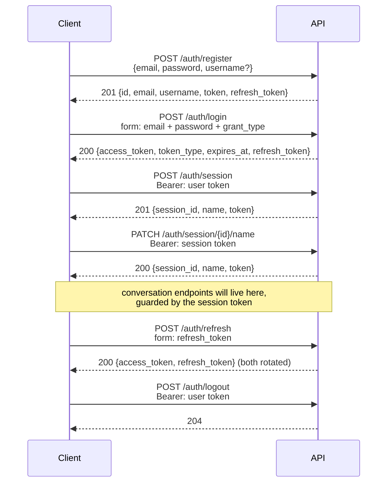

# Authentication

Applies to the `app/` flow (`app.main:app`). The legacy `src/` API has no authentication at
all — see the migration notice in the README.

## Flow



## Credentials

Three credentials, two of them JWTs. They are **not** interchangeable — the decode helper
asserts the `typ` claim on every request, so presenting the wrong scope is a 401.

| Credential | Format | `sub` | `typ` | Grants | Lifetime |
|---|---|---|---|---|---|
| **User token** | JWT HS256 | user id | `user` | create / list / rename / delete sessions, logout | `JWT_ACCESS_TOKEN_EXPIRE_MINUTES` (60) |
| **Session token** | JWT HS256 | session id | `session` | one session only | same |
| **Refresh token** | opaque, 48 bytes from `secrets.token_urlsafe` | — | — | mint a new user token | `REFRESH_TOKEN_EXPIRE_DAYS` (30) |

Why the split: a session token grants access to exactly one conversation. If it leaks it
cannot enumerate the user's other sessions or mint new ones. That property only holds
because of the `typ` assertion — drop it and the two tokens become one.

Access tokens are deliberately short-lived. Revoking one costs a denylist read on every
subsequent request, so the cheaper control is a narrow window plus a long-lived, revocable
refresh token.

### Claims

```json
{
  "sub": "42",
  "typ": "user",
  "uid": 42,
  "iat": 1754300000,
  "exp": 1754303600,
  "jti": "kJ8n2QpX7vBc4Ld1"
}
```

| Claim | Present on | Purpose |
|---|---|---|
| `sub` | both | user id (user token) or session id (session token) |
| `typ` | both | scope assertion — the privilege boundary |
| `uid` | session tokens | owner id, re-checked against `session.user_id` so a reused or reassigned session id cannot be reached with an old token |
| `jti` | both | denylist key for logout |
| `iat` / `exp` | both | `exp` verification is always on |

---

## Endpoints

### `POST /api/v1/auth/register`

Create an account. Returns **201** with a user token and a refresh token — no separate login
call needed.

```json
{
  "email": "you@example.com",
  "password": "Secret123!",
  "username": "you"
}
```

Password requirements: 8+ characters, uppercase, lowercase, number, special character.
Enforced once, in `validate_password_strength`; the Pydantic validator calls it rather than
restating the rules.

There is also a hard ceiling of 72 bytes. bcrypt silently truncates past that, so without the
guard a 100-character password and its 72-byte prefix would authenticate identically.

`username` is optional. When provided it is copied onto each session row at creation time, so
downstream personalisation does not have to join back to the user table on every turn.

| Status | Meaning |
|---|---|
| 201 | created |
| 409 | email already registered |
| 422 | password too weak, or malformed email |
| 429 | rate limited (10/hour) |

Response:

```json
{
  "id": 42,
  "email": "you@example.com",
  "username": "you",
  "token": {
    "access_token": "eyJhbGciOi...",
    "token_type": "bearer",
    "expires_at": "2026-08-04T11:00:00Z"
  },
  "refresh_token": "3sJ9_kLm...48-bytes-urlsafe"
}
```

---

### `POST /api/v1/auth/login`

Exchange credentials for a user token. OAuth2 password-grant form fields.

```bash
curl -X POST http://localhost:8000/api/v1/auth/login \
  -F "email=you@example.com" \
  -F "password=Secret123!" \
  -F "grant_type=password"
```

Returns `access_token`, `token_type`, `expires_at`, `refresh_token`.

| Status | Meaning |
|---|---|
| 200 | authenticated |
| 400 | `grant_type` is not `password` |
| 401 | wrong password **or** no such account |
| 429 | rate limited (20/min) |

An unknown address and a wrong password produce byte-identical responses. Distinguishing
them would turn the endpoint into an oracle for which addresses are registered.

---

### `POST /api/v1/auth/refresh`

Exchange a refresh token for a fresh user token, without re-entering the password.

```bash
curl -X POST http://localhost:8000/api/v1/auth/refresh \
  -F "refresh_token=<refresh token>"
```

**Single-use.** The presented token is revoked and a new one returned alongside the access
token. Store the new one — replaying the old one returns 401. A stolen refresh token is
therefore only useful until the legitimate client next refreshes.

| Status | Meaning |
|---|---|
| 200 | rotated |
| 401 | unknown, already consumed, revoked, or expired |
| 429 | rate limited (30/hour) |

---

### `POST /api/v1/auth/logout`

Revoke the presented access token and **all** of the user's refresh tokens.

```bash
curl -X POST http://localhost:8000/api/v1/auth/logout \
  -H "Authorization: Bearer <user token>"
```

Requires a user token; a session token is rejected. Returns 204.

The token's `jti` goes onto the `revoked_token` denylist until its natural expiry, so the
token stops working immediately rather than at `exp`. Deliberately does not depend on
`get_current_user` — logging out has to work even for a user row that has since been deleted.

---

### `POST /api/v1/auth/session`

Create a session. Requires a **user token**. Returns 201 with a session-scoped token.

```bash
curl -X POST http://localhost:8000/api/v1/auth/session \
  -H "Authorization: Bearer <user token>"
```

```json
{
  "session_id": "1f0c9b3e-...",
  "name": "",
  "token": { "access_token": "eyJhbGciOi...", "token_type": "bearer", "expires_at": "..." }
}
```

---

### `GET /api/v1/auth/sessions`

List the caller's sessions, each with a freshly-minted session token. Requires a **user
token**. Returns only sessions belonging to the token's subject.

---

### `PATCH /api/v1/auth/session/{session_id}/name`

Rename a session. Requires a **session token scoped to that same session**.

```bash
curl -X PATCH http://localhost:8000/api/v1/auth/session/{session_id}/name \
  -H "Authorization: Bearer <session token>" \
  -F "name=My research session"
```

| Status | Meaning |
|---|---|
| 200 | renamed |
| 401 | invalid, revoked, or user-scoped token |
| 403 | valid session token, but for a different session |
| 404 | session no longer exists |

---

### `DELETE /api/v1/auth/session/{session_id}`

Delete a session. Same guard and same status codes as rename. Returns 204.

---

## Testing

`tests/test_auth_flow.py` runs the whole flow against a throwaway SQLite file — no database
container needed:

```bash
uv run pytest tests/test_auth_flow.py -v
```

Two tests are the privilege boundary itself, and a failure in either is a security regression
rather than a flaky test:

- `test_session_token_cannot_create_session`
- `test_user_token_cannot_reach_session_endpoint`

### By hand, in Swagger

Swagger's **Authorize** button holds one token at a time, so testing two scopes means
swapping it:

1. `POST /auth/register` → copy `token.access_token` (user token) and `refresh_token`
2. **Authorize** with the user token
3. `POST /auth/session` → copy `token.access_token` (session token)
4. **Authorize** again, replacing it with the session token
5. `PATCH /auth/session/{id}/name` → 200

Then, with the session token still active:

- `POST /auth/session` → **401**
- `GET /auth/sessions` → **401**

Swap back to the user token:

- `PATCH /auth/session/{id}/name` → **401**

Those three 401s are the privilege boundary working. Any 200 there means the `typ` assertion
has been lost.
