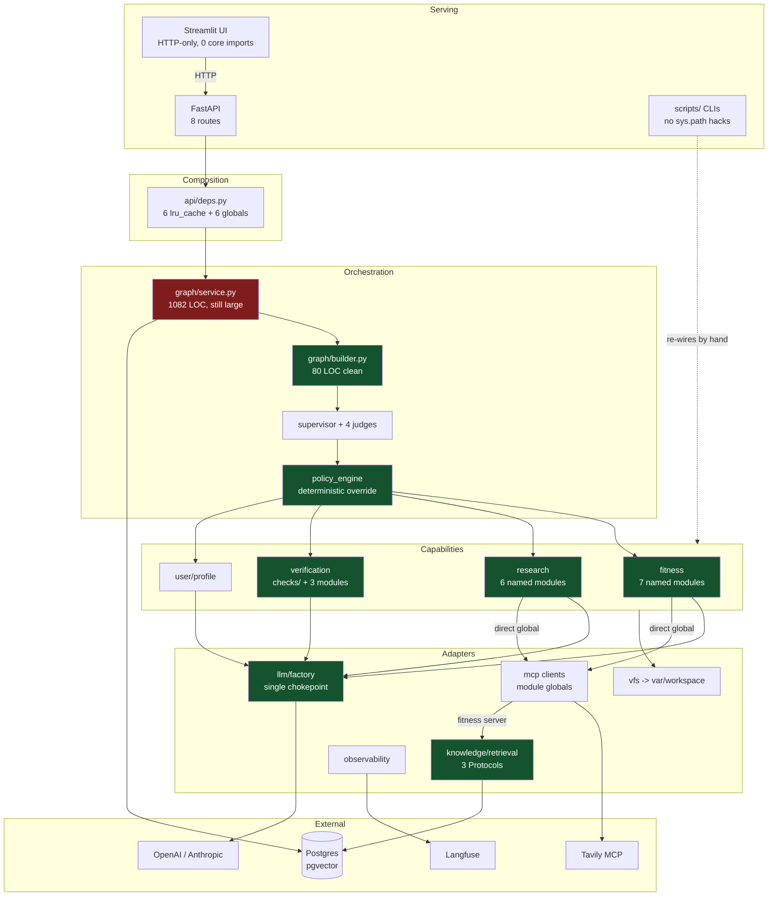
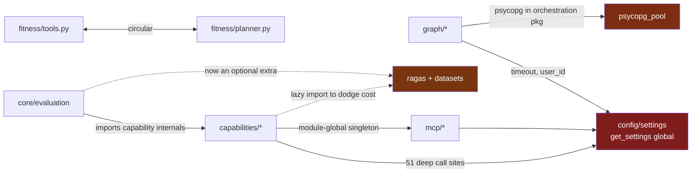

# Architecture Restructure Review — PT AI Core Deep Researcher

**Date:** 2026-07-30
**Scope:** 21,421 LOC / 169 Python files in `src/` + `scripts/`
**Reviewer role:** Principal AI Architect
**Method:** Full repository scan (excluding `.venv/`, `.claude/worktrees/`, `__pycache__`, `src/workspace/`), four parallel subsystem deep-dives, first-hand verification of all structural claims.

> **Revision — re-verified against commit `366fe67` (2026-07-30).**
> Three findings from the first draft (S9 partial, S10, S14) were **already resolved** by commits `10b81a6` and `366fe67`, the latter landing within hours of the original scan. They have been removed, along with their roadmap steps, quick wins, and evidence rows. Every remaining count in this document was re-measured at `366fe67`; several had drifted materially (`get_settings()` 24 → 51 sites, `sys.path` hacks 3 → 6, `src/workspace/` 11 MB → 45 MB).
>
> **This document decays quickly.** The branch is under active development. Re-verify any figure before acting on it.

> **Revision 2 — implementation, branch `chore/architecture-cleanup` (2026-07-30).**
> Fourteen commits have since acted on this report. **S2, S3, S4, S5 and S17 are resolved;
> S1 is partially resolved.** Each affected finding below carries a RESOLVED banner naming
> the commit; the roadmap in Step 7 records what shipped. Suite at the time of writing:
> **494 passed / 3 skipped / 0 failed** locally, **490 / 7 / 0** under CI conditions.
>
> Two corrections to this report's own recommendations, both found while implementing:
>
> * **Step 7's instruction to move `RunStatus`/`RunEvent` into `api/` is self-defeating**
>   and was not followed. `RunOrchestrator` *constructs* `RunStatus` in six methods, so
>   core would have to import from api — inverting the `core -> api` direction this same
>   report praises as a strength in Step 8. See the corrected S1 below.
> * **Step 5's "Move evaluation out of the wheel" would have broken API startup.**
>   `core/evaluation/shadow_eval.py` is imported *eagerly* by `api/deps.py` and
>   `api/main.py`. See the corrected S3.
>
> Defects found during implementation that this static review did not catch are tracked
> in **`KNOWN_ISSUES.md`** at the repo root. One was a live production bug in the very
> pipeline Step 5 scored 9/10 and called "reference quality" — see the note under
> Component Reviews.

---

## Executive Summary

This is **not a codebase that is falling apart**. It is a genuinely sophisticated production AI system that has already solved several problems most LangGraph projects never get to: a single LLM chokepoint, a deterministic policy engine constraining LLM routing, justified retrieval abstractions with real multiple implementations, Postgres-backed checkpointing with idempotency and orphan reconciliation, and an OWASP prompt-robustness suite.

The core structural finding is this: **the move to capability-oriented organization is real but incomplete — the boundary is drawn one level too deep.** Business logic already lives in `src/core/subgraphs/<capability>/`, which was the right destination. What is unfinished is the boundary around it:

- Capability packages live **underneath a technology bucket** (`subgraphs/` — a LangGraph implementation detail, and an inaccurate one, since only `user/` is an actual subgraph), and each capability's logic still **spills across five or more sibling technology buckets** (`grounding/`, `planning/`, `profile/`, `hitl/`, `persist/`, `capabilities/`).
- ~~Three files named `utils.py` hold **1,815 lines of core domain logic** — BMR/TDEE math, safety rules, citation validation, faithfulness scoring.~~ **RESOLVED** (S2).
- `graph/service.py` was a **1,209-line God object** with ~50 methods spanning six concerns; now **1,082** after extracting the DTOs and projection helpers — **partially resolved** (S1).

Three issues flagged as urgent here are now **all resolved**: `ragas` was a production runtime dependency (now an optional extra, **~340 MB** off the built image, measured — S3); runtime artifacts were written into `src/workspace/` (now `var/workspace/` — S5); and the wheel shipped only `core` while the app imports `api` and `ui` (now ships all three — S4). See Revision 2 above and the roadmap in Step 7.

| Score | Value | One-line justification |
|---|---|---|
| Production Readiness | **62 / 100** | Strong runtime hardening; wheel misconfigured, no CI, no Dockerfile, no logging config |
| Maintainability | **7.0 / 10** | Excellent naming and docstrings, undermined by 3 god files and `utils.py` dumping |
| Scalability | **7.0 / 10** | Postgres-backed shared state is correct; global singletons block multi-tenancy |
| Extensibility | **6.5 / 10** | Adding a capability requires touching 6+ folders and a central registry |
| Testing | **7.5 / 10** | 493 tests across 77 files run in 28 s; real integration coverage; flat layout, 10 autouse reset fixtures |
| AI Architecture | **8.0 / 10** | Policy engine, LLM chokepoint, grounding validation, shadow eval — genuinely advanced |

---

## Step 1 — Current Architecture

### Folder tree (actual, `__pycache__` omitted)

```
src/
├── api/                      # FastAPI serving  (8 routes, 747 LOC)
│   ├── main.py               # app factory + lifespan
│   ├── deps.py               # DI: 6 lru_cache providers + 6 module globals
│   ├── schemas.py, serializers.py
│   └── routes/{runs,users}.py
├── core/
│   ├── agents/               # supervisor + 4 LLM judges + state + exec context
│   ├── capabilities/         # registry, policy_engine, dispatcher, nodes, executor
│   ├── config/settings.py    # single 262-line Settings god object
│   ├── evaluation/           # ragas, owasp x2, shadow_eval  (2,076 LOC)
│   ├── graph/                # builder, service(1209), run_tracker, history, idempotency
│   ├── grounding/            # citation validation + finalize + render
│   ├── hitl/                 # human-in-the-loop node
│   ├── knowledge/            # RAG: retrieval_service + retrieval/ + ingestion/
│   ├── llm/                  # factory, metrics, budgets, contracts, payload, serializers
│   ├── mcp/                  # fitness + tavily clients, fitness server, 2 mocks
│   ├── observability/        # langfuse, tracing, hierarchy
│   ├── persist/, planning/, profile/, rate_limit/, repositories/
│   ├── subgraphs/            # <- the real capability packages
│   │   ├── fitness/          # 12 files, 2,634 LOC
│   │   ├── research/         # 12 files, 2,085 LOC
│   │   ├── verification/     # 4 files, 585 LOC
│   │   └── user/             # 5 files, 458 LOC
│   └── vfs/                  # per-run artifact store
├── docs/, ui/                # Streamlit (1,668 LOC, chat.py = 736)
└── workspace/                # 45 MB of RUNTIME ARTIFACTS inside src/
tests/                        # 74 flat test_*.py + helpers/ + fixtures/ + integration/  (493 tests)
scripts/                      # 5 Python CLIs + 2 shell hooks
```

### Module responsibilities

| Module | Responsibility |
|---|---|
| `api/` | HTTP surface: 8 routes, lifespan startup, sole DI composition root |
| `core/agents/` | Supervisor node + 4 LLM judges (intent, topic scope, router, macro report) + orchestration state |
| `core/capabilities/` | Capability registry, deterministic policy engine, result dispatcher, node adapters |
| `core/graph/` | LangGraph assembly, run orchestration runtime, Postgres run stores |
| `core/subgraphs/` | The four business capabilities (fitness, research, verification, user) |
| `core/knowledge/` | RAG: query rewrite, hybrid retrieval, RRF fusion, rerank, ingestion |
| `core/mcp/` | MCP transport + fitness/Tavily clients + fitness MCP server + mocks |
| `core/llm/` | Provider factory, token metering, budgets, payload contracts, serializers |
| `core/observability/` | Langfuse client, callback handler, span helpers, trace hierarchy |
| `core/repositories/` | Postgres+pgvector persistence for guidelines and templates |
| `core/vfs/` | Per-run artifact filesystem with canonical path layout |
| `core/evaluation/` | Ragas benchmarks, OWASP suites, shadow evaluation |
| `ui/` | Streamlit frontend, HTTP-only (zero core imports) |

### Runtime flow

```
POST /runs
  -> api/routes/runs.py:34  create_run
  -> Depends(get_orchestrator)          [api/deps.py:147, @lru_cache singleton]
  -> RunOrchestrator.start_run          [graph/service.py:500]
      |- reserve_request(user_id)       [rate_limit — HTTP 429 surfaces at runs.py:51]
      |- _resolve_idempotent_run_id     [Postgres claim]
      |- init_run_workspace(run_id)     [vfs -> var/workspace/run_<id>/]
      \- _execute_create_run            [background thread, SSE queue]
          -> graph.stream(state, config)
GET /runs/{run_id}/events -> SSE from the in-process queue held by the orchestrator
```

### LangGraph flow

Single `StateGraph(OrchestrationState)`, one conditional edge, hub-and-spoke:

```
START -> supervisor --conditional(route_from_supervisor)--+-> user ---------+
                                                          +-> planning -----+
   +------------------------------------------------------+-> research -----+
   |  every capability returns to supervisor              +-> fitness ------+
   +------------------------------------------------------+-> verification -+
                                                          +-> hitl ---------+  (interrupt_before)
                                                          +-> persist -> END
                                                          \-> END
```

Confirmed in `src/core/graph/builder.py:56-80`. Only `user` is a real nested `StateGraph` (`subgraphs/user/graph.py:88-114`); the other capabilities are single node functions. No `Send`, no reducers — plain last-write-wins `TypedDict`.

The routing design is the strongest part of the system: the LLM Router Judge *proposes* (`agents/supervisor_router_judge.py:94`), then `enforce_routing_invariants` *deterministically overrides* (`capabilities/policy_engine.py:142-224`), and only then does the graph route.

### FastAPI entrypoints

| Method | Path | Handler | Location |
|---|---|---|---|
| GET | `/health` | `health` | `api/main.py:136` |
| POST | `/runs` | `create_run` | `api/routes/runs.py:34` |
| GET | `/runs` | `list_runs` | `api/routes/runs.py:59` |
| GET | `/runs/{run_id}` | `get_run` | `api/routes/runs.py:79` |
| POST | `/runs/{run_id}/resume` | `resume_run` | `api/routes/runs.py:92` |
| POST | `/runs/{run_id}/continue` | `continue_run` | `api/routes/runs.py:121` |
| GET | `/runs/{run_id}/events` | `stream_run_events` | `api/routes/runs.py:201` |
| GET | `/users/{user_id}/runs` | `list_user_runs` | `api/routes/users.py:11` |

Startup (`api/main.py:76-121`) validates model pricing coverage, builds the orchestrator on a worker thread, reconciles orphaned runs, and optionally starts periodic reconciliation and shadow-eval tasks. Graph compilation, Postgres checkpointer, and MCP connections all happen **once at startup**, not per request.

### MCP integration

`MultiServerMCPClient` from `langchain_mcp_adapters` over `streamable_http`. Two clients (fitness at `http://{host}:{port}/mcp`, Tavily at `{tavily_mcp_url}?tavilyApiKey=...`), both held as module-global singletons with `configure_*`/`get_*` accessors. Mock selection is by settings flag (`mock_research`, `mock_fitness_kb`) wired in `api/deps.py:35-42,76-80`.

### RAG pipeline

```
query -> QueryRewriter.rewrite      [Passthrough | Llm]
      -> HybridRetriever.retrieve   [pgvector cosine || Postgres FTS ts_rank_cd]
      -> reciprocal_rank_fusion     [knowledge/retrieval/fusion.py:9]
      -> Reranker.rerank            [Identity | Heuristic | LlmRelevance]
      -> top-k GuidelineHit
```

Composed by `build_retrieval_service` (`knowledge/retrieval_service.py:93-125`), which selects implementations from settings. Reached only through the Fitness MCP server (`mcp/fitness_server.py:46-70`).

### Evaluation pipeline

`scripts/*.py` are thin CLI wrappers (argparse + report writing) over `src/core/evaluation/*`, which owns fixtures, scoring, and live runners. `shadow_eval` runs as a periodic background task from `api/main.py:105-109`.

### Persistence

| Store | Backing | Location |
|---|---|---|
| Graph checkpoints | Postgres (`langgraph-checkpoint-postgres`) | `graph/checkpointer.py` |
| Run tracker | Postgres via `psycopg_pool` | `graph/run_tracker.py:15` |
| Run history | Postgres via `psycopg_pool` | `graph/run_history_store.py:14` |
| Idempotency keys | Postgres via `psycopg_pool` | `graph/idempotency_store.py:14` |
| Rate-limit usage | Postgres or in-memory (Protocol) | `rate_limit/{store,postgres_store}.py` |
| Guidelines / templates | Postgres + pgvector | `repositories/` |
| Run artifacts | Filesystem VFS | `vfs/` -> `var/workspace/run_<id>/` |

### Configuration

Single `Settings` class (`config/settings.py:19-257`, 262 lines) covering 14 logical groups, exposed through `@lru_cache get_settings()` (`:260-261`). Called **51 times across 26 files** in `src/`.

### Prompt locations

| Location | Prompts |
|---|---|
| `llm/prompt_fragments.py:10` | `JSON_ONLY_INSTRUCTION` (shared, appended in ~12 prompts) |
| `agents/supervisor_router_judge.py:51-86` | Router judge system prompt |
| `agents/intent_judge.py:37-61` | Intent judge |
| `agents/topic_scope_judge.py:89-231` | Topic scope judge (142-line inline prompt) |
| `agents/macro_report_judge.py:42-55` | Macro report judge |
| `subgraphs/fitness/prompts.py:5-111` | Planner, edit, edit-operation rules + builder |
| `subgraphs/fitness/edit_classifier.py:11-30` | Edit classifier |
| `subgraphs/fitness/normalize.py:62,130,203` | Extraction, qualitative review, verification explanation |
| `subgraphs/research/prompts.py:5-65` | Query planning, ReAct, synthesis, evaluation |
| `profile/extraction.py:16-29` | Profile extraction |

No `.md` prompt files; no prompt registry or versioning.

### State models

`OrchestrationState` (`agents/state.py:20-73`) — 35-field flat `TypedDict`, no `Annotated` reducers. `UserState` (`subgraphs/user/state.py:4-27`) — manually mapped to/from parent at `user/graph.py:124-126,150-154`.

### Builders and services

| Kind | Symbol | Location |
|---|---|---|
| Graph builder | `build_graph` | `graph/builder.py:45` |
| Subgraph builder | `build_user_subgraph` | `subgraphs/user/graph.py:88` |
| MCP server builder | `build_server` | `mcp/fitness_server.py:39` |
| Retrieval factory | `build_retrieval_service` | `knowledge/retrieval_service.py:93` |
| Embeddings factory | `get_embedding_provider` | `knowledge/embeddings.py:16` |
| LLM factory | `get_standard_llm`, `get_xhigh_*` | `llm/factory.py:181-226` |
| Run orchestrator | `RunOrchestrator` | `graph/service.py:123` |
| Retrieval service | `RetrievalService` | `knowledge/retrieval_service.py:37` |
| Rate limiter | `AIRateLimiter` | `rate_limit/limiter.py:34` |

---

## Step 2 — Mapping to the Four Virtual Layers

The layers are conceptual. **I am not recommending `domain/`, `application/`, or `infrastructure/` folders** — the codebase is close enough that renaming buckets would be pure churn. What matters is whether responsibilities are separated *inside* the current tree.

| Folder | Current layer | Reason | Problems | Suggested layer |
|---|---|---|---|---|
| `subgraphs/fitness/` | Domain + Application + Infra (mixed) | `schema.py` domain; `executor.py` app; `utils.py` does VFS I/O | 828-line `utils.py` mixes BMR math with `write_fitness_artifacts` | Split: Domain (`macros`, `safety`, `edit`), Application (`executor`), Infra (`artifacts`) |
| `subgraphs/research/` | Domain + Infra (mixed) | `utils.py:321,371` calls Tavily directly | Tavily adapter embedded in domain helpers | Extract Tavily to adapter; keep synthesis in Domain |
| `subgraphs/verification/` | **Domain** (misnamed) | `utils.py` = citation/consistency/safety/faithfulness checks | Core business rules named "utils"; lazy `ragas` import at `:337` | Domain, renamed to explicit check modules |
| `subgraphs/user/` | Application | Real nested graph, correct shape | Duplicates profile flags into parent state | Application (keep) |
| `agents/` | Application | Supervisor + judges orchestrate | Judges are Application-with-prompts, fine | Application |
| `capabilities/` | Application | Registry + policy + dispatch | Central registry = every new capability edits shared file | Application (keep) |
| `graph/builder.py`, `routing.py` | Application | Pure LangGraph wiring, 80 lines | None — exemplary | Application (**do not touch**) |
| `graph/service.py` | **All four at once** | Orchestration + persistence + serialization + tracing + HTTP | 1,209 lines, ~50 methods; `RunStatus`/`RunEvent` are HTTP DTOs | Split across Application + Serving |
| `graph/{run_tracker,run_history_store,idempotency_store}.py` | **Infrastructure** | Direct `psycopg_pool` imports (`:14-15`) | Infra sitting in an orchestration package | Infrastructure |
| `knowledge/retrieval/` | Domain + Infra | Protocols with real impls | None significant — best-designed module | Keep as-is |
| `repositories/` | Infrastructure | Postgres SQL, returns domain models | Table names hard-coded; `vector(1536)` couples to embedding model | Infrastructure |
| `mcp/` | Infrastructure | Transport + clients | Module-global singletons reached from domain | Infrastructure |
| `llm/factory.py` | Infrastructure | Provider construction + rate limiting | Returns LangChain `BaseChatModel` (leaky) | Infrastructure |
| `llm/metrics.py` | Infra + Observability | Metering **and** writes `token_cost.md` to workspace | Layer mixing: I/O + observability in `llm/` | Observability |
| `observability/` | Infrastructure | Langfuse callbacks + spans | Mostly non-invasive | Infrastructure |
| `config/settings.py` | Infrastructure | Pydantic settings | Global `get_settings()` called **51 times across 26 files**, deep in call stacks | Infrastructure, injected |
| `vfs/` | Infrastructure | Artifact store | ~~Default root is `src/workspace/`~~ now `var/workspace/` | Infrastructure |
| `profile/` | Domain + Infra (mixed) | `schema`/`goal_spec`/`normalize` domain; `store.py` VFS; `extraction.py` LLM | Four layers in one 6-file folder | Split |
| `grounding/` | **Domain** | `validate.py` pure, zero infra deps | None — exemplary | Domain (**do not touch**) |
| `evaluation/` | Application (dev-time) | Benchmarks + shadow eval | **Ships in the production wheel** | Separate top-level, out of package |
| `api/` | **Serving** | Routes + deps + schemas | Sole DI wiring point; scripts/tests re-wire by hand | Serving |
| `ui/` | **Serving** | Streamlit, HTTP-only | `chat.py` 736 lines with a HITL state machine | Serving |

---

## Step 3 — Architectural Smells

### S1 · God service: `graph/service.py` — 1,209 lines, ~50 methods

**Severity: Critical**

`RunOrchestrator` simultaneously owns six concerns:

| Concern | Evidence |
|---|---|
| Graph orchestration | `create_run:452`, `start_run:500`, `resume_run:575`, `continue_run:748` |
| Postgres persistence | `_mark_run_tracked:280`, `_persist_run_history:393`, `_claim_resume:309`, `reconcile_orphaned_runs:328` |
| HTTP DTO serialization | `RunEvent:57`, `RunStatus:74`, `_to_status:1048`, `_pending_status:990`, `_failed_status:1015` |
| SSE transport | `_open_event_stream:187`, `get_event_queue:191`, `_publish_chunk:274` |
| UI copy generation | `_resolve_hitl_context:1168-1209` builds user-facing HITL preview strings |
| Tracing / cost logs | `_maybe_write_token_cost_log:971` |

**Impact:** every feature touching runs edits one file, guaranteeing merge conflicts. `RunStatus` being defined here means the domain layer owns an HTTP response shape — `api/serializers.py` exists but the DTO lives in core.

**Refactor (as originally written):** split into `runs/orchestrator.py`, `runs/store.py`, `runs/status.py`, and move `RunStatus`/`RunEvent`/`_resolve_hitl_context` into `api/`. "Mechanical, testable, no behavior change."

> **Status: PARTIALLY RESOLVED** (`8ad1249`). `service.py` 1,209 → 1,082 lines.
> **Three of the four proposed moves were wrong on inspection**, and this is the correction:
>
> 1. **Moving the DTOs into `api/` inverts the dependency.** `RunOrchestrator` constructs
>    `RunStatus` in six methods, so core would have to import from api — the exact
>    `core -> api` edge Step 8 and the dependency diagram both celebrate as absent. This
>    report recommends breaking a boundary it elsewhere calls a strength. They went to
>    `core/graph/runs/models.py` instead: out of the god file, direction intact,
>    `api/serializers.py` still imports them unchanged.
> 2. **`runs/store.py` is not a clean seam.** `reconcile_orphaned_runs` also reads graph
>    checkpoints and `_sync_run_tracked` inspects a LangGraph snapshot, so the extracted
>    class would need the graph injected too — relocating the coupling, not removing it.
> 3. **`_to_status`/`_pending_status`/`_failed_status` are not pure projections.** They read
>    `self._pending_runs` and `self._run_failures`, mutable per-instance state that would
>    have to move with them.
>
> What did move: the DTOs (`runs/models.py`, 70 lines) and the six genuinely pure
> checkpoint→status helpers (`runs/projection.py`, 139 lines) — confirmed pure by checking
> they contain zero `self.` references *before* moving. They are now unit-testable without
> constructing a `RunOrchestrator`, which was impossible before.
>
> The "1,209 → ~350 lines" benefit claimed below assumed all four moves were safe. A
> realistic target is ~1,080 until `RunOrchestrator`'s shared mutable state
> (`_pending_runs`, `_run_failures`, `_run_event_queues`, `_active_resumes`) is addressed —
> splitting methods before the state they share is what turns this from mechanical into
> risky. The full reasoning is recorded in `service.py`'s module docstring so it is not
> re-derived later.

### S2 · Utility dumping: 1,815 lines of domain logic named `utils.py`

**Severity: Critical · Status: RESOLVED** (`d574456`, `0a45daa`, `3f45ca2`)

> All three files are now re-export shims; the logic lives in 21 modules named for what
> they do. `fitness/utils.py` 828 → 94, `research/utils.py` 539 → 75,
> `verification/utils.py` 448 → 48.
>
> Code was moved verbatim. Behaviour-neutrality was verified by *identity* (re-exported
> callables are the same object as the moved implementations, `is`-compared) and, for the
> safety-critical values, by parsing the pre-split source with `ast` and diffing all 14
> fitness constants — `MIN_CALORIES_FEMALE`, `MAX_PROTEIN_G_PER_KG` and the rest are
> byte-identical, as this section asked.
>
> One lesson this report did not anticipate: **re-export shims preserve imports, not
> monkeypatch targets.** Ten `monkeypatch.setattr("...research.utils.X")` sites had to be
> retargeted, because patched names resolve in the module that binds them.
>
> Side effect: the Tavily transport is now confined to `research/tavily.py`, which also
> addresses part of S11.

| File | Lines | What is actually inside |
|---|---|---|
| `subgraphs/fitness/utils.py` | 828 | BMR/TDEE (`_calculate_bmr:128`), macro targets (`calculate_macros_data:157`), safety rules (`validate_workout_safety_data:302`), plan synthesis (`synthesize_plan_data:447`), edit operations (`apply_deterministic_edit:767`), **plus** VFS I/O (`write_fitness_artifacts:567`) |
| `subgraphs/research/utils.py` | 539 | Evidence synthesis + **Tavily calls** (`search_tavily_data:355`, `extract_tavily_data:411`) + LLM payload builders |
| `subgraphs/verification/utils.py` | 448 | The entire verification business: `citation_check_data:99`, `consistency_check_data:147`, `safety_check_data:180`, `heuristic_faithfulness_score:214`, `evaluate_faithfulness:274` |

**Impact:** the most valuable, highest-risk business rules in the product (calorie floors, protein ceilings, faithfulness thresholds) are in files whose name signals "nothing important here." A new engineer will not look in `utils.py` for the safety policy. These files are also the hardest to test in isolation because domain math sits beside filesystem writes.

**Refactor:** rename by responsibility — `fitness/{macros,safety,synthesis,edit_ops,artifacts}.py`, `verification/checks/{citation,consistency,safety,faithfulness}.py`, `research/{synthesis,evidence}.py` + `adapters/tavily.py`. Pure renames plus import updates; no logic change. Note the constants are *already* well-named (`ACTIVITY_MULTIPLIERS`, `MIN_CALORIES_FEMALE`, `MAX_PROTEIN_G_PER_KG` at `fitness/utils.py:20-33`) — the content is good, only the filing is wrong.

### S3 · Evaluation ships in the production wheel; `ragas` is a runtime dependency

**Severity: Critical · Status: RESOLVED for the dependency** (`7aa0886`); module relocation
deliberately deferred — see `KNOWN_ISSUES.md` ISSUE-8.

> **This section's framing was half wrong, and the prescribed fix would have broken the
> app.** Two corrections:
>
> 1. **`ragas` was never imported eagerly.** Verified: importing `core.evaluation` leaves
>    `ragas`, `datasets` and `pandas` absent from `sys.modules` — every reference is lazy,
>    inside functions. The cost was disk and attack surface, not import time or cold start.
> 2. **`core/evaluation/` cannot move wholesale.** `shadow_eval.py` is imported *eagerly*
>    at module scope by `api/deps.py:8` and `api/main.py:12`, and `ragas.py` is reached
>    from the production faithfulness path. Following "move to `evals/`" literally would
>    have stopped the API from starting.
>
> What shipped instead: `ragas` moved to a `[project.optional-dependencies] eval` extra,
> removing **~340 MB** from the built image, measured as 1.45 GB with the extra vs 1.11 GB
> without.
>
> *Correction:* an earlier draft of this note attributed the saving to
> `ragas` + `datasets` + `pandas` + `pyarrow`. That was wrong — `pandas` (75 MB) and
> `pyarrow` (140 MB) remain in the production image because **Streamlit** requires them,
> and Streamlit is a runtime dependency. The real saving is larger than first claimed but
> comes from ragas, datasets and their own transitive stack. See `KNOWN_ISSUES.md` ISSUE-9
> for the Streamlit-in-the-API-image question this exposed. Verified by blocking those four modules at the import hook and
> confirming `api.main`, `api.deps`, `shadow_eval` and `verification` all still import,
> with the default heuristic faithfulness path scoring correctly.

```
pyproject.toml:46      packages = ["src/core"]        # -> src/core/evaluation ships
pyproject.toml:23      "ragas>=0.3,<0.4.2",          # -> in [dependencies], NOT dev
```

`src/core/evaluation/ragas.py` imports `ragas`, which transitively pulls `datasets`/`pandas`. `owasp_prompt_robustness.py` (858 lines of attack tooling) also ships.

**Impact:** production images carry a heavy ML-eval dependency tree, enlarging attack surface, image size, and cold-start. `verification/utils.py:339` already lazy-imports `ragas` specifically to dodge module-load cost — an admission the dependency is misplaced.

**Refactor:** move to a top-level `evals/` package outside the wheel; make `ragas` an optional extra `[project.optional-dependencies] eval`. The only production consumer is the opt-in shadow-eval path, which can guard the import.

### S4 · Packaging incoherence — the wheel is misconfigured

**Severity: High · Status: RESOLVED** (`ef3c1d5`)

> `packages = ["src/core", "src/api", "src/ui"]`, the project installed editable, and all
> **six** `sys.path` hacks plus all three ruff suppressions deleted. Verified by building
> the wheel and importing `api.main`, `api.routes.runs` and `ui.api_client` *from the
> extracted artifact* with `PYTHONPATH` overriding the editable `.pth` — not merely
> checking that imports resolve locally, which the editable install would have masked.
>
> CI asserts the wheel ships all three packages; that assertion was negative-tested
> against a simulated `core`-only wheel to confirm it actually fails.
>
> The `src/pt_ai/` collapse remains rejected — see the decision recorded below.

The wheel ships `src/core` only, but the running application imports `api` and `ui` as top-level packages (`src/api/routes/runs.py:8` `from api.deps import ...`; `src/ui/app.py:16` `from ui.api_client import ...`). Those work only because `pythonpath = ["src"]` is set for pytest and **six** files inject `sys.path` manually:

```
src/ui/app.py:11                          sys.path.insert(0, str(_SRC_ROOT))
scripts/owasp_prompt_benchmark.py:23      sys.path.insert(0, str(_PROJECT_ROOT / "src"))
scripts/ragas_benchmark.py:14             sys.path.insert(0, str(_PROJECT_ROOT / "src"))
scripts/export_graph_diagrams.py:11       sys.path.insert(0, str(_PROJECT_ROOT / "src"))
scripts/bootstrap_fitness_db.py:14        sys.path.insert(0, str(_PROJECT_ROOT / "src"))
scripts/ingest_knowledge.py:18            sys.path.insert(0, str(_PROJECT_ROOT / "src"))
```

Three of these then require ruff suppressions (`pyproject.toml:62-64`, `E402`/`I001`).

**Impact:** `pip install` produces a package that cannot serve HTTP. No Dockerfile and no CI exist to catch it.

**Refactor:** declare all three packages in the wheel — a one-line change:

```toml
packages = ["src/core", "src/api", "src/ui"]
```

Then `pip install -e .` and delete all six `sys.path` hacks and the three ruff suppressions, which exist because *nothing is installed*, not because of the folder layout.

**Considered and rejected: collapsing everything into a single `src/pt_ai/` package.** It would rewrite every import in 169 files for no additional benefit — the broken-wheel impact above is fully resolved by the one-liner. The genuine argument for `pt_ai` is different and weaker: `core`, `api`, and `ui` are generic top-level import names that collide with other distributions once installed into a shared environment. That only bites if this is ever installed *alongside* other packages rather than deployed alone in its own venv or container. The rename stays available later at identical cost, so deferring it is free. **Decision: keep `src/{core,api,ui}`.**

### S5 · Runtime artifacts written inside the source tree

**Severity: High · Status: RESOLVED** (`a80310b`, `11b387a`)

> Now `var/workspace/`. The "one-line change" this section proposed was **not sufficient**:
> `.env` and `.env.example` both set `WORKSPACE_ROOT=./src/workspace`, which overrode the
> default, and two benchmark scripts hardcoded `src/workspace/benchmarks`. All four were
> updated; no `src/workspace` reference remains anywhere in code.

`config/settings.py:10` sets `_DEFAULT_WORKSPACE = _PROJECT_ROOT / "src" / "workspace"` (consumed at `:105`). Currently **45 MB across 1,055 run directories** — four times what the first scan measured, and growing with every run. It is `.gitignore`d, so not committed — but it still means the source directory is mutable at runtime.

**Impact:** blocks read-only container filesystems, breaks reproducible builds, pollutes editor indexing, and makes `src/` unsafe to mount read-only. `llm/metrics.py:317-331` also writes `token_cost.md` there.

**Refactor:** default to `var/workspace/` (or `$XDG_STATE_HOME`); a one-line change to `_DEFAULT_WORKSPACE` plus `.gitignore`.

### S6 · Configuration as a global singleton reached from deep call stacks

**Severity: High**

`get_settings()` is `@lru_cache`'d (`settings.py:260-261`) and called **51 times across 26 files**, most of them deep inside domain logic rather than at a composition root: `subgraphs/research/utils.py`, `subgraphs/research/research_agent.py`, `subgraphs/verification/utils.py`, `agents/supervisor.py`, `knowledge/embeddings.py`, `mcp/tavily_client.py`, and so on. Only `graph/checkpointer.py:6` accepts an injected `Settings`.

**Impact:** three costs, of which only the first is currently real. (1) Domain functions have a hidden dependency on process-global state, so testing requires `get_settings.cache_clear()` — which `tests/conftest.py` does in an autouse fixture. (2) Tests cannot run in parallel with differing config — *note this is not a live problem: the suite runs 493 tests in 28 s.* (3) Per-tenant or per-request configuration is impossible without rewriting every call site — also not on the current roadmap.

Config also leaks *around* Settings in **eight** places outside `config/settings.py`, e.g. `ui/api_client.py` (`os.getenv`), `observability/langfuse.py:51,61` (mutates `os.environ` at runtime).

**Refactor:** pass `Settings` down from the composition root; keep `get_settings()` as the default only in the outermost factories. This is incremental — convert one module per PR.

### S7 · Module-global mutable singletons as the DI mechanism

**Severity: High**

The pervasive pattern is a module global plus `configure_X()` / `get_X()`:

| Component | Evidence |
|---|---|
| Fitness MCP client | `mcp/fitness_client.py:83-100` |
| Tavily MCP client | `mcp/tavily_client.py:87-100` (lazily self-constructs at `:98`) |
| Rate limiter | `llm/factory.py:21,53-60` |
| Fitness planner, research agent, 4 judges, executors | `configure_*` in each module |
| Usage store, checkpointer CM, 3 Postgres stores | `api/deps.py:27-32` module globals |

There are **18 `configure_*` functions** in `src/`, each pairing with a module global. The clearest evidence of cost is `tests/conftest.py`: **ten autouse fixtures** exist purely to reset these globals (`reset_fitness_client`, `reset_profile_extractor`, `reset_topic_scope_judge`, `reset_user_intent_judge`, `reset_supervisor_routing_judge`, `reset_fitness_planner`, `reset_research_agent`, `reset_tavily_client`, plus env stubbing). If a single reset is forgotten, tests leak state across files.

**Impact:** order-dependent failures, no test parallelism, and no way to run two differently-configured graphs in one process. **Weigh this honestly:** the reset fixtures are doing their job today — 489 of 493 tests pass in 28 s, with the one failure (`test_fitness_mcp_server.py::test_search_guidelines_returns_seeded_document`, `PoolClosed`) attributable to Postgres availability rather than global leakage. Parallelism buys nothing at that runtime, and multi-tenancy is not on the roadmap — which is why the dependency-container step was **dropped** in the revised roadmap.

**Refactor:** introduce a small explicit `Dependencies` dataclass built once at startup and threaded through `RunnableConfig["configurable"]` — LangGraph's native mechanism for exactly this. Migrate one dependency at a time; the `configure_*` functions can delegate during transition.

### S8 · Capability logic scattered across sibling technology buckets

**Severity: High**

The fitness capability is spread across at least six top-level folders:

```
subgraphs/fitness/   planner, prompts, schema, safety, macros, edit ops
profile/             goal_spec.py, normalize.py, schema.py  <- fitness domain rules
grounding/           validate.py, render.py                 <- used by fitness/planner.py:9
planning/            executor.py, schema.py
hitl/, persist/      approval + write-out for fitness plans
capabilities/        registry entry + policy rules for fitness
```

`subgraphs/fitness/utils.py:7-18` imports from four of these.

**Impact:** "add a capability" is not a local operation. A new capability requires edits in `capabilities/registry.py`, `capabilities/policy_engine.py`, `capabilities/nodes.py`, `graph/builder.py`, `agents/state.py`, plus its own folder — six files, three of them shared. This is the single biggest brake on the "multiple AI agents" goal.

**Refactor:** promote `subgraphs/<capability>/` to `capabilities/<capability>/` and pull the capability-specific pieces of `profile/`, `grounding/`, and `planning/` inside. Keep genuinely shared kernels (`grounding/validate.py`) in a shared module.

### S9 · State duplication and absent reducers

**Severity: Medium**

`OrchestrationState` (`agents/state.py:20-73`, 35 fields) has no `Annotated` reducers — pure last-write-wins. Parent/child mapping is manual field copying:

```
user/graph.py:124-126   fitness_query->query, workspace_path, revision_feedback
user/graph.py:150-154   complete->profile_complete, valid->profile_valid, days_per_week_explicit
```

The state has also grown 28 → 35 fields since the first scan (the `verification_retry_*` trio arrived with the auto-retry feature in `a0f1fc2`), all as flat top-level keys. It is accreting faster than it is being organised.

**Impact:** absent reducers mean concurrent node writes would clobber each other if fan-out is ever added. A flat 35-field `TypedDict` with no grouping is also becoming hard to reason about as a whole.

**Refactor:** add explicit reducers for the accumulating fields (`agent_trail`, `steps`, `capability_results`) before introducing any parallelism. Consider grouping the verification and approval clusters into nested `TypedDict`s.

> **Resolved since the first scan:** the original S9 also reported that three executors read `pending_request` / `resume_capability` without declaring them on the state. Neither key is read anywhere in `src/` at `366fe67`.

> **S10 (executor duplication) — resolved.** The original review found `Deterministic*Executor` classes in research, verification, and planning duplicating their `SupervisorRouted*` counterparts, kept only for unit tests. Commit `366fe67` (`chore: remove legacy deterministic executors and unused capability helpers`) deleted them; only the `SupervisorRouted*` classes remain, and the tests now exercise the production path. The **S-numbering is left intact** (S11-S17 keep their original labels) so evidence references stay stable; the roadmap in Step 7, by contrast, has been renumbered.

### S11 · MCP singletons called directly from domain helpers

**Severity: Medium**

```
research/utils.py:16,20        get_fitness_client, get_tavily_client
research/utils.py:88,368,417   direct client calls
fitness/template_registry.py   get_fitness_client()
```

There is no port/protocol over MCP — `FitnessMCPClient`/`TavilyMCPClient` are thin dataclasses of callables.

**Impact:** the domain knows the transport exists and reaches for a process global. Adding a second research provider, or per-tenant MCP endpoints, requires editing domain code. Contrast with retrieval, which got this right.

**Refactor:** define narrow domain-owned ports (`SearchProvider`, `GuidelineSearch`) and inject MCP-backed implementations. Justified here because a second provider is explicitly in the roadmap and mocks already constitute a second implementation.

### S12 · `llm/metrics.py` mixes metering, observability, and filesystem I/O

**Severity: Medium**

331 lines that collect token usage, compute cost tables, **and** write `token_cost.md`/`.log` into the run workspace (`:317-331`), invoked from `persist/node.py:3,40` and `graph/service.py:988`. Its own docstring (`:7-12`) concedes Langfuse is the authoritative cost source. Token estimation is duplicated with `rate_limit/limiter.py:193-208`.

**Refactor:** move report writing to `observability/`, delete the duplicated estimator, keep `llm/metrics.py` as pure in-memory collection.

### S13 · Business rules duplicated in the Streamlit UI

**Severity: Medium**

`ui/` is correctly HTTP-only (**zero** `from core` imports — verified). But it re-implements backend rules:

```
ui/components/profile_form.py:69-80   client-side bounds, comment: "same bounds core/profile/schema.py enforces"
ui/copy.py:23-61                      step-ID -> friendly label map mirroring backend step names
ui/copy.py:78-80                      feasibility copy duplicated from goal_spec.py
ui/components/chat.py:656-657         hard-coded {"days_per_week":..., "equipment": "gym"}
```

`chat.py` is 736 lines including a HITL routing state machine (`:630-641`).

**Refactor:** serve validation bounds and step labels from the API (`/meta/profile-schema`) so there is one source of truth; extract `chat.py` into timeline / HITL / input-handling modules.

### S14 · Dead directories from the abandoned migration — **RESOLVED**

**Severity: n/a (was Low)**

The original review found `src/core/models/` and `src/core/tools/{fitness,research,verification,planning,persist,hitl,supervisor}/` surviving as eight `.pyc`-only directory trees, and used them as forensic proof that a capability migration had been started and abandoned. **Neither path exists at `366fe67`** — both were cleared before this revision.

Two consequences. The roadmap step that deleted them is gone, and — more importantly — the executive summary's original framing rested on this artifact. That framing has been rewritten: the case for finishing the capability boundary now stands on S8 (fitness logic spanning six folders) and on the `subgraphs/` misnomer, both of which remain verifiable.

### S15 · Circular-dependency workarounds

**Severity: Low**

Function-level imports used to break cycles: `fitness/tools.py:213-217` (with `planner`), `fitness/planner.py:256`, `research/research_agent.py:557`, `user/utils.py:73`. `fitness/tools.py:217` imports from `planner`, which imports from `tools` — a genuine bidirectional cycle. No `TYPE_CHECKING` blocks anywhere.

**Refactor:** the `tools`/`planner` cycle resolves naturally once S2 splits `utils.py`/`tools.py` by responsibility.

### S16 · Flat test layout not mirroring source

**Severity: Low**

**74** `test_*.py` files in one directory (77 including `integration/`), holding 493 tests. Tests also reach into privates: `_invoke_tool` (`test_tavily_client.py`), `_connect_with_retry` (`test_fitness_client.py`), `_ResearchSession` (`test_research_agent.py`), and one test imports `_base_state` **from another test module** (`test_supervisor_node_routing.py`).

Measured at `366fe67`: **489 passed, 3 skipped, 1 failed in 28 s.** The failure is `test_fitness_mcp_server.py::test_search_guidelines_returns_seeded_document` raising `psycopg_pool.PoolClosed` — a Postgres-availability/teardown-ordering issue, not a logic defect. Worth fixing, but the suite is a usable safety net for the refactors below, and its speed materially weakens the parallelism argument in S7.

### S17 · No CI, no Dockerfile, no logging configuration

**Severity: High · Status: RESOLVED for CI and logging** (`9e389a7`, `3b2053e`); Dockerfile
still outstanding.

> **This section named the wrong CI system.** The remote is GitLab
> (`gitlab.asoft-python.com`), so the recommended `.github/workflows/ci.yml` would have been
> inert. `.gitlab-ci.yml` ships instead: lint / test-against-pgvector / build.
>
> It also includes a fail-fast Postgres probe, because of something this review could not
> have seen statically: **without a database the suite does not fail, it hangs** (>10 min
> versus the usual ~25 s). The probe errors in under a second.
>
> Logging: `dictConfig` with a stdlib-only JSON formatter and a filter stamping
> `run_id`/`thread_id` from the existing tracing ContextVars. `settings.log_level` had been
> defined and reported by `/health` since before this review, but nothing ever applied it —
> it does now. Caveat in `KNOWN_ISSUES.md` ISSUE-7: uvicorn's own loggers keep their own
> handlers, so its lines stay plain text.
>
> Dockerfile shipped in `3cad8d0`: multi-stage, non-root, healthchecked, artifacts on a
> volume outside the source tree, and installed *without* the `eval` extra. Verified by
> building it and running the container — `/health` returns ok, logs come out as JSON with
> correlation fields, and the healthcheck reports healthy.
>
> **Building it immediately paid for itself.** It exposed a production-only regression the
> whole green test suite could not see: `langchain` was never a declared dependency (it
> arrived transitively via `ragas`), so once ragas became an optional extra, a clean
> production install could no longer start the API. Fixed in `e68bbdf`, with a
> `runtime-deps` CI job added so the class of bug cannot recur. See `KNOWN_ISSUES.md`
> ISSUE-10.

No `.github/`. No `Dockerfile` (`docker-compose.yml` provisions only Postgres). No `logging.basicConfig`/`dictConfig` anywhere in `src/` — just scattered `logging.getLogger(__name__)`, so log level and format are undefined in production. (Credit: **zero** `print()` calls in `src/`.)

### Smells explicitly checked and NOT found

- **Direct OpenAI/Anthropic SDK use in business logic** — none. All calls route through `llm/factory.py`. The only near-miss is a lazy `langchain_community.callbacks` import at `verification/utils.py:337`.
- **UI -> core imports** — zero.
- **Core -> API/UI imports** — zero (only explanatory comments).
- **SQL leaking to callers** — none; repositories keep connections internal and return domain models.
- **Magic numbers in fitness domain** — none; constants are named at `fitness/utils.py:20-37`.
- **Premature interfaces** — the four Protocols (`QueryRewriter`, `Reranker`, `GuidelineSearchStore`, `UsageStore`) all have >=2 real implementations. `CapabilityExecutor` is borderline (its second implementation is test-only).

---

## Step 4 — Organization by Actionability

**Verdict: roughly 65% capability-organized — further than most projects, but the boundary is drawn one level too deep.**

### Evidence it is capability-organized

`subgraphs/fitness/` is a textbook self-contained capability:

| Concern | File |
|---|---|
| prompt | `prompts.py` (3 prompts + builder) |
| models | `schema.py` (`StructuredWorkout`, `SafetyResult`, `EditOperation`) |
| node | `capability.py` |
| validators | safety + edit validation (inside `utils.py`) |
| helpers | `movement.py`, `template_registry.py`, `blueprint.py` |

`research/` and `verification/` follow the same shape — that consistency across three independently-built capabilities is itself evidence of a deliberate convention, not an accident.

### Evidence the organization is still technology-first

1. **Capabilities are nested under a technology bucket.** `subgraphs/` names a LangGraph implementation detail — and it is inaccurate: only `user/` is an actual subgraph. The other three are single node functions.

2. **Every capability leaks into sibling technology buckets.** Per S8, fitness spans six folders. Self-containment test: *can you delete a capability by deleting one directory?* No — you must also edit `capabilities/registry.py`, `policy_engine.py`, `nodes.py`, `graph/builder.py`, and `agents/state.py`.

3. **Tests are not co-located.** No capability owns its tests; all 74 live in a flat `tests/`.

### Per-capability self-containment

| Capability | Prompt | Models | Node | Validators | Helpers | Tests | Self-contained? |
|---|---|---|---|---|---|---|---|
| fitness | yes | yes | yes | in `utils.py` | yes | flat | **Partial** — leaks to `profile/`, `grounding/`, `planning/` |
| research | yes | yes | yes | in `utils.py` | Tavily inside | flat | **Partial** — transport embedded |
| verification | none | none | yes | all in `utils.py` | — | flat | **Weak** — 441-line `utils.py` *is* the capability |
| user/profile | in `profile/extraction.py` | yes | yes | yes | yes | flat | **Split across two folders** |
| retrieval | cache keys | yes | n/a | yes | yes | flat | **Strong** — best-organized module |
| planning | none | yes | yes | — | yes | flat | Thin, fine |

---

## Step 5 — Component Reviews

Scored 1-10. "Coupling" and "Cohesion" are rated as *quality* (10 = loose coupling / high cohesion).

| Component | Arch | Scalability | Maintainability | Coupling | Cohesion | Prod-ready | Key evidence |
|---|---|---|---|---|---|---|---|
| **LangGraph workflows** | 8 | 7 | 8 | 8 | 9 | 8 | `builder.py` is 80 clean lines; hub-and-spoke is right for supervisor routing. No reducers limits future fan-out. |
| **Deep Agent harness** (supervisor + judges) | 9 | 8 | 8 | 8 | 9 | 8 | LLM-proposes / policy-enforces split (`policy_engine.py:142-224`) is the system's best idea; documented from real incidents (`:13-17`). |
| **MCP integration** | 5 | 5 | 6 | 4 | 7 | 6 | No port abstraction; module globals called from domain (`research/utils.py:95`); Tavily lazily self-constructs (`tavily_client.py:98`). Retry logic exists (`deps.py:45-62`). |
| **Fitness engine** | 5 | 6 | 4 | 6 | 4 | 7 | 828-line `utils.py` mixing BMR math with VFS writes; logic correct and well-commented, filing wrong. |
| **Research engine** | 6 | 6 | 5 | 5 | 5 | 7 | `research_agent.py` 590 lines; Tavily calls inside `utils.py`; query cache is a nice touch. |
| **Verification pipeline** | 6 | 6 | 5 | 6 | 5 | 7 | Entire capability in one 448-line `utils.py`; heuristic + real-Ragas dispatch with threshold is well designed. |
| **RAG** | 8 | 8 | 9 | 9 | 9 | 7 | Three Protocols, each with >=2 real impls; RRF fusion; settings-driven composition. Structurally still the best module here — but see the correction below. |
| **Prompt management** | 6 | 6 | 6 | 7 | 6 | 6 | Mostly centralized in `prompts.py` per capability + shared `JSON_ONLY_INSTRUCTION`. But 4 judge prompts are private module constants, and `topic_scope_judge.py:89-231` is a 142-line inline prompt. No versioning/registry. |
| **State models** | 5 | 5 | 5 | 6 | 6 | 5 | 35-field flat TypedDict (was 28 — still growing), no reducers, manual parent/child copying. |
| **Dependency Injection** | 4 | 4 | 4 | 3 | 5 | 5 | 18 `configure_*` module globals; 10 autouse reset fixtures; only `api/` wires anything, so scripts/tests/evals each re-wire by hand. Costs are real but currently latent — see revised S7. |
| **Configuration** | 5 | 4 | 6 | 3 | 7 | 6 | Single 262-line Settings; `get_settings()` at 51 deep call sites across 26 files; 8 `os.environ` bypasses. Validators and grouping are good. |
| **Logging** | 3 | 4 | 4 | 6 | 5 | 3 | No config anywhere in `src/`; no structured/JSON output; no correlation IDs in logs (though run/thread IDs exist in ContextVars). |
| **Tracing** | 8 | 8 | 8 | 7 | 8 | 8 | Langfuse via `CallbackHandler` (non-invasive) + explicit spans where needed; run->trace->session hierarchy (`hierarchy.py:54-109`). |
| **Persistence** | 7 | 8 | 6 | 5 | 7 | 8 | Postgres checkpointer + idempotency + run tracker + orphan reconciliation — genuinely production-grade. But `psycopg` imports sit in `graph/`, and DDL constants (`vector(1536)`) are hard-coded. |
| **Testing** | 7 | 6 | 6 | 5 | 7 | 7 | 74 files / 493 tests in 28 s (489 pass, 1 Postgres failure), real integration tests, disciplined external stubbing. Flat layout; private-symbol reliance. |
| **Evaluation** | 7 | 7 | 6 | 4 | 7 | 5 | Impressive breadth (Ragas golden + adversarial, OWASP scope + robustness, shadow eval). Ships in the production wheel; `owasp_prompt_robustness.py` is an 858-line god file. |

> **Correction — structural review missed a live defect in the highest-scored module.**
> The RAG row originally read 9/10 and "reference quality". Its *structure* deserves that;
> its *behaviour* did not. `LlmQueryRewriter` infers a `category` and the repository applies
> it as a hard SQL constraint (`d.category = %(category)s`), so a category the model invents
> — but no document carries — excluded every candidate and retrieval returned **nothing**.
> Callers could not distinguish that from "the knowledge base has nothing relevant":
> `search_guidelines` reported `sufficient_coverage=False` and research silently fell back
> to the open web instead of the curated corpus. This was the default production path
> (`fitness_kb_query_rewrite_enabled=True`).
>
> Proven by controlled A/B on one document and one query, varying only its category:
> `general` → 0 hits, `progressive_overload` → 1 hit. Not a threshold effect — 0 hits even
> at `min_similarity=0.0`. Fixed in `f36c3e7`; see `KNOWN_ISSUES.md` ISSUE-1.
>
> **The general lesson for this report:** every score here rates structure — protocols,
> layering, dependency direction — because that is what a static read can see. Structural
> excellence and behavioural correctness are independent, and the module with the cleanest
> abstractions in this codebase was the one shipping a silent quality bug.

---

## Step 6 — Proposed Structure

Design rules applied: **keep the three existing roots** `src/{core,api,ui}` and declare all three in the wheel (fixes S4 — see the rejected `pt_ai` collapse there); restructure only *inside* `core/`; capabilities own their tests; `adapters/` holds everything that wraps an external system; no `domain/`/`application/`/`infrastructure/` folders; no new abstractions beyond the two ports justified in S11.

> **Consistency note.** Step 2 argues that renaming buckets is "pure churn," and that constraint is honoured here: `api/` and `ui/` do not move at all, and the sub-folders introduced below (`orchestration/`, `shared/`, `adapters/`) replace *existing* technology buckets (`graph/`, `agents/`, `llm/`, `mcp/`, `repositories/`, `vfs/`, `observability/`, `rate_limit/`) rather than adding a new layer above them. The net folder count at the top of `core/` goes **down**, from 19 to 6. Any variant of this tree that only *adds* nesting should be rejected.

```
pyproject.toml                      # packages = ["src/core","src/api","src/ui"];  ragas -> [eval] extra
Dockerfile                          # NEW
.github/workflows/ci.yml            # NEW — ruff + pytest + wheel build
var/workspace/                      # runtime artifacts (was src/workspace/)

src/
├── api/                            # UNCHANGED — routes/{runs,users,meta}.py, deps.py, schemas.py
├── ui/                             # UNCHANGED location; chat.py split into 3 (S13)
└── core/
├── capabilities/                   # <- business capabilities, self-contained
│   ├── fitness/
│   │   ├── prompts.py  schema.py  capability.py  executor.py
│   │   ├── macros.py               # <- was utils.py:128-215  (BMR/TDEE/targets)
│   │   ├── safety.py               # <- was utils.py:242-446  (rules + humanize)
│   │   ├── synthesis.py            # <- was utils.py:447-566
│   │   ├── edit_ops.py             # <- was utils.py:661-828
│   │   ├── artifacts.py            # <- was utils.py:58-119, 567-626 (VFS I/O)
│   │   ├── planner.py  blueprint.py  movement.py  template_registry.py
│   │   ├── goal_spec.py            # <- was core/profile/goal_spec.py
│   │   └── tests/
│   ├── research/
│   │   ├── prompts.py  schema.py  capability.py  executor.py  agent.py
│   │   ├── synthesis.py  evidence.py  ranking.py  query_cache.py
│   │   ├── ports.py                # SearchProvider Protocol  (NEW, justified)
│   │   └── tests/
│   ├── verification/
│   │   ├── capability.py  executor.py
│   │   ├── checks/{citation,consistency,safety,faithfulness}.py   # <- was utils.py
│   │   └── tests/
│   ├── profile/                    # <- core/profile/ + subgraphs/user/ merged
│   │   ├── schema.py  normalize.py  labels.py  extraction.py
│   │   ├── graph.py  state.py      # the nested user subgraph
│   │   └── tests/
│   ├── planning/
│   └── retrieval/                  # <- core/knowledge/  (unchanged internals)
│       ├── service.py  embeddings.py  schema.py
│       ├── pipeline/{hybrid_retriever,reranker,query_rewriter,fusion,types}.py
│       ├── ingestion/{pipeline,chunker,loader,validator}.py
│       └── tests/
│
├── orchestration/                  # LangGraph wiring ONLY  (<- graph/ + agents/ + capabilities/ + hitl/ + persist/)
│   ├── graph.py                    # <- graph/builder.py  (keep as-is)
│   ├── state.py                    # <- agents/state.py + reducers (S9)
│   ├── routing.py  registry.py  policy_engine.py  dispatcher.py  nodes.py
│   ├── supervisor/{node,routing,log}.py
│   ├── judges/{intent,topic_scope,router,macro_report}.py
│   ├── hitl/  persist/
│   ├── runs/                       # <- the split of graph/service.py (S1)
│   │   ├── orchestrator.py         # graph invoke / resume / continue / stream
│   │   ├── status.py               # checkpoint -> status projection
│   │   └── store.py                # tracker + history + idempotency (Postgres)
│   └── tests/
│
├── shared/                         # small, genuinely cross-capability kernels
│   ├── grounding/{validate,finalize,render,schema}.py   # keep as-is
│   └── execution_context.py  routing_context.py
│
├── adapters/                       # everything that wraps an external system
│   ├── llm/{factory,budgets,contracts,payload,serializers,metrics,fragments}.py
│   ├── mcp/{transport,fitness_client,tavily_client,fitness_server,mocks}.py
│   ├── db/{checkpointer,guideline_repository,template_repository,bootstrap}.py
│   ├── observability/{langfuse,tracing,hierarchy,logging,cost_report}.py
│   ├── ratelimit/{limiter,store,postgres_store,pricing,context,errors}.py
│   └── artifacts/                  # <- core/vfs/
│
└── config/settings.py              # split into 4 nested models; injected, not global

scripts/                            # stays put; installed package removes the sys.path hacks

evals/                              # <- OUT of the production wheel (S3)
├── ragas/{benchmark,scorer,adversarial}.py
├── owasp/{benchmark,robustness/{engine,scoring,runners}.py}
├── shadow/                         # shadow_eval (imported by API behind a flag)
└── fixtures/                       # <- tests/fixtures/*.json

tests/
├── integration/                    # cross-capability, graph-level
└── conftest.py                     # shrinks as globals are removed
```

**What is deliberately NOT changed:** `graph/builder.py` content, `policy_engine.py`, the whole retrieval pipeline, `grounding/validate.py`, repository SQL, the Protocol set, and the UI's HTTP-only boundary. Most of the tree above is a **move/rename**, not a rewrite.

---

## Step 7 — Refactor Roadmap

Ordered so each step is independently shippable and reversible. Effort assumes one engineer familiar with the codebase.

| # | Step | Pri | Diff | Risk | Effort | Breaking | Files | Strategy | Benefit |
|---|---|---|---|---|---|---|---|---|---|
| **1** | Move workspace root to `var/workspace/` | P0 | Trivial | Low | 1 h | No (path is config) | `settings.py:10`, `.gitignore`, README | Change `_DEFAULT_WORKSPACE`; the 45 MB of existing runs is disposable | `src/` becomes immutable; unblocks read-only containers |
| **2** | Fix the wheel: declare `api` + `ui` | P0 | Trivial | None | 2 h | No | `pyproject.toml`, 6 scripts, `ui/app.py` | `packages = ["src/core","src/api","src/ui"]`; `pip install -e .`; delete 6 `sys.path` hacks + 3 ruff ignores | Wheel is deployable — **no import churn** (see S4 on why `pt_ai` was rejected) |
| **3** | Add CI + Dockerfile | P0 | Easy | None | 1 d | No | `.github/workflows/ci.yml`, `Dockerfile` | ruff + pytest + `uv build` on PR; multi-stage image | Every later step gets a safety net — **do this before refactoring**. Depends on #2 for a buildable wheel |
| **4** | Add logging configuration | P0 | Easy | Low | 0.5 d | No | new `core/observability/logging.py`, `api/main.py` | `dictConfig` with JSON formatter + run_id from existing ContextVars | Production diagnosability; no more undefined log levels |
| **5** | Move evaluation out of the wheel | P0 | Medium | Low | 2 d | Yes — import paths | `src/core/evaluation/*` -> `evals/`, `pyproject.toml`, 2 scripts, 6 tests | Move dir; `ragas` -> `[eval]` extra; guard the shadow-eval import | Removes `ragas`/`datasets`/`pandas` from prod image and attack surface |
| **6** | Rename the three `utils.py` by responsibility | P1 | Medium | Low | 4 d | No (re-export shims) | `fitness/utils.py`, `research/utils.py`, `verification/utils.py` + ~25 importers | Pure moves, no logic edits; leave `utils.py` re-exporting for one release, then delete | **Highest-value item in this roadmap.** 1,815 lines of hidden domain logic becomes discoverable; resolves the `tools`/`planner` cycle |
| **7** | Split `graph/service.py` into `runs/{orchestrator,status,store}.py` | P1 | Medium | Medium | 4 d | No (facade re-exports) | `service.py`, `api/routes/runs.py`, `api/deps.py`, `test_graph_service.py`, `test_run_status.py` | Extract Postgres methods -> `store.py`; DTOs + `_resolve_hitl_context` -> `api/`; keep `RunOrchestrator` as a thin facade | 1,209 -> ~350 lines; HTTP DTOs leave core; run-persistence becomes unit-testable |
| **8** | Add state reducers | P1 | Easy | Low | 1 d | No | `agents/state.py` | `Annotated` reducers for `agent_trail`/`steps`/`capability_results`; consider grouping the `verification_*` cluster | Prerequisite for any parallel fan-out. *(Halved from the original estimate — the undeclared-field half is already resolved.)* |
| **9** | Absorb `profile/` + `goal_spec` into the fitness capability | P2 | Medium | Medium | 3 d | Yes — imports | `profile/**`, `subgraphs/fitness/**`, `subgraphs/user/**` | One capability per PR | **This is the step that fixes S8** — the cross-folder spill, independent of any folder rename |
| **10** | Rename `subgraphs/` -> `capabilities/` | P3 | Easy | Low | 1 d | Yes — imports | `subgraphs/**` + importers | Mechanical `git mv` + codemod, after #9 lands | Cosmetic but genuine: `subgraphs/` names a LangGraph detail, and only `user/` is actually a subgraph. **Demoted to P3 — this buys a name, not a boundary** |
| **11** | Define MCP ports; inject implementations | P2 | Medium | Medium | 3 d | Internal only | `research/ports.py` (new), `research/utils.py`, `fitness/template_registry.py`, `mcp/*` | Declare `SearchProvider`/`GuidelineSearch` in the capability; MCP clients implement them | Domain stops knowing about transport; second provider becomes additive |
| **12** | Inject `Settings`; remove `os.environ` bypasses | P3 | Medium | Medium | 4 d | Internal only | 51 `get_settings()` call sites / 26 files, 8 `os.environ` sites | Convert leaf modules first, one per PR | Removes hidden global dependency. **Do not attempt wholesale** |
| **13** | Co-locate tests; remove private-symbol reliance | P3 | Medium | Low | 4 d | No | ~74 test files | Move alongside #9/#10, one capability at a time | Test layout mirrors source; capabilities self-contained incl. tests |
| **14** | Split `chat.py`; serve validation rules from API | P3 | Medium | Low | 3 d | No | `ui/components/chat.py`, `profile_form.py`, `copy.py`, new `/meta` route | Split into `timeline`/`hitl`/`input`; fetch bounds from API | Ends UI/backend rule duplication |
| **15** | Split `owasp_prompt_robustness.py` (858 lines) | P3 | Medium | Low | 2 d | No | `evals/owasp/**` | Separate scoring engine from the six live runners | Depends on #5; makes the suite extensible |

### Dropped from the original roadmap

| Was | Why it is gone |
|---|---|
| ~~Delete dead dirs `core/models/`, `core/tools/**`~~ | **Done.** Neither path exists at `366fe67` (S14). |
| ~~Delete duplicated `Deterministic*` executors~~ | **Done** in `366fe67` (S10). |
| ~~Unify into one package `pt_ai` (3 d, all 169 files)~~ | **Rejected.** Superseded by step 2's one-line packaging fix, which delivers the entire stated benefit. Full rationale in S4. |
| ~~Introduce `Dependencies` container via `RunnableConfig` (8 d, High risk)~~ | **Dropped, not deferred.** Both justifications are hypothetical at current scale: the suite runs 493 tests in 28 s so parallelism buys nothing, and multi-tenancy is not on the roadmap. **Revive only if** either arrives — a suite past ~3 min, or a real second tenant. Until then it is the most expensive item here with the least certain payoff. |

### What actually shipped

Branch `chore/architecture-cleanup`, 14 commits, 2026-07-30.

| # | Step | Status | Commit |
|---|---|---|---|
| 1 | Workspace root -> `var/workspace/` | **Done** | `a80310b`, `11b387a` |
| 2 | Wheel ships `api` + `ui`; 6 `sys.path` hacks removed | **Done** | `ef3c1d5` |
| 3 | CI (GitLab, not GitHub) | **Done** | `9e389a7` |
| 4 | Logging configuration | **Done** | `3b2053e` |
| 5 | `ragas` -> optional extra | **Done** (module move deferred, ISSUE-8) | `7aa0886` |
| 6 | Split the three `utils.py` | **Done** | `d574456`, `0a45daa`, `3f45ca2` |
| 7 | Split `service.py` | **Partial** — see corrected S1 | `8ad1249` |
| 8 | State reducers | **Not done** — changes state merge semantics | — |
| 9-15 | Capability absorption, renames, MCP ports, Settings injection, test co-location, UI split, OWASP split | **Not started** | — |

Also shipped, not in the original roadmap:

| Change | Why | Commit |
|---|---|---|
| Fixed a Langfuse/global-settings test race | Failed ~1 run in 4; now 0 in 10 | `6c18f71`, `8887d7a` |
| `KNOWN_ISSUES.md` | Track defects found but not fixed | `5f41870` |
| **Fixed a live retrieval bug** | LLM-invented `category` filter silently emptied KB results on the default path | `f36c3e7` |

**Sequencing note, revised.** Steps 1-5 took roughly half a day, not four — the estimates
here were pessimistic for config-shaped work and optimistic for `service.py`. Step 8 is
excluded from "no behaviour change" work by definition: adding `Annotated` reducers
converts state merging from last-write-wins to append.

---

## Step 8 — What Should NOT Change

These are already well designed. Refactoring them would burn effort and add risk for no gain.

1. **`graph/builder.py` (80 lines).** Declarative, readable, does exactly one thing. The hub-and-spoke topology is the correct shape for supervisor routing, and the docstring (`:48-55`) explains *why* there is no dispatcher node. Only its file path should change.

2. **The Supervisor / Policy Engine split.** `agents/supervisor_router_judge.py` proposes; `capabilities/policy_engine.py:142-224` deterministically overrides. This is the single most valuable architectural decision in the repository — it makes an LLM-routed system predictable, and `policy_engine.py:13-17,91-96` documents the production incidents that motivated each rule. **Do not "simplify" by trusting the LLM.**

3. **The entire retrieval pipeline** (`knowledge/retrieval/**`). `QueryRewriter`, `Reranker`, and `GuidelineSearchStore` are Protocols each with two or three genuine implementations, composed from settings in one factory. This is what justified abstraction looks like — use it as the template for the MCP ports in step 11, and change nothing but the folder name.

4. **`grounding/validate.py`.** Pure domain logic: imports only its own schema, operates on plain data, zero infrastructure knowledge. `filter_grounded_claims:98` enforcing a source allowlist is a real hallucination guard. Leave it exactly as it is.

5. **`llm/factory.py` as the single LLM chokepoint.** Every LLM call in the system goes through it, which is why rate limiting, timeouts, reasoning-effort overrides, and prompt-cache keys could be added in one place. Verified: **no business-logic file imports an LLM SDK directly.** The `BaseChatModel` return type is mildly leaky, but wrapping it now would be over-abstraction — only three provider configurations exist.

6. **Run-durability infrastructure**: `graph/{run_tracker,idempotency_store,run_history_store}.py` plus `reconcile_orphaned_runs` (`service.py:328-362`). Idempotency keys, orphan recovery, and atomic resume claims are things most systems add only after an outage. The files should move to `adapters/db/`, but the logic is sound.

7. **`rate_limit/` store abstraction.** `UsageStore` Protocol with in-memory and Postgres implementations, and `postgres_store.py:3-9` documents why (in-memory caps break under horizontal scaling). Two real implementations, real reason.

8. **The UI's HTTP-only boundary.** Zero `from core` imports in `src/ui/` — verified. Streamlit talks to FastAPI exclusively through `api_client.py`. This is the discipline that makes swapping to a Next.js frontend a non-event. `chat.py` needs splitting; the boundary does not.

9. **VFS canonical path layout** (`vfs/layout.py`). Named constants for every artifact path, with path-traversal-safe read/write. Only the default root should move.

10. **Named domain constants in fitness.** `ACTIVITY_MULTIPLIERS`, `MIN_CALORIES_FEMALE`, `MIN_CALORIES_MALE`, `MAX_PROTEIN_G_PER_KG` (`fitness/utils.py:20-33`) — no magic numbers in safety-critical math. The *file* is wrong; the *content* is exemplary. When splitting, preserve these names verbatim.

11. **Langfuse via `CallbackHandler`.** `observability/langfuse.py:145-161` uses LangChain's callback mechanism rather than sprinkling tracing calls through business logic. Only five files import observability at all.

12. **Dependency pinning discipline.** Every dependency in `pyproject.toml` has both lower and upper bounds, plus `uv.lock`. Keep this.

---

## Step 9 — Final Report

### Architecture diagram



### Dependency diagram — problem edges highlighted



Correct directions confirmed: `core` never imports `api`/`ui`; `ui` never imports `core`. The violations are all *depth* (domain reaching for globals) rather than *direction*.

### Current vs proposed tree

| Current | Proposed | Why |
|---|---|---|
| `src/{core,api,ui}` — 3 roots, wheel ships **1** | `src/{core,api,ui}` — 3 roots, wheel ships **3** | Wheel becomes deployable; 6 `sys.path` hacks deleted. **Layout unchanged** — no `pt_ai` collapse (S4) |
| `fitness/utils.py` (828) | `macros` / `safety` / `synthesis` / `edit_ops` / `artifacts` | Domain logic becomes findable |
| `research/utils.py` (539) | `synthesis` / `evidence` + `adapters/tavily` | Transport leaves the domain helpers |
| `verification/utils.py` (448) | `verification/checks/{4 files}` | The "utils" *was* the capability |
| `graph/service.py` (1209) | `core/orchestration/runs/{orchestrator,status,store}` | Six concerns -> three modules |
| `core/evaluation/` (in wheel) | `evals/` (outside) | `ragas` leaves production |
| `core/profile/` + `subgraphs/user/` | `core/capabilities/profile/` | One capability, one folder |
| `core/subgraphs/<cap>/` | `core/capabilities/<cap>/` | Name the capability, not the LangGraph detail — **P3, cosmetic** |
| `src/workspace/` (45 MB, 1,055 dirs) | `var/workspace/` | `src/` becomes immutable |
| `tests/` (74 flat, 493 tests) | `capabilities/*/tests/` + `tests/integration/` | Layout mirrors source |

### Major findings

1. **1,815 lines of critical domain logic filed under the name `utils.py`** — calorie floors, protein ceilings, faithfulness thresholds. The single highest-value fix in this report.
2. `graph/service.py`: 1,209 lines, ~50 methods, 6 concerns, including HTTP DTOs in core.
3. An incomplete capability boundary: capabilities sit under a technology bucket (`subgraphs/`) and fitness spills across 6 sibling folders.
4. `ragas` is a production runtime dependency because evaluation ships in the wheel.
5. The wheel ships only `core` while the app imports `api`/`ui` — real, but a two-hour config fix, not an architecture problem.
6. Runtime artifacts are written into `src/` — now 45 MB / 1,055 directories and growing.
7. No CI, no Dockerfile, no logging configuration.
8. 18 module-global mutable singletons are the DI mechanism, requiring 10 autouse reset fixtures. *Cost is currently latent — the suite runs in 28 s.*
9. `get_settings()` is called 51 times across 26 files, deep inside domain logic.
10. `OrchestrationState` has grown to 35 flat fields with no reducers, and is accreting faster than it is being organised.

> **Two findings from the first draft are resolved and no longer listed:** the eight dead `.pyc`-only directories (S14) and the duplicated `Deterministic*` executors (S10).

### Technical debt register

| Debt | Interest paid today | Principal |
|---|---|---|
| `utils.py` x 3 (1,815 lines) | New engineers cannot find the safety rules | 4 d |
| `service.py` god object | Merge conflicts on every run-related change | 4 d |
| Eval in wheel | Bloated image, larger attack surface | 2 d |
| No CI | Every refactor is unverified | 1 d |
| Capability spill across 6 folders | "Add a capability" is not a local operation | 3 d |
| Flat tests | No capability owns its tests | 4 d |
| UI rule duplication | Validation drifts from backend | 3 d |
| No reducers on state | Blocks any parallel fan-out | 1 d |
| Packaging | Cannot ship a working wheel | **2 h** (was estimated 3 d) |
| Runtime writes into `src/` | 45 MB and growing; blocks read-only containers | 1 h |
| `get_settings()` x 51 | Hidden deps; no per-tenant config | 4 d — *interest is near zero today* |
| Global singletons | 10 reset fixtures | 8 d — *interest is near zero today; see dropped step* |
| `tools`/`planner` cycle | Function-level import workarounds | (free with the `utils.py` split) |
| ~~Duplicate executors~~ | ~~Every rule change made twice~~ | **Paid off in `366fe67`** |
| ~~Undeclared state fields~~ | ~~Silent `None` on producer removal~~ | **Paid off** |

### Quick wins — ~4 days, clears every Critical and High finding except the god files

1. Point `_DEFAULT_WORKSPACE` at `var/workspace/` — **1 h**, one line.
2. `packages = ["src/core","src/api","src/ui"]`, `pip install -e .`, delete 6 `sys.path` hacks + 3 ruff ignores — **2 h**.
3. Add `.github/workflows/ci.yml` + `Dockerfile` — 1 d.
4. Add `logging.dictConfig` with JSON output — 0.5 d.
5. Move `core/evaluation/` -> `evals/`; `ragas` -> optional extra — 2 d.
6. Add `Annotated` reducers for `agent_trail` / `steps` / `capability_results` — 1 d.

*Two items from the original quick-win list — deleting the dead directories and the `Deterministic*Executor` classes — were completed in `10b81a6` and `366fe67` and have been removed.*

### Long-term improvements

- **Capability plug-in registration.** Once #9 lands, replace the central `registry.py`/`nodes.py`/`builder.py` edits with per-capability self-registration so adding an agent touches exactly one directory. This is the prerequisite for the "multiple AI agents" goal. Note the limit: `policy_engine.py` encodes deterministic cross-capability routing invariants and is *inherently* central — self-registration should cover node wiring and the registry, not the policy rules.
- **Prompt registry with versioning.** Prompts are centralized per capability but unversioned. Given the existing OWASP suite, tie prompt versions to benchmark runs so a prompt change produces a diffable robustness delta.
- **Explicit state reducers, then selective fan-out.** After #8, independent capabilities (research + retrieval) can run concurrently — currently impossible with last-write-wins state.
- **Second search provider** to validate the MCP ports from #11, mirroring what multiple `Reranker` implementations did for retrieval.
- **Promote shadow eval to a scored gate** with alerting on faithfulness regression, using the run-history store that already exists.

### Scorecard

| Dimension | Score | Basis |
|---|---|---|
| **Production Readiness** | **62 -> 78 / 100** | Plus: Postgres checkpointer, idempotency, orphan reconciliation, rate limiting, LLM timeouts, run deadline, Langfuse, HITL, OWASP suite, shadow eval. Minus (original): no CI, no Dockerfile, no logging config, misconfigured wheel, eval in prod deps, runtime writes into `src/`. **Remaining after implementation: no Dockerfile, plus the open items in `KNOWN_ISSUES.md`.** |
| **Maintainability** | **7.0 -> 8.0 / 10** | Plus: excellent docstrings explaining *why*, named domain constants, consistent patterns; duplicate executors and dead directories now cleared. Minus (original): 3 files >700 lines, 1,815 lines mis-filed as `utils`, 51 hidden config deps. **Remaining: `service.py` at 1,082 lines and the 51 config deps; the `utils.py` mis-filing is resolved.** |
| **Scalability** | **7.0 / 10** | Plus: Postgres-shared checkpoint/rate-limit/idempotency state is genuinely horizontally scalable. Minus: module globals and SSE queues are per-process; no reducers so no fan-out. |
| **Extensibility** | **6.5 / 10** | Plus: capability folders and Protocols make retrieval trivially extensible; one fewer executor class per capability to keep in sync. Minus: a new capability edits 6 files, 3 shared; MCP additions require domain edits. |
| **Testing** | **7.5 -> 8.0 / 10** | Plus: 74 files / 493 tests in 28 s, real integration tests, disciplined external stubbing, adversarial + OWASP fixtures; tests now exercise the production executors. Minus (original): flat layout, private-symbol reliance, 1 failing Postgres test, `capabilities/` and `persist/node.py` untested. **Remaining: flat layout, private-symbol reliance, those untested modules; the failing test and a 1-in-4 flake are fixed.** |
| **AI Architecture** | **8.0 / 10** | Plus: policy engine constraining LLM routing, single LLM chokepoint, grounding allowlist, hybrid RAG with RRF + rerank, faithfulness gate, shadow eval, prompt-robustness suite. Minus: prompts unversioned, MCP not behind ports, eval coupled to internals. |

**Post-implementation.** Production Readiness rises on CI, structured logging, a deployable
wheel and an immutable `src/`; the remaining gaps are the Dockerfile and the open items in
`KNOWN_ISSUES.md`. Maintainability rises on the `utils.py` split. Testing rises on a fixed
1-in-4 flake and a suite that now passes clean (494/3/0). Scalability, Extensibility and AI
Architecture are unchanged — nothing shipped here touched capability boundaries, DI or the
agent design.

---

## Closing Assessment

The instinct to restructure is right, but the diagnosis matters: this codebase does not need an architecture — it has a good one that is **filed incorrectly**. The convention is already visible and already consistent: three capabilities independently converged on the same `prompts` / `schema` / `capability` / `executor` shape. What was never finished is the boundary around them — the technology-shaped names (`subgraphs/`, `utils.py`) and the spill into six sibling folders.

That is fortunate, because it means most of the proposed structure is achieved with `git mv` and import updates rather than redesign. The genuinely valuable and hard-won parts — the policy engine, the LLM chokepoint, the retrieval Protocols, the run-durability layer — are exactly the parts recommended to remain untouched.

**Three cautions, revised.** First, do **step 3 (CI)** before steps 6 and 7; there is currently no automated verification of a large mechanical move, though the 28-second suite means adding it is cheap and the safety net is genuinely good once wired up. Second, **resist the two changes that feel most architectural and deliver least**: collapsing everything into `src/pt_ai/` and building a dependency-injection container. Both were in the first draft; both are now rejected, for the same reason — they impose repo-wide churn to solve problems this codebase does not currently have. Third, **prioritise by where the risk actually lives.** The single most valuable item in this report is step 6, splitting the three `utils.py` files. Calorie floors, protein ceilings, and faithfulness thresholds are safety-relevant rules currently filed under a name that tells every reader there is nothing important inside. Steps 1-7 deliver the overwhelming majority of the benefit; everything from step 9 on is optional.

**Finally, treat this document as perishable.** Two of its findings were fixed within hours of the original scan, and several counts had drifted by 2-4x. Re-measure before acting.

---

### Postscript — what implementation taught that the review could not

Fourteen commits later, three lessons are worth more than any individual finding above.

**1. Three of this report's own recommendations were wrong, and only implementation
exposed them.** Moving the run DTOs into `api/` would have inverted the `core -> api`
dependency the report praises elsewhere. Moving `core/evaluation/` out of the wheel would
have stopped the API booting, because `shadow_eval` is imported eagerly. The CI file was
specified for GitHub in a GitLab repository. A static read cannot catch any of these —
they only surface when something has to actually run.

**2. Structural quality and behavioural correctness are independent.** The retrieval
pipeline scored highest here and was called "reference quality". It was also silently
returning zero results on its default production path. Everything this report scores —
protocols, layering, dependency direction — is visible without executing anything, and
none of it implies the code does the right thing.

**3. The estimates were wrong in both directions.** Config-shaped work (steps 1-5) took
about half a day against a four-day estimate. `service.py` went the other way: the "1,209
-> ~350 lines, mechanical" claim assumed four safe extractions, three of which were not
safe. Effort estimates from a static read are least reliable exactly where shared mutable
state is involved.

The refactoring recommendations that survived contact were the boring ones — rename by
responsibility, fix the packaging, add CI. The clever restructurings (`pt_ai`, the DI
container, `runs/store.py`) were each rejected on inspection, every time because they
relocated coupling rather than removing it.

---

## Appendix A — Evidence Index

| Claim | File:Line |
|---|---|
| Graph assembly, 8 nodes, 1 conditional edge | `src/core/graph/builder.py:56-80` |
| `interrupt_before=["hitl"]` | `src/core/graph/builder.py:79` |
| Only `user` is a nested StateGraph | `src/core/subgraphs/user/graph.py:88-114` |
| Policy engine deterministic override | `src/core/capabilities/policy_engine.py:142-224` |
| Policy rules motivated by incidents | `src/core/capabilities/policy_engine.py:13-17,91-96` |
| `OrchestrationState` 35 fields, no reducers | `src/core/agents/state.py:20-73` |
| Parent/child state copying | `src/core/subgraphs/user/graph.py:124-126,150-154` |
| `service.py` god object methods | `src/core/graph/service.py:57,74,187,280,393,452,500,575,748,971,1048,1168` |
| `psycopg_pool` in orchestration package | `graph/idempotency_store.py:14`, `graph/run_tracker.py:15`, `graph/run_history_store.py:14` |
| Fitness domain logic in `utils.py` | `src/core/subgraphs/fitness/utils.py:128,157,302,447,567,767` |
| Named domain constants (good) | `src/core/subgraphs/fitness/utils.py:20-33` |
| Verification capability in `utils.py` | `src/core/subgraphs/verification/utils.py:99,147,180,214,274` |
| Lazy `ragas` import to dodge load cost | `src/core/subgraphs/verification/utils.py:339` |
| Tavily calls inside research `utils.py` | `src/core/subgraphs/research/utils.py:355,411` |
| MCP globals called from domain | `research/utils.py:16,20,88,368,417`; `fitness/template_registry.py` |
| Retrieval Protocols | `knowledge/retrieval/hybrid_retriever.py:19-43`, `query_rewriter.py:52-134`, `reranker.py` |
| Retrieval composition factory | `knowledge/retrieval_service.py:93-125` |
| pgvector cosine + Postgres FTS | `repositories/guideline_repository.py:213-227,269-278` |
| `vector(1536)` hard-coded | `repositories/bootstrap.py:55` |
| Settings global singleton | `src/core/config/settings.py:260-261` |
| Workspace default inside `src/` | `src/core/config/settings.py:10` (consumed at `:105`) |
| `os.environ` bypasses (8 outside settings) | `ui/api_client.py`; `observability/langfuse.py:51,61`; `evaluation/ragas.py` |
| DI globals — 18 `configure_*` in `src/` | `api/deps.py:27-32`; `mcp/fitness_client.py:83-100`; `mcp/tavily_client.py:87-100`; `llm/factory.py:21` |
| 10 autouse reset fixtures | `tests/conftest.py` |
| Eval ships in wheel | `pyproject.toml:46` |
| `ragas` in main dependencies | `pyproject.toml:23` |
| `sys.path` hacks (6) | `src/ui/app.py:11`; `scripts/{owasp_prompt_benchmark:23,ragas_benchmark:14,export_graph_diagrams:11,bootstrap_fitness_db:14,ingest_knowledge:18}.py` |
| ruff suppressions for those hacks (3) | `pyproject.toml:62-64` |
| Only `SupervisorRouted*` executors remain | `research/executor.py:40`; `verification/executor.py:40`; `fitness/executor.py:170`; `planning/executor.py:143` |
| Circular import workarounds | `fitness/tools.py:213-217`; `fitness/planner.py:256`; `research/research_agent.py:557`; `user/utils.py:73` |
| `metrics.py` writes to workspace | `llm/metrics.py:317-331` |
| Token estimation duplicated | `llm/metrics.py:238-240` vs `rate_limit/limiter.py:193-208` |
| UI duplicates backend bounds | `ui/components/profile_form.py:69-80`; `ui/copy.py:23-61,78-80` |
| Langfuse via CallbackHandler | `observability/langfuse.py:145-161` |
| `UsageStore` Protocol + 2 impls | `rate_limit/store.py:23-44`; `rate_limit/postgres_store.py:43-151` |
| `grounding/validate.py` pure domain | `grounding/validate.py:12-134` |
| Tests import privates | `test_tavily_client.py`; `test_fitness_client.py`; `test_research_agent.py`; `test_supervisor_node_routing.py` |
| Suite health at `366fe67` | 493 tests, 489 passed / 3 skipped / 1 failed in 28 s; failure = `test_fitness_mcp_server.py::test_search_guidelines_returns_seeded_document` (`PoolClosed`) |
| ~~Dead directories~~ | **Resolved** — `src/core/models/` and `src/core/tools/**` no longer exist |
