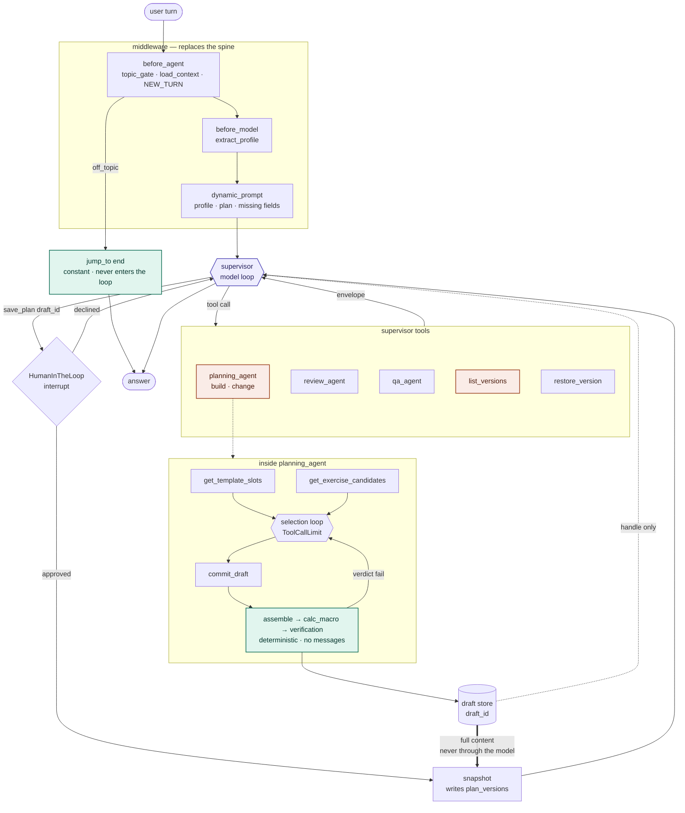

# Supervisor architecture — every branch as an agent

**Status: implemented.** This is the system that runs. The root graph has been
replaced by a supervisor agent, and every branch with a real decision to make is
an agent of its own.

`docs/workflow.md` describes what came before — a router with a fixed spine,
deterministic branches, and four subgraphs invoked with mapped-in state — and it
is still the reference for everything the conversion did not touch: the rubrics,
the plan and catalog shapes, the verify checks, and the reasoning behind each.
Read the two together. This one records only what changed, and what the change
cost.

Where the code lives, section by section: the draft store in
`app/core/langgraph/drafts/`, the supervisor in `app/core/langgraph/supervisor/`,
the agents in `app/core/langgraph/agents/`, and the one function that bundles
macros with verification in `app/core/langgraph/scoring.py`.

---

## 1. What the conversion is, and what it is not

The system is already multi-agent. `agents/__init__.py` registers four agents,
each with its own state, its own contract and its own span name. What changes is
not the number of agents — it is **who decides the order they run in**.

| | Today | After |
|---|---|---|
| Order of steps | Edges in a graph | A model, re-deciding after each result |
| Routing | `classify` → `INTENT_TARGETS` lookup | The supervisor's own tool choice |
| Mandatory steps | Guaranteed by topology | Guaranteed by tool bodies and middleware |
| `patch_plan` | A root node | Absorbed into `planning_agent` |
| `resolve_version` | A root node with its own LLM call | Absorbed into the supervisor |

Two root nodes disappear entirely. Both for the same reason: they existed to
make a judgment that the supervisor is already making anyway. `patch_plan`
shares every input and every output with the build path, so `mode="change"` is
one parameter rather than a second branch; `resolve_version` maps *"the original
plan"* onto a `version_id`, and the supervisor has already read the conversation
that phrase came from.

---

## 2. The translation rule

Every guarantee in `workflow.md` is currently expressed as an edge. An agent has
no edges to express them with, so each one has to land somewhere else. There are
exactly three destinations, and the choice between them is not stylistic.

Ask, for each pair of adjacent steps: **if the agent runs the first and skips
the second, is the result wrong?**

| Answer | Destination |
|---|---|
| Yes, and the two steps belong to one operation | **One tool body.** What was an edge becomes a function call inside a tool |
| Yes, and the step must run every turn regardless of what the agent does | **Middleware hook.** These compile to real nodes, so they cannot be skipped |
| Yes, and the step is a condition on being allowed to proceed at all | **Precondition inside the tool**, returning a refusal envelope |
| No | A separate tool is fine |

The rule is what produces the tool list. It is not a preference about
granularity: a tool that returns a plan without having verified it is a tool
that will eventually be called on its own.

### 2.1. Why `create_agent` and not `StateGraph`

An agent's internal graph is fixed: a `model` node, a `tools` node, and one node
per middleware hook, wired by `create_agent`. There is no `add_node`. Anything
that needs arbitrary nodes and edges is not an agent — it is a `StateGraph`, and
`verification` stays one for exactly that reason (§8).

This is why nothing below describes "nodes" inside an agent. Deterministic work
lives in tool bodies as plain Python; work that must run every turn lives in
middleware.

---

## 3. Diagram



---

## 4. Supervisor

Replaces four nodes: `classify`, `intent_branch`, `verdict_gate`,
`compose_answer`.

### 4.1. State

```python
class SupervisorState(AgentState):    # messages comes from AgentState
    profile: dict
    plan: dict | None                 # what the user has — survives the turn
    macros: dict | None
    episodic_context: str
    current_version_id: str | None    # parent_id for the next snapshot
    intent_hint: Intent | None        # from the topic gate, advisory only
    missing_fields: list[str]
    goal_conflict: GoalConflict | None
```

Eight fields, down from twenty in `RootState`. Everything that vanished —
`draft_plan`, `computed_macros`, `submitted_plan`, `issues`, `verdict`,
`repair_count`, `pending_commit`, `scope`, `changes`, `revert_target` — was
derived within a turn, and derived state now lives in the draft store instead
(§9). What is left is exactly the set that must survive the turn boundary, which
is also why the `NEW_TURN` reset gets simpler rather than harder.

`intent_hint` is advisory and must stay that way. It is the topic gate's
classification, passed on so the supervisor does not re-reason from scratch; it
is not a routing instruction, because the supervisor may legitimately disagree
after reading a tool result.

### 4.2. Tools

| Tool | Returns | Notes |
|---|---|---|
| `planning_agent(mode, changes)` | `DraftEnvelope` \| `MissingFields` | Agent-as-tool |
| `review_agent(pasted)` | `ReviewEnvelope` | Read-only; no `draft_id` |
| `qa_agent(question)` | text | Agent-as-tool |
| `list_versions()` | `list[VersionRef]` | Replaces `resolve_version` |
| `restore_version(version_id)` | `DraftEnvelope` | Re-verifies before returning |
| `save_plan(draft_id)` | `SavedVersion` | The only write in the system |

`save_plan` takes **no plan argument**. That is the whole point of it: the
content comes from the draft store, so the numbers written to `plan_versions`
are the numbers that were verified, not a version the model retyped.

Subagents are called as tools rather than handed control with
`Command(goto=...)`. Handoff would end the supervisor's turn, and the confirm
gate, the save and the final answer all live at supervisor level — nothing would
be left to run them.

### 4.3. Middleware

| Hook | Replaces | Runs |
|---|---|---|
| `before_agent`: `topic_gate` | `classify`, `decline`, `NEW_TURN` | Once per turn |
| `before_agent`: `load_context` | `load_context` | Once per turn |
| `before_model`: `extract_profile` | `extract_profile` | Every model call |
| `dynamic_prompt` | `_render_semantic_context`, `ask_missing`, `ask_goal` | Every model call |
| `HumanInTheLoopMiddleware(interrupt_on={"save_plan"})` | `build_diff` + `confirm` | On the save call |
| `ModelCallLimitMiddleware` | `recursion_limit` | |
| `ModelRetryMiddleware`, `ModelFallbackMiddleware` | `llm_service` retry and fallback | |

#### The topic gate

```python
@before_agent(can_jump_to=["end"])
async def topic_gate(state: SupervisorState, runtime) -> dict | None:
    """Refuse an out-of-scope message before the supervisor sees it."""
    decision = await llm_classify(_recent_turns(state["messages"]))

    if decision.intent == "off_topic":
        logger.info("routing_declined_off_topic")
        return {"messages": [AIMessage(content=_OFF_TOPIC_ANSWER)], "jump_to": "end"}

    return {**NEW_TURN, "intent_hint": decision.intent}
```

`classify` does not die in the conversion — it moves into this hook, and its
output is used for two things instead of one: the topic decision, and
`intent_hint`. That is what keeps the gate from costing an extra round-trip,
which is the objection `workflow.md` §10.1 raises against a standalone guardrail
and which still stands.

It must be ordered **before** the `extract_profile` hook. Today an off-topic
turn writes nothing to the profile because `extract_profile` returns early on
that intent; after the conversion, that property comes from ordering alone.

`before_agent` is the right hook and `before_model` is not: the topic of a turn
does not change between iterations of the loop, so classifying on every model
call pays three times for one answer.

---

## 5. `planning_agent`

Absorbs the build branch and `patch_plan`. The one agent whose nature actually
changes: `choose_exercises` is a single structured call today, and becomes the
agent's own loop.

### 5.1. State

```python
class PlanningState(AgentState):
    profile: dict
    goal: str
    preferences: str                       # extracted string, not a transcript
    mode: Literal["build", "change"]
    changes: dict                          # empty for build
    base_plan: dict | None                 # the plan being changed; None for build
    slots: list[dict]
```

No `plan` field, and no `draft_plan`. The agent cannot write the user's plan
because it has nowhere to write it: its only output is a `draft_id` minted by
`commit_draft`.

`preferences` stays an extracted string rather than a transcript, for the reason
`workflow.md` §2.5 gives — the reason an exercise was chosen has to be traceable
to a value in state.

### 5.2. Tools

| Tool | Body contains | Why merged |
|---|---|---|
| `get_template_slots()` | `select_template` + `filter_candidates` | Candidate filtering is not a decision; a slot list without candidates is useless |
| `get_exercise_candidates(slot_id, exclude_ids)` | catalog query with injury filter applied | The one place the model chooses. Injury filtering is inside the tool, never in the prompt |
| `commit_draft()` | `assemble_plan` + `calc_macro` + `verification` + draft store write | §2, first row. These four cannot be separated |

`commit_draft` is the **only** path that mints a `draft_id`, and the supervisor
only accepts envelopes that carry one. An agent that assembles a plan on its own
and reports it has produced nothing the system will save.

### 5.3. Middleware

| Hook | Purpose |
|---|---|
| `dynamic_prompt` | Renders profile, mode, and the change delta |
| `ToolCallLimitMiddleware(run_limit=N, exit_behavior="continue")` | Replaces `_MAX_REPAIRS`. The repair loop is now the agent's loop, so its cap moves here |
| `ModelCallLimitMiddleware(exit_behavior="end")` | Floor under a model that only ever calls tools |
| `ModelRetryMiddleware`, `ModelFallbackMiddleware` | Same registry order as `llm_service` |

The cap is not optional. `workflow.md` §8 stops after two failed repairs because
two failures usually means genuinely conflicting constraints — six sessions a
week, bands only, both knees hurting — which is a decision for the user. An
uncapped loop turns that into a timeout.

---

## 6. `review_agent`

Today's `ingest`. Earns agent status because the input is free text of unknown
quality and the number of resolution rounds cannot be predicted.

### 6.1. State

```python
class ReviewState(AgentState):
    catalog: dict
    submitted_plan: dict | None
    unresolved: list[dict]                 # lines no catalog entry matched
    incomplete: list[str]                  # lines missing sets or reps
```

### 6.2. Tools

| Tool | Body contains |
|---|---|
| `resolve_exercise(raw_text)` | Three-tier match: alias, `pg_trgm`, vector. Returns `None` and candidates below threshold |
| `score_plan()` | `calc_macro` + `verification`, read-only |

`score_plan` returns a `ReviewEnvelope`, which deliberately **has no
`draft_id`**. That is how `submitted_plan` is kept from becoming `plan`: a review
produces nothing `save_plan` can accept. The distinction that `workflow.md` §2.3
enforces with two separate state fields is enforced here by the absence of a
handle.

Low confidence from `resolve_exercise` is reported, never guessed. A review that
silently omits three exercises is worse than one that names them.

### 6.3. Middleware

`dynamic_prompt`, `ToolCallLimitMiddleware` on `resolve_exercise`, retry and
fallback. Same shape as the others.

---

## 7. `qa_agent`

Unchanged. `agents/qa/graph.py` is already `create_agent` with five middleware
and no nodes; it is the reference for the two agents above rather than something
the conversion touches.

One addition is worth making independently of this design: an
`estimate_macros(sessions_per_week?, weight_kg?, goal?)` tool, so a what-if
question — *"what would 5 days do to my calories?"* — can be answered with a
number instead of the general form. It is safe here and only here, because QA is
read-only and has no path to a save. The tool must be named and documented as an
estimate, and forbidden for *"what is my current protein target"*, which is
answered by quoting `plan_context` verbatim. Two different numbers for the same
question is worse than one general answer.

---

## 8. `verification` — deliberately not an agent

Stays a `StateGraph`: a conditional entry edge fanning out to three checks,
joined at `merge_issues`. It is called from tool bodies (`commit_draft`,
`score_plan`) and is not reachable by any supervisor tool call.

`VerifyState` keeps its defining property — **no `messages` field**. In this
architecture that guarantee is stronger than it is today, not weaker: the
verifier runs inside a function that is never handed a transcript, so there is
nothing to pass in even by mistake.

Giving a model any part of rubric scoring would make MRV and MEV negotiable.
They are not.

---

## 9. The draft store

The single most important mechanic in the conversion. Without it, plan JSON
travels from a tool result, through the supervisor's context, and into the next
tool call — and the moment a model retypes a number, `workflow.md` §1.1 is dead.

```python
class DraftEnvelope(TypedDict):
    draft_id: str            # the handle — the only thing save_plan accepts
    plan_rendered: str       # text for the supervisor to describe, not to relay
    macros: dict
    issues: list[Issue]
    verdict: Literal["pass", "warn", "fail"]
    diff: dict | None        # None for build; the confirm question renders this
```

Rules, all of them load-bearing:

1. `commit_draft` is the only writer.
2. `save_plan(draft_id)` reads the content from the store, never from arguments.
3. A draft with `verdict == "fail"` is refused at save time, not only at
   compose time.
4. Drafts expire. A `draft_id` from three turns ago describes a profile that may
   have changed since.
5. `plan_rendered` is for prose. The supervisor describes the plan from it; it
   does not reconstruct the plan out of it.

`build_diff` folds into the envelope rather than being its own tool, because the
diff is what the confirm question shows and there is no moment when one is
wanted without the other.

---

## 10. What the profile gate becomes

It cannot be a tool. Given `check_profile()` as an option, some turns the model
will decide the profile looks complete and proceed with `activity_level = None`,
producing a TDEE wrong by several hundred calories that looks authoritative.
That is `workflow.md` §1.2 and it does not stop being true here.

So it becomes a precondition, checked on the first line of every tool that could
produce a plan:

```python
@tool
def planning_agent(mode: str = "build", changes: dict | None = None) -> dict:
    """Build or change a plan. Profile is read from the database, never passed in."""
    missing = missing_fields(profile, "build_plan" if mode == "build" else "change_plan")
    if missing:
        return {"status": "missing_fields", "fields": missing}
    ...
```

Two properties come from this, and both matter:

- Calling the tool anyway achieves nothing but a list of what to ask for.
- The tool does **not** accept `profile` as a parameter. A tool that did would
  let the model fill in `weight_kg=75` for a user who never said it.

`REQUIRED_FIELDS` stays a constant in `app/services/profile.py`. It is not the
model's judgment about whether it has enough information.

---

## 11. What is lost, and what has to replace it

Three things. Stated plainly, because the design is only honest if they are.

### 11.1. `calc_macro` becomes three local invariants instead of one global one

Today there is no path from any plan to any answer that skips it. After the
conversion it is guaranteed inside `commit_draft` and inside `score_plan` —
separately. A fourth plan-producing tool added later that forgets to bundle it
is a silent bug of a kind the current graph cannot have.

**Replacement:** a test asserting that every envelope carrying a `draft_id` also
carries non-`None` `macros`, and that every plan-producing tool routes through
`commit_draft`.

### 11.2. Topology tests become behaviour tests

`tests/test_app_graph_routing.py` currently *proves* properties by inspecting
edges: `test_no_intent_can_skip_the_profile_gate`,
`test_only_finalize_ends_the_graph`,
`test_decline_cannot_reach_anything_that_touches_a_plan`. None of those port.
Their replacements mock a model and sample behaviour, which is slower and
weaker.

**Replacement:** the strongest available substitute is static — assert that no
subagent's tool set contains a write tool, and that `save_plan`'s signature has
no `plan` parameter. Both are checkable without running a model.

### 11.3. Trace shape stops being deterministic

`evals/` baselines compare runs. A supervisor that takes a different number of
hops on the same input makes those comparisons noisier.

**Replacement:** score on outcomes rather than on spans, and record hop count as
its own metric so drift is visible instead of confusing.

### 11.4. What is *not* lost

The topic gate (§4.3), the confirm gate (`HumanInTheLoopMiddleware` interrupts
on a tool name, not on a model's judgment), and verifier blindness (§8) all
survive intact. An earlier draft of this design listed the first as a casualty;
it is not.

---

## 12. Layout and registry

```
app/core/langgraph/
  supervisor/
    agent.py            build_supervisor() — create_agent + middleware
    middleware.py       topic_gate, load_context, extract_profile, dynamic_prompt
    tools.py            list_versions, restore_version, save_plan
    state.py            SupervisorState
  agents/
    __init__.py         AGENTS registry — unchanged in shape
    planning/
      agent.py          create_agent, replaces graph.py
      tools.py          get_template_slots, get_exercise_candidates, commit_draft
      state.py          PlanningState
      prompts/
    review/             (today's ingest/)
    qa/                 unchanged
    verification/       unchanged — StateGraph, called from tool bodies
  drafts/
    store.py            mint, read, expire
```

`agents/planning/nodes.py` is deleted. Its four functions do not disappear —
`select_template` and `filter_candidates` become the body of
`get_template_slots`, `assemble_plan` becomes part of `commit_draft`, and
`choose_exercises` becomes the model loop itself.

```python
AGENTS: dict[str, Callable[[], CompiledStateGraph]] = {
    "planning":     build_planning_agent,
    "review":       build_review_agent,
    "qa":           build_qa_agent,
    "verification": build_verification_graph,
}
```

Four names, unchanged. Two of them change what they build. The registry
docstring still holds: `routing/` and `profile/` remain outside it, now because
they are middleware rather than because they are root nodes.

---

## 13. What the decision rested on

Kept as written, because it is the record of why this was done rather than a
question still open. The case for a supervisor rests on three things the router
cannot do: handle a turn with two intents, recover from its own bad routing
decision, and ask a follow-up without ending the turn. All three are measurable
from Langfuse traces rather than arguable:

- Share of turns where the classified intent produced nothing (`draft_plan is
  None`, `_NO_PLAN_FOUND_ANSWER`, `_UNBUILT_BRANCH_ANSWER`) — the misroute rate.
- Share of turns immediately followed by a user correction — the multi-intent
  need.
- Distribution of `repair_count == 2` — the self-correction need.

Below roughly 5% misroutes, a supervisor does not pay for what §11 costs. The
intermediate option is in `docs/workflow.md`'s terms: keep the router and the
spine, convert only `planning` and `ingest` into agents, and leave `calc_macro`,
`verification` and `confirm` as root nodes. That change is two files and keeps
every property in §11.
