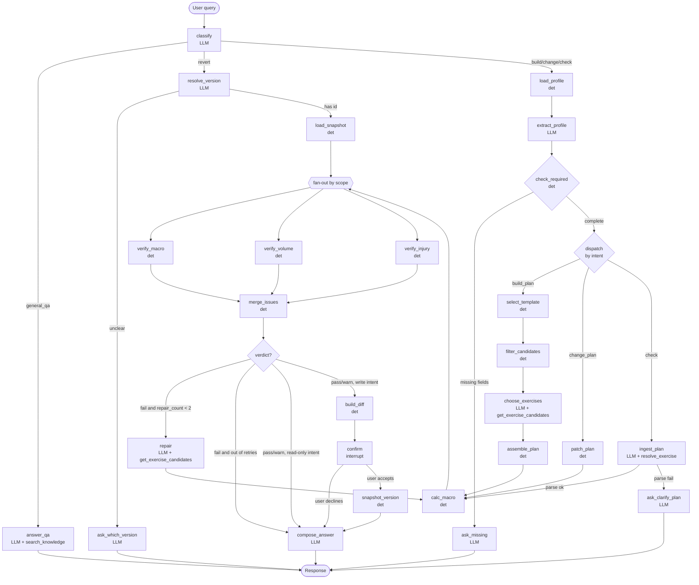
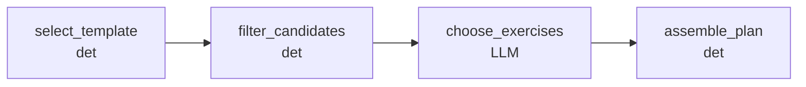
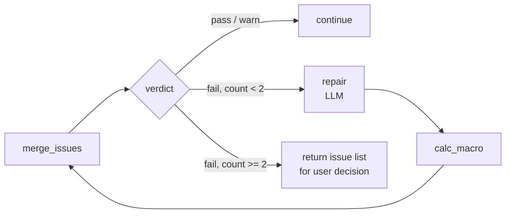
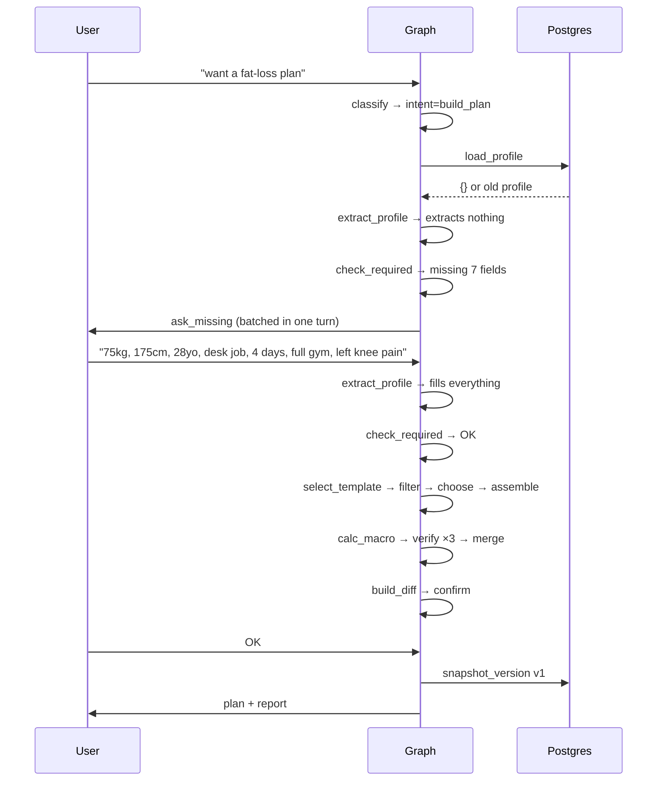
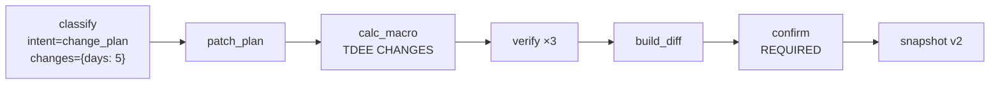
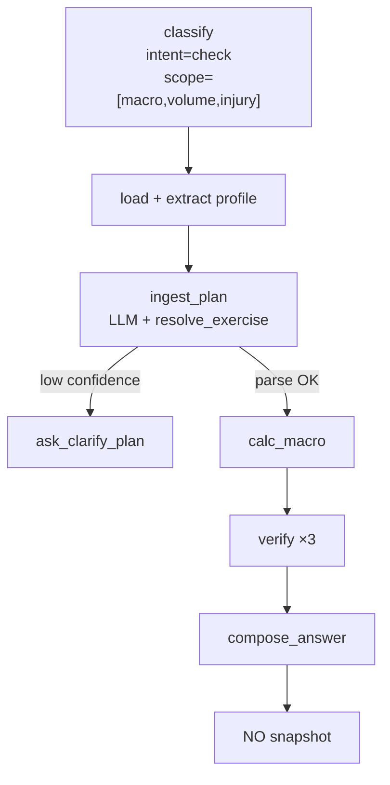
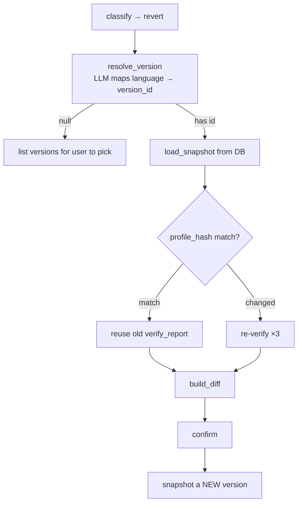

# Fitness Agent — Graph, State & Tools Architecture

Design document for the LangGraph-based workout plan build/verify system.

---

## 1. Three principles that govern the entire design

**1.1. The LLM does not invent numbers.** Every number — sets, reps, RIR, calories, macros — comes from a template or a formula. The LLM may only *choose* from a pre-filtered list. The hallucination surface collapses to a single decision: "among these 6 valid exercises, which one?"

**1.2. Control flow is not a tool.** If the agent may decide whether to call `verify_profile`, some turns it will skip it. Every mandatory step lives on the graph, not in the tool list.

**1.3. The verifier is blind to the build process.** The verifier receives `(plan, profile, macros, rubric)` — not `messages`. Enforced by types: the verify subgraph uses a separate `VerifyState` with no `messages` field, so a violation is a type error, not a convention breach.

---

## 2. State

### 2.1. Supporting types

```python
from typing import Annotated, Literal, TypedDict
from operator import add

Intent = Literal[
    "build_plan",    # create a new plan
    "change_plan",   # edit an existing plan
    "check",         # grade a plan/macro — scope decides which verifiers run
    "revert",        # restore a previous version
    "general_qa",    # knowledge question
]

VerifyScope = Literal["macro", "volume", "injury"]

class Issue(TypedDict):
    source: VerifyScope
    severity: Literal["info", "warn", "block"]
    location: str              # "Push A / Back squat"
    message: str
    suggestion: dict | None    # replacement exercise, not just an error report
    rubric_ref: str            # "volume.quads.mrv" — traceable

class VersionRef(TypedDict):   # ~100 bytes, lives in state
    version_id: str
    label: str
    created_at: str
```

### 2.2. Main state

```python
class State(TypedDict):
    # --- conversation ---
    messages: Annotated[list, add]

    # --- routing ---
    intent: Intent
    scope: list[VerifyScope]        # which verifiers are on for this turn
    changes: dict                   # delta for change_plan, e.g. {"days": 5}
    revert_target: str | None

    # --- profile ---
    profile: dict
    missing_fields: list[str]

    # --- plan ---
    plan: dict | None               # plan the system holds (source of truth)
    macros: dict | None             # macros attached to the current plan
    submitted_plan: dict | None     # plan the user PASTED IN — not *the* plan
    computed_macros: dict | None    # macros computed for comparison
    draft_plan: dict | None         # uncommitted draft

    # --- verify ---
    issues: Annotated[list[Issue], add]   # reducer required for fan-out
    verdict: Literal["pass", "warn", "fail"] | None
    repair_count: int

    # --- version ---
    version_index: list[VersionRef]       # index only; snapshots live in DB
    current_version_id: str | None
    pending_commit: dict | None           # staged, awaiting user confirm

    # --- output ---
    answer: str
```

### 2.3. Three fields that are easy to overlook

| Field | Why they must stay separate |
|---|---|
| `submitted_plan` vs `plan` | User pastes someone else's plan for feedback. If `ingest_plan` writes straight into `plan`, you overwrite their approved plan with something they only wanted an opinion on. |
| `computed_macros` vs `macros` | `verify_macro` is a comparison of two values — both must exist at once. |
| `repair_count` | The loop crosses many nodes; a local variable does not survive. |

### 2.4. Why `version_index` instead of full versions

LangGraph serializes the entire state after **every node**. If history holds 8 versions × full plan JSON, every conversation turn rewrites everything many times — cost grows quadratically.

Full snapshots live in the Postgres `plan_versions` table. State only keeps `VersionRef`s sufficient for `resolve_version` to map "the original plan" → `version_id`. Only when the user confirms a revert do we `SELECT` the full snapshot.

---

## 3. Overall diagram



**How to read the diagram:** `calc_macro` is an intentional bottleneck — there is no path from `patch_plan` to `confirm` that skips recomputing macros and verify. That is how the "modify must not take a shortcut" principle is enforced.

---

## 4. Node table

### 4.1. LLM nodes

| Node | Reads state | Writes state | Allowed tools |
|---|---|---|---|
| `classify` | `messages` | `intent`, `scope`, `changes` | — |
| `answer_qa` | `messages`, `plan`, `macros` (read-only) | `answer` | `search_knowledge` |
| `extract_profile` | `messages`, `profile` | `profile` | — |
| `ask_missing` | `missing_fields`, `intent` | `answer` | — |
| `resolve_version` | `messages`, `version_index` | `revert_target` | — |
| `ingest_plan` | `messages` | `submitted_plan` | `resolve_exercise` |
| `choose_exercises` | `draft_plan.slots`, `profile` | `draft_plan` | `get_exercise_candidates` |
| `repair` | `issues`, `draft_plan`, `profile` | `draft_plan`, `repair_count` | `get_exercise_candidates` |
| `compose_answer` | everything | `answer` | — |

### 4.2. Deterministic nodes

| Node | Reads state | Writes state | Internal function |
|---|---|---|---|
| `load_profile` | — | `profile` | `db.get_profile` |
| `check_required` | `profile`, `intent` | `missing_fields` | `REQUIRED_FIELDS[intent]` |
| `select_template` | `profile` | `draft_plan` (empty frame) | `db.query_templates` |
| `filter_candidates` | `draft_plan`, `profile` | `draft_plan.slots[].candidates` | `db.query_exercises` |
| `assemble_plan` | `draft_plan` | `draft_plan` | `validate_schema` |
| `patch_plan` | `plan`, `changes` | `draft_plan` | `deep_merge` |
| `calc_macro` | `profile`, `draft_plan` | `computed_macros` | `mifflin_st_jeor`, `split_macros` |
| `verify_macro` | `computed_macros`, `draft_plan` | `issues` | rubric `macro_rules` |
| `verify_volume` | `draft_plan`, catalog | `issues` | rubric `volume_landmarks` |
| `verify_injury` | `draft_plan`, `profile.injuries` | `issues` | rubric `contraindications` |
| `merge_issues` | `issues` | `verdict` | sort by severity |
| `build_diff` | `plan`, `draft_plan` | `pending_commit` | `json_diff` |
| `snapshot_version` | `pending_commit` | `plan`, `macros`, `version_index`, `current_version_id` | `db.insert_version` |
| `load_snapshot` | `revert_target` | `draft_plan`, `computed_macros` | `db.get_version` |

---

## 5. Tools

Only **three** functions are exposed to the LLM. Everything else is internal; nodes call them directly.

### 5.1. `get_exercise_candidates`

```python
@tool
def get_exercise_candidates(
    slot_id: str,
    exclude_ids: list[str] = [],
) -> list[dict]:
    """Return valid exercises for one slot in the template.

    Filters already applied (cannot be bypassed):
      - movement_pattern matches the slot
      - equipment ⊆ equipment the user has
      - skill_level <= user level
      - joint_actions ∩ contraindications = ∅

    Returns at most 8 exercises, each with id, name, primary_muscles,
    equipment, fatigue_cost. Does NOT return set/rep — those belong to the slot.
    """
```

Called by: `choose_exercises`, `repair`.

Key point: injury filtering lives **inside** the tool, not in the prompt. The LLM has no way to retrieve a contraindicated exercise even if it wants to.

### 5.2. `resolve_exercise`

```python
@tool
def resolve_exercise(raw_text: str) -> dict:
    """Map a free-form exercise name to an exercise_id in the catalog.

    Three tiers; stop at the first confident enough:
      1. exact match on the alias table        → confidence 1.0
      2. pg_trgm fuzzy, threshold 0.6          → confidence 0.8
      3. vector search top-3, threshold .85    → confidence = score

    Returns {"exercise_id": None, "confidence": 0.4, "candidates": [...]}
    when not confident enough. The calling node MUST handle None by
    asking the user again — never guess.
    """
```

Called by: `ingest_plan`.

Mis-mapping "leg press" to "leg extension" makes the injury check grade completely wrong. Returning `None` is correct behavior, not a failure.

### 5.3. `search_knowledge`

```python
@tool
def search_knowledge(query: str, top_k: int = 4) -> list[dict]:
    """Semantic search over the nutrition/training knowledge base.
    Only for general_qa. Do not use it to fetch build-plan data."""
```

Called by: `answer_qa`.

Data source: `data/knowledge/*.docx`. Each `Heading 2` is a passage (over-long sections
are split, with the heading repeated on every part), embedded with `text-embedding-3-small`
and stored in the `knowledge_chunks` table. Loaded via `scripts/seed_knowledge.py` —
idempotent; only re-embeds passages whose content changed.

Passages below `KNOWLEDGE_MIN_SCORE` are dropped. Vector search always returns a full
`top_k`, so without a threshold an out-of-scope question still gets the least-related
passages — and the model will cite them. Returning `[]` is correct: the `qa.md` prompt
already tells the model to answer on its own and state that the knowledge base has no
documents on that topic.

### 5.4. Internal functions (LLM cannot call them)

| Function | Calling node | Why not a tool |
|---|---|---|
| `db.get_profile` | `load_profile` | Must always run; nothing to decide |
| `db.query_templates` | `select_template` | Hard-criteria filter |
| `db.query_exercises` | `filter_candidates` | Same as above |
| `calculator_macro` | `calc_macro` | Pure arithmetic — LLM involvement is pure risk |
| `verify_macro/volume/injury` | verify nodes | Must run; must not be skippable |
| `find_alternative` | `verify_injury` | Catalog query by attributes |
| `db.insert_version` | `snapshot_version` | Side effect; needs confirm first |

---

## 6. Build plan — from template to JSON

This is the inside of the `build_plan` branch.



### 6.1. `select_template` — deterministic

```python
SELECT * FROM templates
WHERE days_per_week = :days
  AND :goal  = ANY(goal)
  AND :level = ANY(level)
ORDER BY popularity DESC LIMIT 3;
```

Pick top-1, or let the LLM choose among 3 if the user has special requirements. The template already contains set counts, rep ranges, and RIR ranges for each slot.

**This answers "where do sets/reps come from": from the template, not from the model.**

### 6.2. `filter_candidates` — deterministic

For each slot, filter the catalog:

```python
candidates = [
    ex for ex in catalog
    if ex.movement_pattern == slot.pattern
    and set(ex.equipment) <= set(profile.equipment)
    and ex.skill_level <= profile.level
    and not (set(ex.joint_actions) & forbidden_actions)
]
```

`forbidden_actions` = union of `avoid_joint_actions` from every injury the user declared.

### 6.3. `choose_exercises` — LLM

Receives a slot + a list of 5–8 candidates, picks 1. This is the **only** place the LLM participates in plan creation.

Prefer LLM choice over random because it handles what rules cannot:
- avoid duplication across sessions in the week
- balance barbell / dumbbell / machine
- respect preferences stated in the query ("I hate deadlifts")

### 6.4. `assemble_plan` — deterministic

Assemble the JSON, then hard-validate:
- every `exercise_id` exists in the catalog
- every slot is filled
- sets/reps match the original template (the LLM must not edit them)

Validate fail → not a user error; raise an exception and log. This is a bug.

---

## 7. Verify — what data grading uses

Three rubrics, stored in git, with `rubric_version` so old results can be reproduced.

### 7.1. `verify_macro`

Reads: `computed_macros`, `draft_plan.macros`, `profile`, rubric `macro_rules`.

```json
{
  "rubric_version": "2026.1",
  "protein_g_per_kg": {"min": 1.6, "target": 2.0, "max": 2.5},
  "fat_g_per_kg": {"min": 0.6},
  "deficit": {"max_pct_bw_per_week": 1.0, "max_pct_tdee": 25},
  "floor_kcal": {"male": 1500, "female": 1200}
}
```

Fail when: protein below floor, deficit too deep, kcal below floor.

### 7.2. `verify_volume`

Reads: `draft_plan`, catalog (to map exercises → muscle groups), rubric `volume_landmarks`.

```json
{
  "rubric_version": "2026.1",
  "quads":      {"mev": 8, "mav": [12, 18], "mrv": 22},
  "chest":      {"mev": 8, "mav": [12, 20], "mrv": 22},
  "side_delts": {"mev": 8, "mav": [16, 22], "mrv": 26},
  "frequency":  {"min_per_week": 2, "max_per_week": 4},
  "session":    {"max_sets": 25, "max_hard_sets_per_muscle": 10}
}
```

Catalog is required for conversion — one bench set contributes 1.0 set to chest, 0.5 to triceps and front delts:

```json
"contribution": {"chest": 1.0, "triceps": 0.5, "front_delts": 0.5}
```

Fail when: sets/week outside MEV–MRV, frequency < 2, session too long, two consecutive days hitting the same heavy muscle group.

### 7.3. `verify_injury`

Reads: `draft_plan`, catalog, `profile.injuries`, rubric `contraindications`.

```json
{
  "knee_pain_patellofemoral": {
    "severity": "block",
    "avoid_joint_actions": ["knee_flexion_deep"],
    "avoid_loaded_positions": ["knee_end_range"],
    "limit": [{"pattern": "lunge", "max_sets_week": 4}]
  },
  "shoulder_impingement": {
    "severity": "block",
    "avoid_joint_actions": ["shoulder_abduction_overhead"],
    "avoid_loaded_positions": ["shoulder_end_range_external"]
  }
}
```

**Map injuries to forbidden attributes, not to exercise name lists.** If you write `"knee pain": ["squat", "lunge"]`, tomorrow `hack_squat` lands in the catalog and slips through. Mapping to `joint_actions` means every new exercise is graded correctly automatically, because the rule is a set intersection:

```python
def verify_injury(plan, profile, catalog, rubric) -> list[Issue]:
    issues = []
    forbidden = union(rubric[i]["avoid_joint_actions"]
                      for i in profile["injuries"])
    for day in plan["days"]:
        for ex in day["exercises"]:
            meta = catalog[ex["exercise_id"]]
            hits = set(meta["joint_actions"]) & forbidden
            if hits:
                issues.append(Issue(
                    source="injury",
                    severity="block",
                    location=f"{day['name']} / {meta['name']}",
                    message=f"Contraindicated: {sorted(hits)}",
                    suggestion=find_alternative(meta, forbidden),
                    rubric_ref=f"contraindications.{profile['injuries'][0]}",
                ))
    return issues
```

No LLM in this function.

**Note:** `filter_candidates` already filters injuries at build time, but `verify_injury` **must still run** — because `patch_plan` and `ingest_plan` introduce exercises without going through that filter.

### 7.4. Verify subgraph with its own state

```python
class VerifyState(TypedDict):
    plan: dict
    profile: dict
    computed_macros: dict
    catalog: dict
    rubric_version: str
    issues: Annotated[list[Issue], add]
    # NO messages — that is the point
```

The verifier cannot see the build process even if someone accidentally tries to pass it in.

---

## 8. Repair loop



`repair` receives `issues` + `draft_plan`, calls `get_exercise_candidates` to replace violating exercises. It does **not** receive `messages` — same reason as the verifier.

After 2 attempts, stop and present issues to the user. Do not let the agent repair forever: if two tries fail, the constraints are usually contradictory (user wants 6 days/week, only has resistance bands, pain in both knees and shoulders) — that needs the user, not more agent loops.

---

## 9. Four scenarios — detailed flows

### 9.1. "I want a fat-loss plan" — missing information



`REQUIRED_FIELDS["build_plan"]` = weight, height, age, sex, activity level, days/week, equipment, injuries.

This list is a **deterministic constant**; do not let the LLM decide what to ask. If it decides, some turns it will think "enough already" and enter the loop with `activity_level = None`.

Batch all questions into one turn; do not ask one by one.

### 9.2. "Change 4 days to 5" — change_plan



Core point: adding one training day raises TEA → raises TDEE → breaks the current deficit. So `calc_macro` and all three verifiers must re-run; no shortcuts.

`patch_plan` only merges the delta into the JSON, keeping every existing constraint (goal, equipment, level). Routing straight back to `build_plan` regenerates from scratch and loses context.

If the change is structural (4→5 days changes the split), `patch_plan` re-calls `select_template` for the new frame but **keeps previously chosen exercises** in slots that still match the pattern.

Confirm is mandatory: we are overwriting an approved plan.

### 9.3. "Is this plan OK? I have knee pain" — check



`ingest_plan` is the step the other three cases do not have. Without normalizing to the schema, verify has nothing to grade.

Write to `submitted_plan`, **not** to `plan`.

Low confidence from `resolve_exercise`, or missing sets/reps → ask again, do not guess.

This is a read-only branch: skip `build_diff`, `confirm`, `snapshot_version`.

### 9.4. "What is protein?" — general_qa

Does not touch the plan graph. But reads `plan`/`macros` from state for personalization:

> Protein is… Your plan currently sets 150g/day, i.e. 2g/kg — at the target level for a fat-loss phase.

This is what makes a PT chatbot different from a general knowledge bot.

**Technical constraint:** this node may only return `{"answer": ...}`. No other keys. A knowledge question must not mutate the plan.

### 9.5. "Go back to the original plan" — revert



**Revert is append, not rewind.** Restoring v1 creates v4 with v1's content, with `restored_from: "v1"`, `parent_id: "v3"`. v2 and v3 remain — delete them and the user cannot undo the undo, and they will need to ("actually, go back to the 5-day version").

**`profile_hash` gate:** between v1 and now, the user may have lost 3kg (old macros are wrong) or newly reported knee pain (v1 passed injury check when there was no injury). Blind restore returns a plan that was once valid but is now contraindicated. If the hash matches, verify is guaranteed to produce the same result — skip and save 3 compute passes.

**Diff is shown against the current plan**, not the target. Users care about "what am I about to lose":

> Reverting to v1 (4 days, PPL). Dropping: day 5, the shoulder volume cut from v3. Macros back to 2100 kcal (currently 2300). Re-verified because weight changed 78 → 75kg.

---

## 10. Confirm rules

| Intent | Confirm? | Reason |
|---|---|---|
| `build_plan` | No | User has nothing to lose yet |
| `change_plan` | **Yes** | Overwrites an approved plan |
| `revert` | **Yes** | Overwrites an approved plan |
| `check` | No | Read-only |
| `general_qa` | No | Read-only |

`confirm` is implemented with LangGraph's `interrupt()`, not by asking and waiting for the next turn — that way state is frozen at the pause point.

---

## 11. Storage

| Data | Where | Why |
|---|---|---|
| Exercise catalog (~200 rows) | Postgres + GIN index | Needs precise array/set ops, not semantic search |
| Template library | Git (JSON/YAML) | Config; changes go through review |
| Rubrics ×3 | Git, versioned | `rubric_version` must reproduce old results |
| User profile | Postgres | |
| `plan_versions` | Postgres | Full snapshots |
| Conversation state | LangGraph Postgres checkpointer | |
| Exercise aliases + embeddings | pgvector | Only for `resolve_exercise` |
| Knowledge base (`knowledge_chunks`) | pgvector | Only for `search_knowledge`; source is `data/knowledge/*.docx` |

```sql
CREATE TABLE exercises (
  id                text PRIMARY KEY,
  name              text NOT NULL,
  movement_pattern  text NOT NULL,
  primary_muscles   text[] NOT NULL,
  secondary_muscles text[] NOT NULL,
  equipment         text[] NOT NULL,
  joint_actions     text[] NOT NULL,
  loaded_positions  text[] NOT NULL,
  contribution      jsonb NOT NULL,
  skill_level       int NOT NULL,
  fatigue_cost      int NOT NULL
);
CREATE INDEX ON exercises USING GIN (joint_actions);
CREATE INDEX ON exercises USING GIN (equipment);
```

**Rubrics live in git, not the DB.** Rubrics decide which plans pass — they are closer to code than data. In the DB, someone can bump quads MRV from 22 to 30 with one UPDATE, no PR, no diff, and every old `verify_report` becomes unexplainable.

**Postgres is the single source of truth.** Embeddings are derived data and must be re-indexed when the catalog changes. Do not let exercise names exist only in the vector store.

---

## 12. Failure modes to handle

| Situation | Handling |
|---|---|
| `resolve_exercise` confidence < 0.85 | Ask the user; do not guess |
| Pasted plan missing sets/reps | Ask the user; do not assume |
| Verify fails twice | Stop, present issues, let the user decide |
| Contradictory constraints (6 days + bands only) | Detect in `select_template` when no template matches → report early; do not wait for verify |
| `assemble_plan` validate fails | Exception + log. This is a bug, not a user error |
| User changes profile mid-flow | `extract_profile` runs every turn; `profile_hash` changes → verify must not be reused |
| Concurrent writes from fan-out | `issues` has an `add` reducer. Every other field may be written by exactly one branch |

---

## 13. On injury data

Self-reported `"knee pain"` is not a diagnosis. The contraindication table currently assumes knee pain = patellofemoral, when it might be a meniscus tear — and the "safe alternative" would still be wrong.

Therefore:
- default severity is conservative; prefer removing exercises over keeping them
- output must state this is an exercise-adjustment suggestion, not a substitute for seeing a clinician
- for acute injuries or escalating pain, do not propose a plan; recommend professional care
