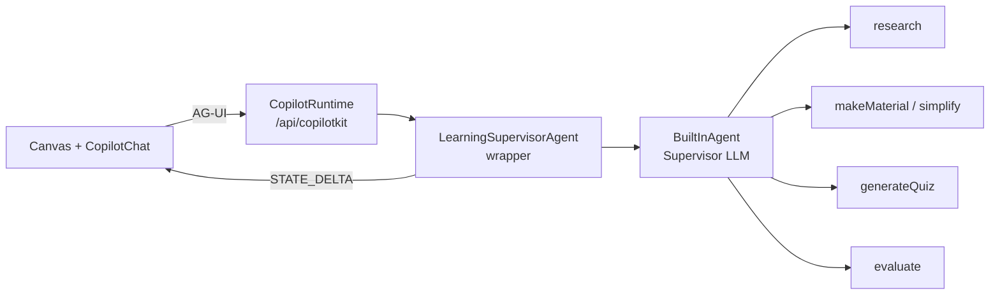
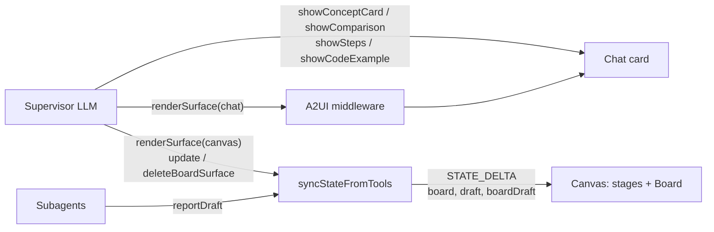
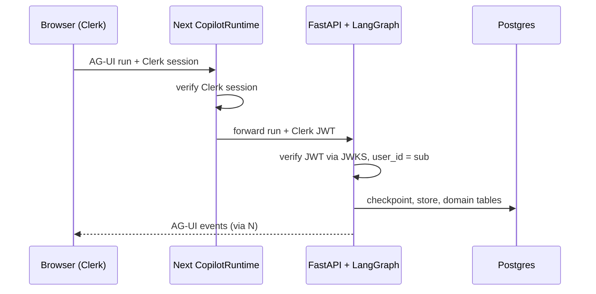
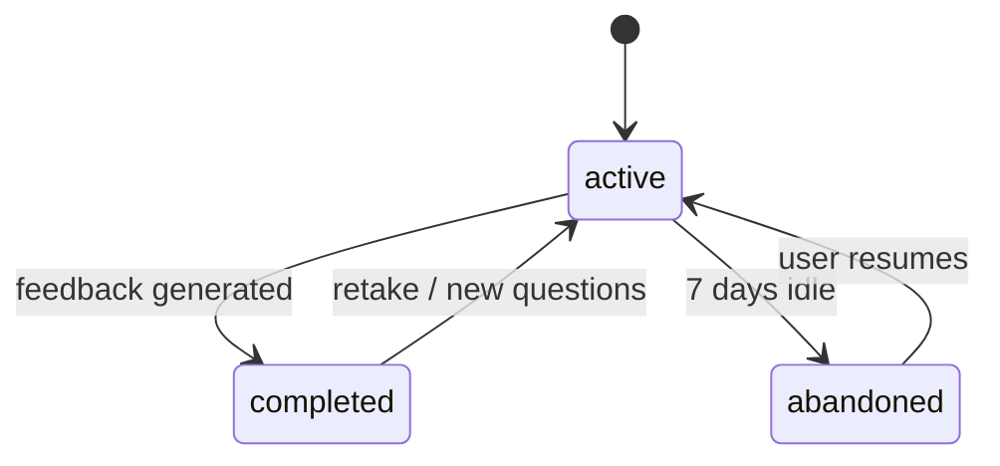

# Learning Assistant — Design Doc

2026-09-18 · Hoan Minh Hoang · Task breakdown: [v1-tasks.md](./v1-tasks.md)

## Overview

We are building a learning assistant that takes a student from a topic to scored, personalised feedback in one session. It uses CopilotKit 1.72, AG-UI and A2UI, with a Supervisor that delegates to four subagents: Research, Material, Quiz and Evaluator.

The end-to-end flow is **Research → Learning Material → Quiz → Evaluation → Score → Feedback**.

| User scenario                                          | Handled by                                      |
| ------------------------------------------------------ | ----------------------------------------------- |
| Enter a topic and ask for research                     | Supervisor → Research Agent                     |
| Structure research into learning material              | Supervisor → Material Agent                     |
| Rewrite complex content in student-friendly language   | Supervisor → Material Agent (simplify)          |
| Generate N multiple-choice questions from the material | Supervisor → Quiz Agent                         |
| Submit answers, get a score and detailed feedback      | Deterministic scoring in code + Evaluator Agent |
| Pick the question count, learning level and theme      | Settings popover → `forwardedProps.settings`    |
| Review the whole flow                                  | Stepper canvas with six stages                  |
| Ask a side question and get a visual answer (M8)       | Supervisor → chat cards or `renderSurface`      |
| Build a cheat sheet or overview to keep (M8)           | Supervisor → `renderSurface` → canvas Board     |

**Scope.** v1 is TypeScript only in `apps/web`, keeps state for the session only, and has no auth or database. v2 moves the agents to Python (LangGraph + FastAPI) and adds Clerk auth, Postgres persistence, long-term memory and multiple conversations. v1 includes the seams that make that migration cheap.

## v1 architecture

In v1 everything runs inside the Next.js app. `CopilotRuntime` hosts a single agent, `LearningSupervisorAgent`, which is a thin wrapper around CopilotKit's `BuiltInAgent`. The subagents are server tools that the Supervisor calls; this is the agents-as-tools pattern.



The diagram shows one run. The Supervisor LLM picks a tool, the tool runs a focused subagent, and the wrapper turns the result into an AG-UI state event.

**Why a wrapper.** In CopilotKit 1.72, three `BuiltInAgent` behaviours need working around:

- Shared state only changes when the LLM calls `AGUISendStateSnapshot` or `AGUISendStateDelta`. Server tools cannot emit state.
- A server tool's `execute` receives only its arguments. It cannot see `forwardedProps`, so it cannot read the model the user picked.
- The whole `input.state` is written into the system prompt on every turn.

On each run the wrapper does four things:

1. Reads `forwardedProps.settings` (question count, level) and the user's OpenAI key.
2. Builds an inner `BuiltInAgent` whose subagent tools have the settings and the full state in scope.
3. Passes the inner agent a trimmed state: stage, topic, flags and short summaries, never the full learning material or quiz.
4. Watches the event stream, and emits a `STATE_DELTA` when a subagent tool result arrives. The LLM never copies data into state.

**Code layout.**

| Path                                               | Contents                                                       |
| -------------------------------------------------- | -------------------------------------------------------------- |
| `packages/shared/src/schemas/`                     | zod state and subagent output schemas, exported to JSON Schema |
| `packages/shared/src/a2ui/`                        | fixed A2UI templates (JSON) and catalog definitions            |
| `apps/web/app/api/copilotkit/[[...slug]]/route.ts` | runtime, A2UI middleware, agent registration                   |
| `apps/web/services/agents/`                        | wrapper agent, Supervisor prompt, subagents                    |
| `apps/web/services/`                               | scoring, answer-key sealing, OpenAI model                      |
| `apps/web/components/{canvas,chat,settings,a2ui}/` | UI, split out of the reference file                            |
| `apps/web/constants/openai.ts`                     | OpenAI model and reasoning effort                              |

## Agents and tools

The Supervisor is the only agent that talks to the user and the only thing that changes state. Each subagent is a single `generateObject` call with its own prompt and a zod output schema. All of them use the model from Settings and get the learning level in their prompt.

| Agent               | Supervisor tool               | Input                                                   | Output                                                                                |
| ------------------- | ----------------------------- | ------------------------------------------------------- | ------------------------------------------------------------------------------------- |
| Research            | `research(topic)`             | topic, level                                            | `{ title, summary, keyInsight, keyTerms[{term, definition}], sources[{title, url}] }` |
| Material            | `makeMaterial()`              | research                                                | markdown learning material → `material.original`                                      |
| Material (simplify) | `simplify(scope, selection?)` | the whole learning material or the selected text, level | student-friendly markdown → `material.simplified`, or the selection rewritten         |
| Quiz                | `generateQuiz(count?)`        | material (the active view), level, question count       | `questions[{id, concept, question, options[4]}]` + answer key (sealed)                |
| Evaluator           | `evaluate()`                  | questions, answers, unsealed key                        | per-question explanations + dynamic A2UI feedback surface                             |

**Research source.** Research uses Tavily when `TAVILY_API_KEY` is set, and returns cited sources. Without the key it uses only the model's own knowledge, and `sources` is empty.

**Flow control.**

- **Step by step (default).** Each scenario is its own request. If a prerequisite is missing, the Supervisor explains what is needed instead of guessing, e.g. no quiz before learning material exists.
- **Autopilot.** "Do the whole thing" chains research → learning material → quiz, then stops, because the user has to answer the quiz.
- **New topic.** When learning material or a quiz already exists, the user confirms before anything is reset. The confirmation is human-in-the-loop, via `useHumanInTheLoop`. Chat history is kept.

**Submitting the quiz.** The Submit button is an A2UI action (`submit_quiz`) that carries the answers. The wrapper sees it in `forwardedProps.a2uiAction` and runs `evaluate` directly, without waiting for the LLM to choose the tool. Since M8 the `evaluate` card is the whole reply: a successful grading ends the run, and the Supervisor LLM runs only to explain a failed one.

**Scoring.** Scoring is done in code: each answer is compared with the unsealed `correctIndex`. Mastery for each concept, the weakest concept and the tier are computed in code too: under 50% is Novice, under 80% is Practitioner, and 80% or more is Master. The Evaluator LLM writes only the explanations and the feedback.

**Retake and New questions.** Retake clears the answers and keeps the same questions. New questions calls `generateQuiz` again. Editing the learning material clears the quiz, evaluation, score and feedback, and a banner tells the user the quiz is out of date.

## Shared state and AG-UI sync

Agent state is the single source of truth for the canvas. The server changes it with `STATE_DELTA` events, and the Learning Material editor changes it from the client with `agent.setState`. Settings are not part of state: they live in zustand, are saved to `localStorage`, and are sent in `forwardedProps`.

```ts
{
  stage: "idle"|"research"|"material"|"quiz"|"evaluation"|"score"|"feedback",
  status: { running: null|"research"|"material"|"simplify"|"quiz"|"evaluate", error?: string },
  topic: string | null,
  research: { title, summary, keyInsight, keyTerms[], sources[] } | null,
  material: { original: string, simplified: string | null, view: "original"|"simplified" } | null,
  quiz: { id, questions[{ id, concept, question, options[4] }],
          answers: Record<qid, idx>, answerKeySealed: string, submitted: boolean } | null,
  evaluation: { correct, total, percent, weakestConcept,
                perQuestion[{ qid, correctIndex, isCorrect, explanation }],
                mastery[{ concept, percent }] } | null,
  score: { percent, tier: "Novice"|"Practitioner"|"Master" } | null,
  feedback: { a2uiOperations: unknown[], summary: string } | null,
  reflection: { rating, text } | null,
  quizOutdated: boolean,
  // M8
  board: { id, title, operations: unknown[], revision }[],   // oldest first, at most 8
  draft: { task: RunningTask, ...output so far } | null,    // the running subagent's partial output
  boardDraft: { id, title, operations: unknown[] } | null   // a Board view being written
}
```

| Concern                       | Rule                                                                                                                                                                             |
| ----------------------------- | -------------------------------------------------------------------------------------------------------------------------------------------------------------------------------- |
| What the LLM sees             | A trimmed state: `stage`, `status`, `topic`, which stages have data, a 1–2 line summary of each. Never the full learning material or quiz.                                       |
| Who writes to state           | The wrapper, from subagent results. The client writes only learning material edits, the material view toggle, quiz answers and the reflection.                                   |
| Stage advance                 | The wrapper sets `stage` when a tool finishes; the canvas follows it and unlocks that stage.                                                                                     |
| Answer key                    | `answerKeySealed` is AES-GCM-encrypted `{correctIndex[], explanations[]}` using `QUIZ_SEAL_SECRET`. It is unsealed only inside `evaluate`. Behind an `AnswerKeyStore` interface. |
| Correct answers on the client | Appear only in `evaluation.perQuestion` after submit.                                                                                                                            |
| Errors                        | A failed subagent sets `status.error`. The stage shows Retry, and the Supervisor explains the failure in chat.                                                                   |
| Board and drafts (M8)         | Written only by the wrapper: `board` from surface tool results, `draft` and `boardDraft` from streamed output. The LLM sees `board` as `{ id, title }[]` only.                   |

## UI and A2UI

The UI follows `apps/web/refer-ui/ai_learning_canvas_chat.tsx` closely: header, chat panel 380–420px wide on the left, stepper canvas on the right, Tailwind, `lucide-react` icons. Dark mode uses the Tailwind `dark:` class on `<html>` instead of ternaries in each component.

**Chat.** `CopilotChat` (v2), restyled to match the reference (bubbles, avatars, Online badge). The quick-prompt chips become dynamic suggestions through `useConfigureSuggestions`. Tool calls show progress cards ("Researching 'X'…"). The dynamic Feedback surface shows a "Feedback ready →" card in chat and renders on the canvas.

**Stepper.** A stage can be clicked once its data exists. The canvas moves to a stage when the agent finishes it. While a subagent runs, its stage shows a skeleton, and Stop cancels the run.

| Stage      | Rendering                  | Components                                                                                                                            |
| ---------- | -------------------------- | ------------------------------------------------------------------------------------------------------------------------------------- |
| Research   | A2UI, fixed                | ArticleCard, InsightCallout, Flashcards (flipping is local state), SourceList                                                         |
| Material   | Custom React               | Markdown editor/preview, Simplify for the whole learning material or a selection, Original/Simplified toggle                          |
| Quiz       | A2UI, fixed                | QuestionCard with ChoicePicker for each question, Submit (`submit_quiz` action), Retake, New questions                                |
| Evaluation | A2UI, fixed                | StatTiles (accuracy, answered, weakest concept), MasteryBars by concept                                                               |
| Score      | A2UI, fixed                | TierBadge, ScoreCard, StatChips                                                                                                       |
| Feedback   | A2UI, dynamic + fixed form | The Evaluator composes FeedbackCard, ConceptChip, ReviewLink and NextStepList; a fixed reflection form (rating + text) is shown below |

**How fixed surfaces render.** The templates are JSON in `@repo/shared/a2ui/`. The canvas builds `createSurface` + `updateComponents` from the template, plus `updateDataModel` from agent state, and renders them with `A2UIRenderer`. Each `STATE_SNAPSHOT` or `STATE_DELTA` re-renders the surface, and that is the AG-UI state sync.

**How the dynamic surface renders.** The A2UI middleware injects `render_a2ui` with a small Feedback catalog as its `schema`. The resulting operations are stored in `feedback.a2uiOperations` and rendered in the Feedback stage.

**Catalog.** A custom catalog built with `extendsBasicCatalog`: React components styled with the reference's Tailwind. Only the four Feedback components go into the dynamic catalog, which keeps the LLM's output valid.

**Settings popover.** It holds question count (3–20, default 5), learning level (beginner / intermediate / advanced), the theme toggle and a link to change the OpenAI API key. The reference's Interactive Hints field is removed.

## Configuration

The app uses OpenAI only. The user enters their own OpenAI API key on `/api-key`. The server checks it (`GET /v1/models`) and seals it with AES-256-GCM (`API_KEY_SEAL_SECRET`), and the browser keeps only the sealed key in `sessionStorage`. The CopilotKit provider sends it in the `x-openai-key-sealed` header, and the runtime route opens it for each request to build the agent. Every agent uses `gpt-5.4-mini` with low reasoning effort (`constants/openai.ts`).

**Other settings.** Question count 3–20 (default 5); learning level beginner / intermediate / advanced, which goes into every subagent's prompt.

**Other environment variables.** `TAVILY_API_KEY` is optional and turns on web research. `QUIZ_SEAL_SECRET` is required and is the key for sealing the answer key.

## M8: Visual answers, the Board and streaming

M8 changes how the Supervisor answers, in three parts. A chat answer can be a visual card instead of prose. The canvas gets a **Board**, a tab next to the stages that holds views the Supervisor composes and can later edit or delete. Subagent output and Board views **stream** to the canvas while they are being written, instead of appearing only when they are finished.



### Visual answers in the chat

| Tool                                                  | Kind                 | Pick it when                                             |
| ----------------------------------------------------- | -------------------- | -------------------------------------------------------- |
| `showConceptCard(term, definition, example?)`         | Frontend, fixed card | "What is X?" about one term                              |
| `showComparison(left, right, rows[2–6], verdict?)`    | Frontend, fixed card | "X vs Y", "what is the difference"                       |
| `showSteps(title, steps[2–8])`                        | Frontend, fixed card | "How does X work", when the order matters                |
| `showCodeExample(title, language, code, explanation)` | Frontend, fixed card | "Show me an example"                                     |
| `renderSurface(target: "chat", title, components)`    | Server, dynamic A2UI | None of the cards fits, and the answer mixes a few parts |

- The four cards are frontend tools with no handler, registered with `useComponent`. Their argument schemas (`@repo/shared/schemas/chat-cards.ts`) are also the card props, so the model's arguments are drawn as they are.
- `renderSurface` takes a flat A2UI v0.9 component list with literal values and no data bindings. The server checks the tree against the target's catalog with `@ag-ui/a2ui-toolkit`: one root, every child resolved, no cycles, and no Board-only component in the chat. An invalid tree returns the errors so the model can fix them and call again. Surface ids are assigned by the server, never by the model.
- A chat result is an `a2ui_operations` envelope. The A2UI middleware turns it into an activity, which the chat draws with its own catalog.
- Plain chat stays plain: greetings, short answers and next-step suggestions get no visual. A visual never repeats the learning material, research, quiz or feedback, which stay in the stages.

| Catalog | Id                            | Components                                                                                                                                         |
| ------- | ----------------------------- | -------------------------------------------------------------------------------------------------------------------------------------------------- |
| Chat    | `learning-assistant/chat/v1`  | Panel (root), Section, Paragraph, BulletList, Callout, Table, Timeline, Meter, TagList                                                             |
| Board   | `learning-assistant/board/v1` | Every chat component, plus Stack (root), Columns, ArticleCard, InsightCallout, Flashcards, StatTiles, CodeBlock, KeyValueList, ProsCons, Checklist |

Both catalogs are defined in `@repo/shared/a2ui/` for the server and registered as React components under the same ids in `features/chat` and `features/canvas`.

### The Board

The canvas has two tabs: **Learning path** (the six stages) and **Board**. Both stay mounted, so switching tabs keeps the current stage and anything typed in it.

| Tool                                                 | Does                                                                     |
| ---------------------------------------------------- | ------------------------------------------------------------------------ |
| `renderSurface(target: "canvas", title, components)` | Adds a view to the Board                                                 |
| `readBoardSurface(surfaceId)`                        | Returns a view's title and components so it can be edited. Shows nothing |
| `updateBoardSurface(surfaceId, title, components)`   | Replaces a view's whole component list and keeps its id                  |
| `deleteBoardSurface(surfaceIds)`                     | Removes whole views; passing every id clears the Board                   |

- A canvas result is `{ surface }` rather than an envelope, so the middleware leaves it out of the chat, and `syncStateFromTools` writes it to `state.board`.
- The Board holds at most 8 views, and the oldest is dropped first. A revised view replaces the old one, gets `revision + 1` and moves to newest. Its operations are always a full `createSurface`, never an A2UI update, and the client redraws it from scratch.
- The Supervisor sees the Board only as `{ id, title }[]`. To edit, it picks the view the student names by title, or the newest if they name none, reads it, and sends back the whole list with only the requested change. An unknown id returns an error that lists the ids that exist.
- The canvas follows the agent. A view that starts streaming, is added or is revised opens the Board. A removal does not, because it is announced in the chat. A learning task starting opens the stages.
- Each view has its own `A2UIProvider`, so a view that fails to draw does not break the others.
- CodeBlock highlights with shiki (`github-dark`). shiki is imported on first use with the JavaScript regex engine, grammars load per language, and an unknown language stays plain. A copy button is included.
- The Board is kept apart from the stages: no learning tool clears it. "New topic" resets the whole state, and so it clears the Board as well.

### Streaming to the canvas

`generateStructured` uses `streamText` + `Output.object` when it gets an `onPartial` callback. Each subagent passes its partial output to `ctx.reportDraft`, which is throttled to one draft per 120 ms (`DRAFT_INTERVAL_MS`). Every draft carries everything so far, so a dropped draft loses nothing.

Drafts reach the state sync as internal `CUSTOM` events (`learning.stageDraft`, `learning.boardDraft`). `syncStateFromTools` turns them into `STATE_DELTA`s on `state.draft` and `state.boardDraft` and does not forward the events themselves.

| Task                   | Draft                                                                                                                                     | Stages it fills             |
| ---------------------- | ----------------------------------------------------------------------------------------------------------------------------------------- | --------------------------- |
| `research`             | Every field so far; the sources are known before writing starts                                                                           | Research                    |
| `material`, `simplify` | The markdown so far; for a selection, the whole material with the selection rewritten so far                                              | Material                    |
| `quiz`                 | The questions so far: concept, question and options only. The answer and explanation stay on the server                                   | Quiz                        |
| `evaluate`             | The evaluation and score are complete from the start because grading is in code; the explanations, summary and Feedback surface stream in | Evaluation, Score, Feedback |

- A draft is applied only while its task is still the one running, so a late draft never outlives the result. The draft is cleared when a task starts, returns, fails or is interrupted.
- A Board draft is parsed from the partial JSON arguments of `renderSurface` or `updateBoardSurface`. `toDraftComponents` keeps a component only when it passes the schema, is the first one with its id, and has children that are already written. Nothing is drawn until there is a root and a title. A new view gets the id `board-draft-<toolCallId>`, and a revision hides the view it replaces.
- On the canvas, a stage with a draft counts as building (`DRAFT_STAGES`). It shows the output so far with a "Writing…" note instead of a skeleton.

### Quieter chat, sturdier runs

- **The card is the reply.** Every tool shows its own status or answer card, so the prompt tells the Supervisor to call tools without a preamble and to write nothing after a success. `muteRepliesAfterCards` enforces this in code by dropping any text that starts after a successful result from a tool in `CARD_TOOLS`. A failure still lets the explanation through. Autopilot ends after `generateQuiz` without a closing message.
- **Lost tool calls.** When the AI SDK rejects a tool call (invalid arguments or an unknown tool), `BuiltInAgent` emits no result, and the next request fails with a missing tool result error. `closeLostToolCalls` adds `{ ok: false, error: LOST_TOOL_RESULT }` for such server calls before the run ends. `repairToolHistory` fills the same gap in older threads before each run.
- **Smaller context.** `dropA2UIContext` removes CopilotKit's generic `A2UI …` context entries (about 3,000 tokens) from the Supervisor's input, because the Supervisor's own `renderSurface` schema already defines the components. The chat provider sets `includeSchema: false`.
- **Tracing.** LangSmith runs record cached input tokens and reasoning tokens.

**Testing.** Vitest covers card-reply muting, lost-tool-call repair, draft throttling and parsing, partial surface components, Board result/removal state deltas, surface tool validation, A2UI operation parsing, and code highlighting.

## v1 delivery

v1 shipped as six milestone commits on the `learning-assistant` branch; M7 and M8 extend it. No PR is opened until it is requested. The task-level breakdown is in [v1-tasks.md](./v1-tasks.md).

| #   | Milestone                                                                                  | Done when                                                                                                                          |
| --- | ------------------------------------------------------------------------------------------ | ---------------------------------------------------------------------------------------------------------------------------------- |
| 1   | Shared schemas, JSON Schema export, wrapper agent, runtime + A2UI middleware               | A chat message reaches the Supervisor with the chosen model; a tool result produces a `STATE_DELTA`                                |
| 2   | Settings popover, app shell, layout, CopilotChat restyle, stepper                          | The reference layout renders with live settings and dark mode                                                                      |
| 3   | Research + Learning Material (editor, Simplify, two-way sync), fixed A2UI Research surface | Research → Learning Material works end to end, including edits and Simplify                                                        |
| 4   | Quiz + answer-key sealing + `submit_quiz` routing                                          | Answers stay hidden until submit; Retake and New questions work                                                                    |
| 5   | Evaluation, Score, dynamic Feedback surface, reflection form                               | Submit shows score, tier, mastery and AI feedback                                                                                  |
| 6   | Cleanup: delete `apps/docs`, remove the Clerk mention from metadata, README                | Lint, type-check and tests pass                                                                                                    |
| 7   | Dynamic Research surface (planned): [m7-dynamic-research.md](./m7-dynamic-research.md)     | Research surfaces differ by topic; layout changes cost no model call                                                               |
| 8   | Visual chat answers, the canvas Board, streaming drafts, card-only replies                 | A side question gets a card; a cheat sheet lands on the Board and can be edited and deleted; every stage fills in as it is written |

**Testing.** Vitest covers the pure logic: scoring, mastery, tiers, sealing round-trips, template and data binding, and turning tool results into state deltas. Playwright is out of scope for v1.

## v2 migration: LangGraph + FastAPI

v2 replaces the TypeScript wrapper agent with a Python LangGraph graph behind FastAPI, and adds Clerk auth, Postgres persistence, long-term memory and multiple conversations. The frontend keeps the same AG-UI contract, so the canvas, A2UI and chat do not change.

### Seams built in v1

- The frontend talks only AG-UI. In v2, `CopilotRuntime` points to a `LangGraphHttpAgent` (FastAPI + `ag-ui-langgraph`) instead of the wrapper.
- zod schemas are exported to JSON Schema in `@repo/shared/schema/*.json`, and Python generates Pydantic models from them. A2UI templates are already JSON.
- `forwardedProps.settings` maps to LangGraph `config.configurable`.
- The answer key goes through `AnswerKeyStore`. In v2 it lives in the database and never reaches the client.
- The agent name and tool names stay the same, so tool renderers keep working.

### Topology and auth



Next acts as a backend-for-frontend (BFF). Clerk is checked in Next and again in FastAPI, so FastAPI stays safe if it is reached directly. A user row is created on the first request, keyed by `clerk_user_id`, and a Clerk webhook handles user deletion.

### Persistence

The LangGraph checkpointer (`AsyncPostgresSaver`) holds each thread's full state and is used to resume a conversation. Domain tables (alembic + SQLModel, as in the sibling repos) are written when each stage completes and are used for history, dashboards and memory.

| Table           | Key columns                                                                                                                           |
| --------------- | ------------------------------------------------------------------------------------------------------------------------------------- |
| `users`         | id, clerk_user_id, email, created_at                                                                                                  |
| `user_settings` | user_id, question_count, level, theme                                                                                                 |
| `conversations` | id = thread_id, user_id, title, topic, stage, status, last_activity_at, created_at                                                    |
| `research`      | conversation_id, payload jsonb, sources jsonb                                                                                         |
| `material`      | conversation_id, original, simplified, updated_at                                                                                     |
| `quiz_attempts` | id, conversation_id, attempt_no, questions, answer_key, answers, status, score_pct, tier, mastery, feedback, started_at, submitted_at |
| `reflections`   | conversation_id, rating, text                                                                                                         |

Settings move from `localStorage` to `user_settings`, so they follow the user across devices.

### Conversations and unfinished work

One conversation is one LangGraph thread and one topic. "New topic" creates a new conversation instead of resetting the current one. A conversation can hold several quiz attempts.



- `abandoned` is computed from `last_activity_at` when the data is read. There is no cron job.
- A quiz attempt is `in_progress` until it becomes `submitted`. Draft answers are saved with a debounced `PATCH /api/v1/attempts/{id}/answers`, which does not start an agent run.
- Resuming restores the checkpoint state, the canvas stage and the draft answers. A banner shows e.g. "You were on the Quiz stage, 3/5 answered."
- An attempt that is never submitted is not scored and does not count toward mastery.

### Memory

| Kind                | Where                                       | Contents                                                                                          | Written by                                                                        |
| ------------------- | ------------------------------------------- | ------------------------------------------------------------------------------------------------- | --------------------------------------------------------------------------------- |
| Short-term          | Checkpointer, per thread                    | Messages + state; once a thread passes ~30 messages, old ones are summarised into `state.summary` | Summarise node                                                                    |
| Long-term: profile  | `AsyncPostgresStore` `(user_id, "profile")` | Preferred level, explanation style, language                                                      | The LLM, extracting from reflections and chat in a background step after each run |
| Long-term: concepts | `(user_id, "concepts")`                     | Running mastery per concept                                                                       | Code, after each submitted attempt                                                |
| Long-term: topics   | `(user_id, "topics")`                       | Topics studied, best and latest score                                                             | Code, after each submitted attempt                                                |

The Supervisor prompt reads the profile and the relevant weak concepts. The Quiz Agent spends about 20% of questions on weak concepts that relate to the topic. A Memory panel in Settings lets users view and delete memories. Semantic search (pgvector) is left out for now.

### Multiple conversations and deletion

- A collapsible conversation sidebar next to the chat, with a "New topic" button. Rows show title, topic, stage, status and score, and can be searched, filtered, renamed and deleted.
- A History / Progress page shows scores over time for each topic, per-concept mastery and a Retake button. It is the last v2 milestone.
- API: `GET/POST/PATCH/DELETE /api/v1/conversations` and `GET /conversations/{id}/attempts`. Switching conversations changes `<CopilotKit threadId>`.
- **Delete is permanent**, after a confirmation step. In one request it removes the rows (cascading to research, material, attempts and reflections) and calls `checkpointer.adelete_thread`.
- On delete, long-term memory is recomputed: the topic's entry is removed and concept mastery is rebuilt from the attempts that remain. Profile memories are kept, and users delete them in the Memory panel.

## Decision log

We agreed these decisions in the design review on 2026-09-18; Q40–Q46 were added with M8 on 2026-09-24. Where a later decision replaced an earlier one, the row says so.

| #   | Decision                                                                                                         |
| --- | ---------------------------------------------------------------------------------------------------------------- |
| Q1  | Agents run in TypeScript inside the Next route; no separate backend in v1                                        |
| Q2  | Agents-as-tools: one Supervisor, subagents as typed server tools                                                 |
| Q3  | Research uses Tavily when a key is present, otherwise model knowledge only                                       |
| Q4  | Step by step by default, plus autopilot that stops at the quiz                                                   |
| Q5  | Scoring in code, feedback from the LLM; answers hidden until submit                                              |
| Q6  | Simplify the whole set of notes or a selection (updated by Q15)                                                  |
| Q7  | OpenAI, Anthropic and Google; server-only keys; one reasoning control; one model for every agent; 3–20 questions |
| Q8  | Split layout: chat and canvas with a stepper                                                                     |
| Q9  | Custom components for fixed artifacts, A2UI for agent-composed UI (replaced by Q21)                              |
| Q10 | Delete `apps/docs`; no Clerk in v1; session-only state                                                           |
| Q11 | Follow the reference UI closely, split into components                                                           |
| Q12 | Restyle CopilotChat; dynamic suggestions                                                                         |
| Q13 | Settings: remove API Key and Interactive Hints; keep Learning Level and Theme                                    |
| Q14 | Research output: title, summary, keyInsight, keyTerms, sources                                                   |
| Q15 | Notes are editable markdown with two-way sync; Simplify with an Original/Simplified toggle                       |
| Q16 | Answer key revealed only after evaluate; Retake + New questions                                                  |
| Q17 | Pacing dropped for Weakest concept; each question tagged with a concept                                          |
| Q18 | Score: tier + stats; Feedback: AI feedback + a reflection form                                                   |
| Q19 | A2UI for Feedback (replaced by Q21)                                                                              |
| Q20 | Stages unlock as their data appears; the canvas advances automatically                                           |
| Q21 | A2UI fixed for Research, Quiz, Evaluation, Score; dynamic for Feedback; Notes is custom React                    |
| Q22 | Canvas surfaces are driven by state, built from shared templates                                                 |
| Q23 | Custom Tailwind catalog built on `extendsBasicCatalog`                                                           |
| Q24 | Wrapper agent: settings in scope, trimmed state, `STATE_DELTA` from tool results                                 |
| Q25 | Answer key sealed with AES-GCM in state                                                                          |
| Q26 | Submit routed in code, not by the LLM                                                                            |
| Q27 | State shape as in this doc; editing notes invalidates the quiz                                                   |
| Q28 | Skeleton + progress cards; Stop and Retry                                                                        |
| Q29 | Model allowlist incl. free-tier `gemini-3.8-flash` and `gemini-2.5-flash`                                        |
| Q30 | New topic resets after a human-in-the-loop confirmation (v2: a new conversation)                                 |
| Q31 | Vitest for pure logic, no Playwright; six milestone commits                                                      |
| Q32 | v1 builds the migration seams                                                                                    |
| Q33 | Next as BFF; Clerk checked in Next and in FastAPI                                                                |
| Q34 | One conversation = one thread = one topic                                                                        |
| Q35 | Checkpointer to resume + domain tables written at stage completion                                               |
| Q36 | Conversation and attempt statuses; draft answers saved via PATCH; resume                                         |
| Q37 | Short-term summarisation; long-term profile, concepts and topics in the store; Memory panel                      |
| Q38 | Conversation sidebar, History page; delete is permanent                                                          |
| Q39 | On delete, recompute topics and concept mastery; keep profile memories                                           |
| Q40 | M8: side questions can be answered with four fixed chat cards or a free-form `renderSurface` in the chat         |
| Q41 | M8: `renderSurface` is the app's own typed tool, validated per catalog; the generic `render_a2ui` stays off      |
| Q42 | M8: a canvas Board, kept apart from the stages, holds at most 8 editable, deletable views                        |
| Q43 | M8: subagent output and Board views stream to the canvas as drafts; a quiz draft never holds the answer          |
| Q44 | M8: a tool's chat card is the whole reply, enforced in code; a submitted quiz gets no Supervisor summary         |
| Q45 | M8: tool calls the AI SDK rejects get a failure result, so the thread never breaks                               |
| Q46 | M8: shiki, lazy-loaded, highlights Board code (reverses M7.3's "no highlighting dependency")                     |
