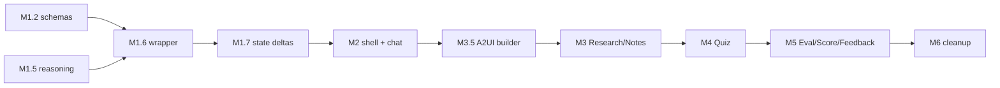

# Learning Assistant — v1 Task Breakdown

2026-09-18 · Hoan Minh Hoang · Design: [design.md](./design.md)

v1 is split into 6 milestones and 44 tasks, each small enough for one focused PR-sized change. It implements the [design doc](./design.md). Each milestone ends in one commit on `learning-assistant`.

| Convention | Rule |
| --- | --- |
| Task ID | `M<milestone>.<n>`, e.g. `M3.4` |
| Size | S ≤ 2h, M ≤ half a day, L ≤ 1 day |
| Paths | `web/` = `apps/web/`, `shared/` = `packages/shared/src/` |
| Before writing code | CopilotKit/AG-UI files: load the `copilotkit-langgraph-review` skill. Next.js files: read `node_modules/next/dist/docs/` (per `AGENTS.md`) |
| Definition of done | `pnpm lint`, `pnpm check-types` and `pnpm test` pass; the milestone's check is shown working in the browser; conventional commit message |

## M1 — Foundation: schemas, wrapper agent, runtime

Done when a chat message reaches the Supervisor running the chosen model, and a tool result produces a `STATE_DELTA` the client receives. 9 tasks.

- [ ] **M1.1** (S) Add dependencies: `vitest` (web + shared), `lucide-react`, `@ai-sdk/*` if not already pulled in, `zod-to-json-schema` or zod 4's built-in export. Add a `test` pipeline to `turbo.json`.
- [ ] **M1.2** (M) `shared/schemas/`: zod for `LearningState` plus every subagent output (`ResearchResult`, `NotesResult`, `QuizDraft`, `EvaluationFeedback`) and `Settings`. Export the types.
- [ ] **M1.3** (S) Script `shared/scripts/export-json-schema.ts` → `shared/schema/*.json`, run by `pnpm --filter @repo/shared build:schema`. Check the files in.
- [ ] **M1.4** (S) `web/constants/models.ts`: provider and model allowlist, whether each supports reasoning, defaults. `web/services/llm/providers.ts` returns only providers whose env key is set.
- [ ] **M1.5** (M) `web/services/llm/reasoning.ts`: pure mapper from effort to `providerOptions` (OpenAI effort, Anthropic budget, Gemini 3.x level vs 2.5 budget). Vitest table test.
- [ ] **M1.6** (L) `web/services/agents/supervisor-agent.ts`: `LearningSupervisorAgent extends AbstractAgent`. It reads `forwardedProps.settings`, builds the inner `BuiltInAgent` (model, `providerOptions`, `maxSteps`), passes it the trimmed state, and pipes events through.
- [ ] **M1.7** (M) `web/services/agents/state-deltas.ts`: pure function from subagent tool results to JSON Patch, plus `stage` and `status` changes. The wrapper emits the patch as `STATE_DELTA` after `TOOL_CALL_RESULT`. Vitest.
- [ ] **M1.8** (S) `web/services/agents/prompts/supervisor.ts`: Supervisor prompt covering the tools, prerequisites, autopilot rule, and the rule never to paste notes or quiz into chat.
- [ ] **M1.9** (S) Update `route.ts`: register `learning` (the wrapper) and wrap it with `A2UIMiddleware` (inject the tool, Feedback schema, `defaultCatalogId`). Add `.env.example` with all variables. Smoke test with a stub `ping` tool that writes to state.

## M2 — Shell, settings, chat, stepper

Done when the reference layout renders with a working chat, live settings sent in `forwardedProps`, and dark mode. 8 tasks.

- [ ] **M2.1** (S) `web/app/layout.tsx` + `globals.css`: Tailwind v4 `dark` variant driven by the class on `<html>`, fonts, and metadata without the Clerk mention.
- [ ] **M2.2** (S) `web/hooks/use-settings-store.ts`: zustand + `persist` to `localStorage` (wrapped in try/catch), validated with the `Settings` zod schema, defaults from `models.ts`.
- [ ] **M2.3** (S) `web/app/api/providers/route.ts` (or a server component prop) tells the client which providers have keys.
- [ ] **M2.4** (M) `web/components/settings/SettingsPopover.tsx`: provider, model, reasoning effort (disabled when unsupported), question count 3–20, learning level, theme toggle. Split from the reference header.
- [ ] **M2.5** (M) `web/components/AppShell.tsx` + `Header.tsx`: `<CopilotKit runtimeUrl agent="learning">` provider, and `properties`/`forwardedProps` fed from the settings store on each run.
- [ ] **M2.6** (M) `web/components/chat/ChatPanel.tsx`: `CopilotChat` restyled through slots and CSS to match the reference (bubbles, avatars, Online badge, input). Suggestions via `useConfigureSuggestions` that depend on `stage`.
- [ ] **M2.7** (M) `web/components/canvas/Stepper.tsx` + `CanvasShell.tsx`: six stages read from `useAgent` state; a stage unlocks when its data exists; follows `state.stage` automatically; Prev/Next; empty and skeleton states.
- [ ] **M2.8** (S) `web/components/chat/ToolProgress.tsx`: `useRenderTool` cards for each subagent tool (running / done / error), plus a Stop button that aborts the run.

## M3 — Research and Notes

Done when "research X" fills the Research stage (a fixed A2UI surface), and "make notes" and "simplify" work, including edits the user makes by hand. 8 tasks.

- [ ] **M3.1** (M) `web/services/agents/subagents/research.ts`: `generateObject` → `ResearchResult`. Uses a Tavily search when `TAVILY_API_KEY` is set, otherwise model knowledge with `sources: []`. Takes the learning level into account.
- [ ] **M3.2** (M) `notes.ts` + `simplify.ts` subagents: notes as markdown from the research; simplify for the whole set of notes or a selection (returns the rewritten selection).
- [ ] **M3.3** (M) Register the `research`, `makeNotes` and `simplify` tools in the wrapper, with settings and full state in scope. Checks prerequisites and returns an error the Supervisor can explain.
- [ ] **M3.4** (L) `web/components/a2ui/catalog.ts`: custom catalog with `extendsBasicCatalog`, plus the ArticleCard, InsightCallout, Flashcards and SourceList React components (Tailwind from the reference).
- [ ] **M3.5** (M) `shared/a2ui/templates/research.json` + `web/services/a2ui/build-surface.ts`: template + state → `createSurface`/`updateComponents`/`updateDataModel`. Vitest for the binding.
- [ ] **M3.6** (S) `web/components/canvas/stages/ResearchStage.tsx`: `A2UIProvider`/`A2UIRenderer` fed from state, re-rendered on every state change.
- [ ] **M3.7** (L) `web/components/canvas/stages/NotesStage.tsx`: markdown editor and preview, debounced `agent.setState` on edit, Original/Simplified toggle, "Simplify all" and "Simplify selection" buttons that send a message to the agent.
- [ ] **M3.8** (S) Invalidate on notes edit: clear quiz, evaluation, score and feedback, and show an "out of date" banner. Vitest for the reducer.

## M4 — Quiz, sealing, submit

Done when N questions render as a fixed A2UI surface, answers stay hidden until submit, and Submit triggers evaluation without the LLM routing it. 7 tasks.

- [ ] **M4.1** (M) `web/services/answer-key/`: `AnswerKeyStore` interface + `SealedAnswerKeyStore` (AES-GCM via `node:crypto`, key from `QUIZ_SEAL_SECRET`, random IV, quiz id as AAD). Vitest round-trip and tamper tests.
- [ ] **M4.2** (M) `quiz.ts` subagent: `generateObject` → `QuizDraft` with a `concept` tag per question and exactly 4 options. Validates the count against settings; retries once on a schema failure.
- [ ] **M4.3** (S) `generateQuiz` tool: seals the key, writes `quiz` to state without the answers, and resets `answers`, `submitted` and later stages.
- [ ] **M4.4** (M) Catalog: QuestionCard (ChoicePicker plus the result state after submit). `shared/a2ui/templates/quiz.json` with the Submit action `submit_quiz` whose context holds the answers.
- [ ] **M4.5** (M) `QuizStage.tsx`: renders the surface; each selection writes `quiz.answers` via `setState`; Submit is disabled until every question is answered; Retake clears the answers; New questions asks the agent for a new quiz.
- [ ] **M4.6** (M) Wrapper: detect `forwardedProps.a2uiAction.name === "submit_quiz"` and run the `evaluate` pipeline directly (M5.1–M5.3). The Supervisor then only writes the chat summary.
- [ ] **M4.7** (S) Security check: confirm (with a test) that no state snapshot or delta before submit contains `correctIndex` or explanations.

## M5 — Evaluation, Score, Feedback

Done when Submit leads to Evaluation (stats, mastery), then Score (tier), then Feedback (a dynamic A2UI surface), and the reflection form is sent to chat. 7 tasks.

- [ ] **M5.1** (M) `web/services/scoring.ts`: pure functions for score, per-question correctness, per-concept mastery, weakest concept, and tier (<50 Novice, <80 Practitioner, ≥80 Master). Vitest, including edge cases (0 answers, ties).
- [ ] **M5.2** (M) `evaluator.ts` subagent: explanations for each question, plus a feedback summary written from the scoring result and the notes.
- [ ] **M5.3** (M) Dynamic feedback: the Evaluator calls `render_a2ui` using only the Feedback catalog (FeedbackCard, ConceptChip, ReviewLink, NextStepList). The operations are captured into `feedback.a2uiOperations`, and a fallback plain summary is kept if rendering fails.
- [ ] **M5.4** (M) Catalog + templates for StatTiles, MasteryBars, TierBadge, ScoreCard, StatChips; `evaluation.json` and `score.json`.
- [ ] **M5.5** (M) `EvaluationStage.tsx` + `ScoreStage.tsx`: render from state; the quiz surface shows correct and incorrect answers plus explanations after submit.
- [ ] **M5.6** (M) `FeedbackStage.tsx`: the dynamic surface from `feedback.a2uiOperations`, a "Feedback ready →" card in chat, and the fixed reflection form (rating + text) that saves `reflection` and posts it to chat.
- [ ] **M5.7** (S) Autopilot and prerequisite rules checked by hand against the Supervisor prompt: "do everything on X" stops at the quiz; "quiz me" with no notes gets an explanation, not a failure.

## M6 — Cleanup and verification

Done when the repo contains only what v1 uses, and a fresh clone runs the whole flow by following the README. 5 tasks.

- [ ] **M6.1** (S) Delete `apps/docs`, `apps/web/refer-ui/` (once everything from it has moved into components), and unused `.gitkeep` files; update `pnpm-workspace.yaml` and `turbo.json` if needed.
- [ ] **M6.2** (S) New-topic reset with a human-in-the-loop confirmation (`useHumanInTheLoop`) when notes or a quiz exist; chat history is kept.
- [ ] **M6.3** (M) Error handling pass: `status.error` and Retry on each stage; a provider or key error gives a readable chat message; A2UI render failures fall back to the text summary.
- [ ] **M6.4** (S) Add `README.md` to replace the Turborepo starter text: setup, environment variables, providers, scripts, architecture summary, and a link to the design doc.
- [ ] **M6.5** (M) Run the full flow with each provider (OpenAI, Anthropic, Gemini free tier) in both light and dark mode; `pnpm lint`, `check-types` and `test` pass.

## Dependencies and risks

The critical path runs through the wrapper agent (M1.6) and the A2UI surface builder (M3.5). Everything after those two tasks reuses their patterns.

M2.1–M2.4 (layout and settings UI) can run in parallel with M1.

| Risk | Impact | Mitigation |
| --- | --- | --- |
| Wrapping `BuiltInAgent` event streams is not a documented pattern in 1.72 | M1.6 slips | Spike it first (half a day); if it's blocked, fall back to having the frontend `setState` from tool results (Q24 option c) |
| Rendering A2UI surfaces outside chat with `A2UIRenderer` behaves differently from chat rendering | M3.6 slips | Prove it with a hard-coded template in M3.5 before building the catalog |
| Capturing `render_a2ui` output into state for the canvas | M5.3 slips | Fallback: render Feedback in chat and show a link on the canvas |
| Gemini free-tier rate limits during M6.5 | Flaky manual testing | Test Gemini last; use `gemini-2.5-flash` as the backup |
| Next 16 API changes (`AGENTS.md` warning) | Rework in M2 | Read `node_modules/next/dist/docs/` before M2.1 |
