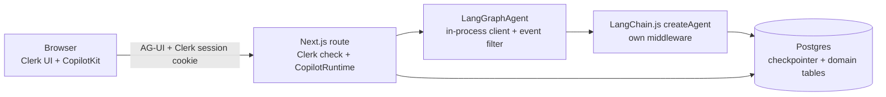

# v2 Migration Plan: single LangChain.js agent + Clerk + conversations + memory

2026-10-03 · M7 done: the migration is complete, with fixes after it (M7-9 to M7-15) · Spikes done, see [v2-spike-findings.md](./v2-spike-findings.md). Parked variant: `v2-migration-plan-python.md` (referenced earlier, not in the repo).

## 1. Goal and scope

| # | Goal | Notes |
| --- | --- | --- |
| G1 | Replace the AI SDK `BuiltInAgent` agent with a LangChain.js `createAgent` supervisor, subagents as tools | One engine only. No switch, no second agent |
| G2 | Clerk authentication | Clerk UI in the browser; the Next.js backend does the authoritative check |
| G3 | Multiple conversations | Sidebar, resume, rename, delete |
| G4 | Short-term memory | Checkpointer + summarisation |
| G5 | Long-term memory | Profile, concepts, topics, Memory panel |

Out of scope: FastAPI/Python, dual engines, pgvector, Playwright, rewriting the canvas or A2UI UI.

## 2. What exists today (facts from the code)

| Area | Today |
| --- | --- |
| Runtime | `CopilotRuntime` in `apps/web/app/api/copilotkit/[[...slug]]/route.ts`, agent id `learning`, A2UI middleware on, `injectA2UITool: false` |
| Agent | `LearningSupervisorAgent extends AbstractAgent` wrapping `BuiltInAgent` (AI SDK 6, `gpt-5.4-mini`, low reasoning), in `apps/agent` |
| Subagents | `research`, `makeMaterial`, `simplify`, `generateQuiz`, `evaluate`: each one `streamText` + `Output.object` via `generateStructured` |
| Other server tools | Chat cards, `renderSurface` (validated per catalog), `readBoardSurface`, `updateBoardSurface`, `deleteBoardSurface` |
| Frontend tools | `setTheme`, `setLayout`, `setLearningSettings`, `confirmNewTopic` (HITL), chat cards |
| App context | `useAgentContext` in `apps/web/hooks/use-display-context.ts`; the agent drops CopilotKit's A2UI entries (`dropA2UIContext`) |
| State | `LearningState` (zod, `packages/shared`); server writes via wrapper `STATE_DELTA`, client writes via `agent.setState` |
| Streaming | `draft` / `boardDraft` from partial structured output, throttled 120 ms |
| Quiz | Answer key AES-GCM-sealed in state; Submit = `forwardedProps.a2uiAction`, graded in code |
| Settings / key | Settings in localStorage → provider `properties` → `forwardedProps.settings`. BYOK OpenAI key sealed, sent as header `x-openai-key-sealed`, opened in the Next route |
| Auth / DB | None |
| AI SDK workarounds in the wrapper | `repairToolHistory`, `closeLostToolCalls`, `muteRepliesAfterCards`, `explainRunErrors`, `traceTurn` |

## 3. Target architecture

**Clerk model.** Clerk is used on both sides, and the backend is the authority:

| Side | Role |
| --- | --- |
| Browser | `ClerkProvider`, sign-in UI, user button. Only for UX; nothing in the browser is trusted |
| Next.js backend | `clerkMiddleware` plus `auth()` in every route handler and in the runtime route. It derives `userId` from the verified session, never from a request body or header the client sent |
| Agent | Receives `userId` from the Next backend only, as run `context` set by the in-process client after everything the client sent |

**Where the agent runs: H1, decided by S1.**

| Option | How | Result |
| --- | --- | --- |
| **H1 (chosen)** | In-process in the Next route. `LangGraphAgent` from `@ag-ui/langgraph` with a custom `client` that runs the compiled graph in this process | Works end to end. One auth check. Client cannot forge config or context (verified) |
| H2 | Separate LangGraph server via `LangGraphAgent({ deploymentUrl, graphId })` | Works, but browser `forwardedProps.config` overrides server config and `x-*` headers become config keys; production needs LangSmith Deployment or its self-hosted image; needs a newer langgraph than the runtime |
| H3 | Own Node service exposing the graph over AG-UI | H1's adapter behind HTTP; no gain |

**What the route adds around the agent** (all verified in the spikes):

| Piece | Why |
| --- | --- |
| In-process client (`assistants`, `threads`, `runs`: 11 methods) | H1. Picks `settings` / `a2uiAction` from the payload and puts them, the verified `userId` and the app context into run `context`. Cancels by thread for Stop |
| `input_schema` / `output_schema` keys reported by that client | Client may write only client-owned keys; sees only client-visible keys (S4) |
| AG-UI middleware on the agent: drop `RAW`, strip `rawEvent` | Otherwise all graph state and model inputs reach the browser (F-1) |
| `forwardHeaders: { deny: ["authorization"], denyPrefixes: ["x-"] }` on the runtime | Keeps browser headers out of the graph config (S8) |
| `runner: CheckpointRunner` on the runtime | Reload after a restart rebuilds messages and state from the checkpoint (S9) |

## 4. Decisions (recommendation first)

| # | Question | Recommendation |
| --- | --- | --- |
| D1 | OpenAI key | Keep BYOK, stored encrypted per Clerk user, resolved server-side by `userId`. Build `ChatOpenAI` per request with the key in the instance. **Never put the key in run `context` or `configurable`: context is recorded in every LLM trace (S8).** Or one server key if BYOK can go |
| D2 | Long-term memory storage | Typed tables written by code (matches the "drop mem0" decision). `PostgresStore` exists in JS if free-form memories are ever needed. **Done in M6**: `learner_profiles`, `concept_memories`, `topic_memories` in `@repo/db`, no store |
| D3 | Subagent shape | Each is one structured-output call inside a tool, streamed as raw text with `response_format: json_schema` + partial-JSON parsing (`withStructuredOutput` does not stream partials) |
| D4 | Answer key | Keep AES-GCM sealing in state. Safe in checkpoints and in `STATE_SNAPSHOT`; relies on the `RAW`/`rawEvent` filter for everything else |
| D5 | New topic | New conversation (design Q34); drop the `confirmNewTopic` card. **Done in M5**: `research` refuses a second topic in a conversation (`requires: "newConversation"`), and the Supervisor points the student to "New topic" |
| D6 | Migration style | Replace `apps/agent` internals in place on a branch; delete the AI SDK code when parity is reached. The in-process client and route pieces live in `apps/agent` (or `apps/web`), not in a new app |
| D7 | Existing sessions | Nothing to migrate: v1 keeps no persisted data |
| D8 | Short-term memory | Accepted: two states, full `messages` plus `summary` for agent context (E1) |
| D9 | Hosting | H1, single instance (or sticky by thread): `/connect` replay and `/stop` use in-process runner memory (F-10) |
| D10 | State ownership | Split `LearningState` into client-owned top-level keys (quiz answers, material edits and view, reflection) and server-owned keys; the schema whitelists are per top-level key, so nested client fields (today `quiz.answers`) must move up. **Done in M3, without moving fields up.** The in-process client never writes a browser key as it is: it takes the server's state from the checkpoint and applies only the edits the browser may make (`applyClientEdits`: `quiz.answers` for the quiz the server holds, the learning material's text and view, the reflection), each with what follows from it (an edit clears the quiz, changed answers on a graded quiz are a retake). The browser runs the same functions on its own copy at once (`@repo/shared/utils/client-edits`), so the canvas hooks did not change. The adapter's whitelist (`quiz`, `material`, `reflection`) only cuts the input down before that |

## 5. Work breakdown

### Spikes (done)

| # | Question | Result |
| --- | --- | --- |
| S1 | Which of H1/H2/H3 works with CopilotKit 1.72? | H1 |
| S2 | Does `copilotkitMiddleware` with JS `createAgent` work in our versions? | Yes, except `useAgentContext` never reaches the model (A12). Replaced in M5: the whole `@copilotkit/sdk-js/langgraph` entry is deprecated (M5-1) |
| S3 | How do tools stream drafts mid-tool? | `dispatchCustomEvent("manually_emit_state", fullState)`; not `copilotkitEmitState` |
| S4 | Client `agent.setState` vs checkpoint? | Client state overwrites; fixed by schema key whitelists (D10) |
| S5 | Where do `forwardedProps` arrive? | Only via our in-process client, into run `context` |
| S6 | `a2ui_operations` from a LangChain tool? Reuse `validateA2UIComponents`? | Yes, yes |
| S7 | Change model messages without writing state? | Yes, `wrapModelCall` with a declared `stateSchema` |
| S8 | Config values in checkpoints or traces? | Run `context` is in traces; key in the model instance is not |
| S9 | `PostgresSaver`, JS store? | Both work; reload needs `CheckpointRunner` |

Exit status: a tool that streams a draft, updates state and survives reload works through the real runtime handler. **Not yet verified: Clerk** (needs B1 keys) and the React client against this adapter; do both first in M1.

### A. Agent (`@repo/agent`, rewritten in place)

| # | Task |
| --- | --- |
| A1 | `generateStructured` on LangChain: `ChatOpenAI` gpt-5.4-mini, low reasoning, `useResponsesApi: true`; raw stream with `response_format: json_schema`, partial-JSON parse, zod-validate the final; abort via signal; inner calls tagged `emit-messages: false`, `emit-tool-calls: false`. **Done in M2**, same signature, so the five subagents already call it (181 partials on the research schema against the real model) |
| A2 | Supervisor `createAgent`: state schema from `LearningState` (D10 split), `SUPERVISOR_PROMPT` kept, tool names unchanged so renderers keep working. Route pieces from §3: in-process client, schema whitelists, event filter, header deny-list, `CheckpointRunner`. **Done in M2** (`apps/agent/src/services/graph`), with no server tools yet (A3, A6) and `MemorySaver` until C2. The graph is built per request (the model holds the user's key); see "Found in M2" below |
| A3 | Five subagent tools with prerequisites and state effects (stage, what each clears, `status.error`/`failed`); each returns `Command` with a `ToolMessage`. Parallel tool calls off (two writes to one key kill the run, F-7). **Done in M3** (`services/graph/tools`). The `ToolMessage` is a short summary (`ToolSummarySchemas`), not the result: the result goes to state only, so the thread no longer carries the research, the material and the quiz into every later model call |
| A4 | Quiz: keep sealing; port the quiz-security tests; no correct answer in any state or event before Submit. **Done in M3**: route-level tests search the whole event stream and the checkpoint |
| A5 | Submit routing from `a2uiAction` in run `context`: grade in code, model only explains failures. Decide what to do with the synthetic `ai`+`tool` pair the A2UI middleware appends (it holds the answers and stays in history). **Done in M3** (`quiz-submit.ts`): the first model call of a Submit run is answered by a model that only calls `evaluate`; a graded quiz ends the run there. The synthetic pair is dropped before it reaches the thread |
| A6 | Chat cards, `renderSurface`, Board read/update/delete, catalog validation, `a2ui_operations` results (verified pattern). **Done in M4** (`services/graph/tools/surface-tools.ts`): Board writes are `Command`s on `board`; their result names the view (`{ surface: { id, title, revision } }`), so the thread does not carry its components twice. The chat cards needed no change: `copilotkitMiddleware` already offers them (since M5 our own `frontendToolsMiddleware`, M5-1) |
| A7 | Card-only replies; `toolErrorMiddleware` so a failing tool does not end the run; readable run errors (`explainRunErrors` stays). Keep `repairToolHistory` (Stop leaves unanswered tool calls that OpenAI rejects). Delete only the workarounds that stop being needed. **Done in M3**: replies after a card are dropped from the stream and from message snapshots (the thread keeps them); open tool calls are answered for the model only (`answerOpenToolCalls`). The AI SDK workarounds are still in the tree, unused, until A11 |
| A8 | Draft streaming for every stage (manual state emit, throttled 120 ms) and the Board (from `TOOL_CALL_ARGS`; try a `STATE_DELTA` for `boardDraft` from the route middleware). **Stages done in M3, the Board in M4** (`services/graph/board-drafts.ts`): the event filter parses the call's `TOOL_CALL_ARGS` and sends `boardDraft` as a `STATE_DELTA`, the whole draft first and then the diff inside it |
| A9 | Call limit (`modelCallLimitMiddleware`), Stop (tools honour `config.signal`), retries. **Done in M3**: 8 model calls per run, then the run ends; Stop ends the run without an error and saves nothing of the step. Retries are the OpenAI client's defaults plus the quiz and feedback-surface retries that were already there |
| A10 | LangSmith tracing with `thread_id` and the current turn names; nothing secret in `context`. **Done in M4**: LangChain's own tracing, one trace per turn named `learning` or `learning: quiz submit`, with `thread_id` and `user_id` in the run metadata, which every step and subagent call inherits. Not seen in LangSmith yet: tracing is off in `.env` (cap) |
| A11 | Remove `ai`, `@ai-sdk/openai`, `BuiltInAgent` wrapper, and its tests when parity is confirmed. **Done in M4**, with `langsmith` as a direct dependency and the AI SDK error shape in `classifyOpenAIError` (it now reads the OpenAI SDK's `status`). Left: `ToolResultSchemas` in `@repo/shared`, the old wrapper's result format, still typing `runEvaluation` |
| A12 | App context: the in-process client passes `useAgentContext` entries as run context; the context builder renders them without CopilotKit's A2UI entries. **Done in M2**: `supervisorContextMiddleware` appends the entries and the trimmed state to the system message on each model call, and writes nothing to the thread |

**Found in M2** (all covered by route-level tests in `apps/agent/src/services/graph/__tests__`):

| # | Finding | What the code does |
| --- | --- | --- |
| M2-1 | The adapter builds each `STATE_SNAPSHOT` from the `values` chunks it has seen. The spike client sent one only at the end, so every snapshot before it held just the keys a node had written: the canvas would go blank during each run | The in-process client sends the state the run starts from first, then the graph's own `values` stream |
| M2-2 | The adapter always adds `messages` (raw LangChain messages, with provider metadata) and `tools` to the output keys, and sends a snapshot at every graph step: 17 for one chat turn | The event filter keeps only the `LearningState` keys and drops a snapshot equal to the last one sent: 1 per turn while nothing changes |
| M2-3 | The spike client passed the browser's `forwardedProps.command` on as a LangGraph `Command`, so `command.update` could write any state key, and spread `forwardedProps.config` into the run config | The client ignores `command`, `config` and `context`; it reads only `settings` and the `useAgentContext` entries |
| M2-4 | With input whitelists the adapter also drops `copilotkit` (frontend tools) and `ag-ui` (context entries) from the run input | Both are listed as input keys next to the client-writable state keys |
| M2-5 | After a `RUN_ERROR` the adapter still sends snapshots and `RUN_FINISHED` (F-9) | The event filter ends the stream at `RUN_ERROR`, after a readable chat message |
| M2-6 | Reload needs a graph to read the checkpoint, but `/connect` has no request, so no user key | The runner builds a read-only graph with a placeholder key; its model is never called |

**Found in M3**:

| # | Finding | What the code does |
| --- | --- | --- |
| M3-1 | The adapter's input whitelist is per top-level key, but nothing forces the in-process client to write what passes it | The client builds the run input itself (`createRunInput`), so client fields can stay nested (D10) and a forged key is ignored even if the whitelist lets it through |
| M3-2 | LangGraph's default of 25 steps per run counts every middleware hook; research → material → quiz hit it | `recursionLimit` 150; the cap on model calls is what bounds a run |
| M3-3 | A tool's mid-run state reaches the browser twice: as a snapshot and as a `CUSTOM` event with the same state | The event filter drops the `CUSTOM` copy |
| M3-4 | A snapshot sent mid-tool keeps being shown until the graph reports the saved state, so a draft could outlive its result | Snapshots are sent one after another, and the last one a tool sends is the state it is about to save |
| M3-5 | Stop surfaced as a run error ("This operation was aborted") when it landed during a model call | The in-process client ends a stopped run without an error event; the adapter then sends what was saved |
| M3-6 | A run error right after a successful card left its chat message muted in the next message snapshot | The mute skips the message a failed run leaves |
| M3-7 | The model trusted an old `evaluate` result in the thread over the state after the student edited the material | The state section now says it outranks earlier messages |
| M3-8 | Confirming a new topic cleared only the browser's copy of the state | The run that starts with the card's confirmed result starts from the initial state |

**Found in M4**:

| # | Finding | What the code does |
| --- | --- | --- |
| M4-1 | With the Responses API only the first and last stream events carry the response id; LangChain names every chunk in between `run-<id>`. The adapter streams a message under the chunks' id and the final `MESSAGES_SNAPSHOT` holds the saved `resp_` id, so the browser drops the streamed message and appends the saved one at the end: below a chat surface drawn after it | `createChatModel` builds a `ChatOpenAIResponses` subclass that gives every chunk the response id (`withResponseId`). `ChatOpenAI` cannot be extended for this: it hands Responses calls to an inner model of its own |
| M4-2 | Between the model call and the tool, the adapter sends snapshots without the Board draft, so the canvas would blank the draft before the view arrives | The event filter keeps the draft in every snapshot that still holds the Board it started on, until the view lands, the call fails, or the run ends |
| M4-3 | A delta changes the browser's state without a snapshot, so the next snapshot can equal the last one sent and be dropped | The repeated-snapshot filter forgets the last snapshot after a delta |
| M4-4 | Each model call is its own assistant message, so `readBoardSurface` (no card) left an empty avatar before the edit's card | The chat draws no turn whose tool calls all have no card (`TOOLS_WITHOUT_CARD`) |

**Found in M5**:

| # | Finding | What the code does |
| --- | --- | --- |
| M5-1 | `@copilotkit/sdk-js/langgraph` is deprecated as a whole since 1.68.2, `copilotkitMiddleware` included, with "no 1:1 v2 replacement" | `frontendToolsMiddleware` (`services/graph/frontend-tools.ts`) does the three things we used: offers the run's frontend tools to the model, takes their calls out of the message so the run ends, and puts them back when it ends. `@copilotkit/sdk-js` and the `@ag-ui/langgraph` override are gone (one copy, 0.0.43) |
| M5-2 | Other deprecated APIs in use: LangChain's `message.getType()`, React's `FormEvent`. ESLint here uses the Babel parser and cannot see deprecations | `.type` and `SubmitEvent`. A TypeScript language-service check (suggestion diagnostics with `reportsDeprecated`) now finds none in the four packages |
| M5-3 | An explicit `threadId` makes `CopilotChat` hide its welcome screen and `/connect`; a non-explicit one only clears the messages, not the state | `ConversationThread` passes a started conversation as explicit (the checkpoint comes back) and a new one as not (welcome screen, no request). Switching clears the agent's messages and state first, so the canvas never shows the last conversation |
| M5-4 | The browser sends the whole thread on every run, so its last user message is not necessarily new | `findUserText` skips messages the checkpoint already holds; a Submit press has none |
| M5-5 | The M1 guard let the first run claim any thread id it named | A thread is a conversation made by `POST /api/conversations`; any other id gets 404 on every runtime route. "New topic" reuses the one conversation not started yet |
| M5-6 | Thread ids come from the browser; a non-uuid makes Postgres throw on the `uuid` column | The repositories check the id first and answer "not found" |
| M5-7 | A stage completes in the checkpoint before its row is written | A failed write is logged and the stage still counts; the checkpoint stays the source for resume |
| M5-8 | Tools see the thread only in `runtime.config.configurable.thread_id` | `runSubagentStep` reads it there and passes it to the step's `record` |

Not done in M5: `/conversations/[id]/state` and `/messages` (reload goes through `/connect`; History page in M7), `PATCH /attempts/[id]/answers` (draft answers live only until the next run), writing `reflections`, and the student's own material edits in `material` (only tool output is written). Runs still take settings from `forwardedProps` (validated), not from `user_settings`.

### B. Clerk (Next.js backend is the authority)

| # | Task |
| --- | --- |
| B1 | Clerk app and env vars (`NEXT_PUBLIC_CLERK_PUBLISHABLE_KEY`, `CLERK_SECRET_KEY`, webhook secret) |
| B2 | `ClerkProvider`, sign-in/sign-up pages, user button in Header |
| B3 | `proxy.ts` (Next 16's name for middleware) runs `clerkMiddleware()` only to make the session readable; it checks nothing (Clerk now advises against route protection there and deprecated `createRouteMatcher`). Pages call `requireSignedInUser`, route handlers go through `withSignedInUser` (401), server actions check `getSignedInUserId` |
| B4 | The runtime route builds the agent per request with the verified `userId` as trusted run context; the client cannot supply or override it |
| B5 | ~~Agent service reachable only from Next~~ Not needed with H1 |
| B6 | Lazy user row on first request; Clerk webhook `user.deleted` (signature verified) cascades conversations, checkpoints, memory, stored key. **Done in M5** (`services/users.ts`, `services/clerk-webhook.ts`); memory cascades with the user row since M6. A stored key does not exist yet |
| B7 | Thread ownership: look up a client `thread_id` in `conversations` for this user before any run, `/connect`, `/stop`, read or delete. Never trust it as is. **Interim done in M1** (`features/threads`): the runtime's own thread endpoints (list, messages, events, state, `/connect`, `/stop`, and `threads/clear`, which wiped every user's threads) knew no users; runtime hooks now keep an in-memory owner per thread, answer 404 for anyone else and filter the list. **Done in M5** (`features/conversations`): owners come from `conversations`, and a thread no conversation has is a 404 too |
| B8 | Rate limits per user id. **Done in M5**: 20 runs and 60 changes per minute, in process memory (D9) |
| B9 | Decide the BYOK page's fate (D1) |
| B10 | Auth tests: no session → 401 on every route, other user's thread → 404, deleted user. **Done**: route tests since M1/M5, and in M7 page tests (`app/__tests__/pages.test.ts`): every page sends a signed-out visitor to sign in, `/history` shows only the session user's topics and nothing to a deleted user's still-valid session |

### C. Persistence and conversations

| # | Task |
| --- | --- |
| C1 | Postgres + migrations (drizzle or similar). Tables from design.md: `users`, `user_settings`, `conversations`, `research`, `material`, `quiz_attempts`, `reflections`. **Done in M5**: `@repo/db` (drizzle), Postgres 16 in `docker-compose.yml`, `pnpm db:migrate`; PGlite runs the same migrations in tests |
| C2 | Checkpointer tables via `PostgresSaver.setup()` (idempotent, run at boot). **Done in M5** (`apps/web/instrumentation.ts`); the `MemorySaver` is gone |
| C3 | Domain rows written by tool bodies when a stage completes, from the tool's own output, never from round-tripped client state. **Done in M5** (`LearningRecords`, injected; M5-7, M5-8) |
| C4 | Route handlers: `GET/POST/PATCH/DELETE /api/conversations`, `/conversations/[id]/state`, `/messages`, `/attempts`, `PATCH /attempts/[id]/answers` (debounced, no agent run). Reload of the open thread goes through `/connect` + `CheckpointRunner`. **Done in M5** except `/state`, `/messages` and the answers `PATCH` |
| C5 | Auto-title; status rules (active, completed, abandoned computed on read). **Done in M5**: titled as soon as the first message is sent: the message, cut, at once, then a short summary of it from `POST /api/conversations/[id]/title`; then by the research unless renamed |
| C6 | Delete: rows cascade + `checkpointer.deleteThread(id)`, then recompute memory. **Done in M5**; since M6 the delete also drops the topic and rebuilds concept mastery in the same transaction |
| C7 | Settings move to `user_settings`; localStorage stays as first-paint cache. **Done in M5** (`useSettingsSync`) |

### FE. Frontend

| # | Task |
| --- | --- |
| FE1 | Conversation sidebar with search, rename, delete confirmation, status and score badges. **Done in M5** |
| FE2 | Switching conversation: `threadId`, load state and messages, resume banner. **Done in M5** (M5-3) |
| FE3 | Remove `confirmNewTopic` HITL; "New topic" creates a conversation. **Done in M5** |
| FE4 | Re-check hooks against the D10 state split: Submit, material edits, reflection, suggestions. **Done in M7**: Submit after a Retake with the same answers (M7-1), a material edit a quick run missed (M7-2), a suggestion D5 refuses (M7-3); the reflection hook needed no change. Message ids come from `uuid` |
| FE5 | Memory panel; History/Progress page last. **Done in M7**: Settings → Memory (`/memory`) shows the profile, concepts and topics; the profile is edited in a form that sends only changed fields, and each field, concept or topic can be forgotten after a confirmation step. The header's Progress (`/history`) is server-rendered from `quiz_attempts` (`getLearningHistory`): per topic the latest and best score, a chart of every attempt, the latest attempt's concept mastery, and Retake (`/?retake=<id>`, M7-4) |

### E. Memory

| # | Task |
| --- | --- |
| E1 | Two message states per thread. `messages`: full history, append only, never trimmed (UI, resume, memory extraction). `summary` + `summarizedUpTo`: rolling summary of older messages, used only to build the agent's context; server-only (not in the output keys). **Done in M6**: both are graph state keys (`schemas/graph.ts`), not `LearningState` keys, so no snapshot or reload carries them |
| E1a | Context builder in `wrapModelCall` (declares `summary`/`summarizedUpTo` in its `stateSchema`): system prompt + `summary` + messages after `summarizedUpTo` verbatim + trimmed state + app context; repairs unanswered tool calls. Does not write back to `messages`. Not the built-in summarisation middleware, which removes messages. **Done in M6** in `supervisorContextMiddleware`: prompt, then memory, summary, app context, state (least changing first) |
| E1b | Summariser: runs after the turn when unsummarised tokens pass a budget; small model; folds the old summary and the new chunk into one; never cuts between a tool call and its results; keeps the current turn whole. **Done in M6** (`conversationSummaryMiddleware`, `afterAgent`): over 3,000 estimated tokens it folds everything before the last 3 turns, cutting only at a student's message; a failed fold is logged and retried next turn. The model is `OPENAI_MODEL` (already the mini) |
| E1c | Summary is data: excludes quiz answers (including the synthetic Submit messages), prompt marks it as a record, not instructions. **Done in M6**: the transcript drops any surface action, the summariser is told never to write answers, and the Supervisor reads it under "Earlier in this conversation" as a record |
| E2 | Long-term profile (level, style, language): extracted after a run, user-editable. **Done in M6**: after each run with a student message, one silent structured call notes what the message says (`learnProfile`); only changed, non-null fields are saved. Editable with `PATCH /api/memory` |
| E3 | Concepts and topics: written by code after each submitted attempt. **Done in M6** inside `recordEvaluation`'s transaction: concept correct/total counts (normalised names) and the conversation's topic with best/latest score |
| E4 | Read once per turn, rendered into the prompt within a token cap; stored memory treated as data, not instructions. **Done in M6**: the in-process client reads it into run context (`memory`); the prompt gets the profile, up to 5 concepts under 70% and 5 recent topics within 1,200 characters, one line each. The Quiz Agent also gets up to 3 weak concepts and spends about a fifth of the questions on them when the material covers them (design.md) |
| E5 | Memory panel API, delete, recompute on conversation delete. **Done in M6** (API only; the panel is FE5): `GET /api/memory`, `PATCH /api/memory`, `DELETE /api/memory/[kind]/[id]` for a profile field, a concept or a topic |
| E6 | Tests: no cross-user leakage; deleted memory never reaches the prompt; `messages` is never mutated by summarising; boundary never splits a tool call from its result; summary is idempotent when rerun. **Done in M6**: route-level (`conversation-summary.test.ts`, `long-term-memory.test.ts`), unit (`utils/__tests__/conversation-summary.test.ts`, `student-memory.test.ts`), PGlite (`@repo/db` `memory.test.ts`) and web route tests (`app/api/memory`) |

**Found in M6**:

| # | Finding | What the code does |
| --- | --- | --- |
| M6-1 | `createAgent` routes every way a run ends (a reply, a frontend tool, the call cap) through the `afterAgent` hooks; only Stop skips them | The summary is folded in `afterAgent`, so it is saved in the run's own checkpoint and never races a later run. The cost: when the budget is passed, `RUN_FINISHED` waits for the fold (the reply has already streamed) |
| M6-2 | Memory in graph state would be checkpointed: a deleted memory would stay in every old checkpoint, and in the next run until refreshed | Memory goes in run `context`, read once per run by the in-process client. Context is in traces; this is learning data, not a secret (unlike the key, D1) |
| M6-3 | Profile learning needs a model call, and the adapter sends `RUN_FINISHED` only when the client's stream ends | The client starts it after the run is saved and does not wait for it (D9: one process). Without a `memory` the agent reads and learns nothing, so tests with one scripted model see no extra calls |
| M6-4 | `quiz_attempts` keeps each concept's percent, not per-question results | Concept counts come from questions + mastery (`countConceptResults`, shared), both when an attempt is graded and when a delete rebuilds them, so the two never disagree |
| M6-5 | A rebuild from the remaining attempts would bring back a concept the student deleted | The rebuild only updates or drops concepts that still exist; a new graded attempt can add it again |
| M6-6 | A null from the profile learner means "nothing new"; a null in `PATCH` means "forget it" | `toProfileUpdate` drops nulls and unchanged fields; `ProfileUpdateSchema` keeps null as forget |
| M6-7 | One existing test (nine Board turns, about 3 s alone) passed Vitest's 5 s default under the turbo run's parallel load | It has a 15 s timeout |
| M6-8 | `apps/web/.env` had no `DATABASE_URL` | Added locally (gitignored) from `.env.example` |
| M6-9 | A `next dev` started before M5 kept M2's `MemorySaver` under the same `globalThis` key (`__learningThreadCheckpointer`), and `??=` kept it through every reload: that server never checkpointed to Postgres, while the domain rows did land | Restarted the dev server. Restart `next dev` after a change to what a `globalThis` key holds |

Not done in M6: the Memory panel and History page (FE5, M7); a profile field the student set can be overwritten by what a later message says. Topics are remembered only once a quiz is graded.

**Found in M7**:

| # | Finding | What the code does |
| --- | --- | --- |
| M7-1 | The server read a retake only from changed answers, so Retake and then the same answers again left the quiz graded, and Submit failed with "already submitted" | A graded quiz the browser sends back as not submitted is a retake too (`applyAnswers`). The browser can undo a grade this way, never make one |
| M7-2 | A material edit reached the state 600 ms after the last keystroke; a run started sooner (a suggestion) went without it, and the run's snapshots then overwrote it | The editor also saves a waiting edit when it loses focus, which happens before any click elsewhere |
| M7-3 | The Feedback stage's "Start a new topic" suggestion asked for what D5 makes Research refuse | Replaced with two follow-ups on the graded quiz |
| M7-4 | A reload replayed the checkpoint twice, and the second replay brought the graded quiz back after a retake was applied. Traced after M7 (M7-9) | A Retake from the Progress page holds for that quiz and is applied again after any later replay, until the student picks an answer or another quiz arrives; opening another conversation in the sidebar drops it |
| M7-5 | Two more route-level tests and one PGlite `beforeEach` crossed Vitest's defaults under turbo's parallel load (with `next dev` running) | 15 s test and 30 s hook timeouts in the agent, db and web Vitest configs; M6-7's per-test timeout is gone |
| M7-6 | A chart in an SVG `viewBox` scales its text with the card: 16 px labels on a wide card, 6 px on a narrow one | The chart measures its card (`useElementWidth`) and is drawn at that width |
| M7-7 | Importing `app/page.tsx` in a test pulls in CopilotKit's CSS, which Node cannot load | The page tests mock `AppShell` and read the props the page gives it |
| M7-8 | The M6 browser check left test values in the profile | Forgotten through the new Memory panel, which tested `DELETE` and `PATCH` |

Fixed after M7 (2026-10-03):

| # | Finding | What the code does |
| --- | --- | --- |
| M7-9 | The docked chat and the popup are both always mounted, and every `CopilotChat` with an explicit thread connects on mount: each reload and switch replayed the thread twice, in production too | Each chat has its own `ConversationThread`; only the docked one, which never unmounts, may connect. The popup gets the same thread, never as explicit, and shows the shared agent. The flag cannot be turned off below a provider that sets it, so no provider wraps both. One `/connect` per load and per switch |
| M7-10 | Without a provider around the workspace, `agent.threadId` is a random id until the docked chat's effect moves it, so the Retake hook read the mismatch as a switch and dropped the request | The Retake hook waits for the thread; the sidebar ends a pending Retake when another conversation opens. The draft-answers hook keys on the open conversation, not `agent.threadId` |
| M7-11 | A profile field the student set could be overwritten by what a later message said (M6) | `learner_profiles.student_fields` (migration `0002_student_profile_fields`): `saveLearnerProfile(…, "student")` marks a field, `null` unmarks it; `"agent"` writes skip marked fields |
| M7-12 | Picked answers lived only in the browser until the next run: a reload or a switch lost them (`PATCH /attempts/[id]/answers` was not built, M5) | `GET`/`PUT /api/conversations/[id]/answers` keep them in the quiz's open attempt; a pick on a graded quiz opens the retake's attempt, which grading closes. `useDraftAnswers` saves 800 ms after a pick (never during a run) and restores once the state is back, unless the student picked since or came from a Progress Retake |
| M7-13 | `ToolResultSchemas` (the old wrapper's result format) still typed `runEvaluation` (A11) | Removed; `runEvaluation` returns the agent's own `EvaluationResult` |
| M7-14 | A `next dev` that ran through many branch checkouts kept stale server modules: the new answers route answered an empty 500 while the same code returned 200 against the same database | Restarted the dev server (as in M6-9) |
| M7-15 | The Memory panel kept an empty notice line and squeezed concept names next to their counts on narrow screens | The notice takes no space when empty; a concept's name has its own line, its count sits by the meter |

The "HTTP status codes" conversation whose row says Quiz while its checkpoint holds only a Board view dates from M6-9: its research, material and graded attempt were recorded while checkpoints went to the old `MemorySaver`. Stale local data, not a code path; deleting the conversation clears it.

Not done: the student's own material edits to `material` (M5; the checkpoint keeps them, and nothing reads those rows yet); B9 (BYOK page) is undecided; a forgotten memory has no undo.

### F. Testing and docs

| # | Task |
| --- | --- |
| F1 | Vitest with a scripted fake chat model for the agent (pattern in `spikes/v2/src/scripted-model.ts`; stream tool name and args in separate chunks). **Done** since M2 (`ScriptedModel`, `runtime-harness.ts`, `scripted-agents.ts`) |
| F2 | Keep pure-logic tests (scoring, sealing, state rules); rewrite wrapper-level tests; drop tests that only guarded AI SDK quirks. **Done** (A11 in M4); nothing in the tests mentions the AI SDK |
| F3 | Update design.md v2 section and decision log; README setup for Clerk and Postgres. **Done in M7**: design.md's v2 section describes what was built (Q47–Q56 for D1–D10 and the Progress page); README has Clerk and Postgres setup step by step, the Memory panel and Progress page, and the v2 architecture |
| F4 | Route-level tests from the spikes: no `RAW`/`rawEvent`/server-only keys in the stream, client cannot write server keys, no key in traces. **Done in M7** (`stream-security.test.ts`, `in-process-client.test.ts`): research → material → quiz, a Submit and a reload, with long-term memory loaded, send no raw event, no server-only key in a snapshot or delta, and none of the key, the memory, the prompt or the graph's own keys; no traced step holds the key. The client-write tests were already there (M2, M3) |

## 6. Suggested order

| Milestone | Contains | Done when |
| --- | --- | --- |
| M0 | Spikes, decisions D1–D10 | Done except Clerk (findings in v2-spike-findings.md) |
| M1 | B1–B4, B10 | Sign-in required; every route checks the session on the backend |
| M2 | A1–A2, A12 | A chat message runs through the LangChain agent end to end, in the browser. **Done.** Until M3 the Supervisor has only the frontend tools: research, learning material, the quiz, cards and the Board are off on this branch |
| M3 | A3–A5, A7–A9 | Research → Score works with quiz security and streaming. **Done**, in the browser too: research, learning material, quiz, Submit, score and feedback, retake, an edit of the material, a new topic, Stop. Cards and the Board are still off (M4) |
| M4 | A6, A10 | Cards, Board, tracing at parity; then A11 removes the AI SDK code. **Done**, in the browser too: concept and comparison cards, a chat surface, a Board view streamed and saved, an edit, a removal, and research on the new model class |
| M5 | C1–C7, FE1–FE3, B6–B8 | Multiple conversations, resume, delete. **Done**, in the browser too: three conversations, switching and a reload after a server restart restore chat, canvas and Board, rename, delete (rows and checkpoints), and another user's conversation answers 404 on every route |
| M6 | E1–E6 | Short- and long-term memory. **Done**, in the browser too: with the summary budget lowered for the check, a first message set the profile (beginner, analogies), a Vietnamese one added the language and the replies followed both; Autopilot and a Submit wrote four concepts and the topic; a later turn folded the first two into a Vietnamese summary without answers, `messages` kept all 15, the Supervisor answered from the summary, and a replay of every run carried none of it; deleting the conversation removed its checkpoints, topic and concepts and kept the profile |
| M7 | FE4–FE5, F | History page, tests, docs. **Done**, in the browser too: the profile's M6 test values forgotten and cleared in the Memory panel; a quiz graded, its topic on the Progress page with its concepts in Memory; Retake from Progress opened the conversation at an empty quiz; the same answers submitted again were graded (attempt 2 on the chart); both pages fit a 375 px phone |

## 7. Risks

| Risk | Impact | Mitigation |
| --- | --- | --- |
| The in-process client is our code against `@ag-ui/langgraph` internals (11 SDK methods, event shapes) | An adapter upgrade can break the agent | Pin `@ag-ui/langgraph`; route-level tests (F4); keep the client small |
| `useAgentContext` does not reach the model via the frontend tools middleware | Agent blind to what is on screen | A12 |
| No dual engine means no fallback if parity is late | Regression for users | Work on a branch; merge only at parity; keep the old code in git history |
| Full-state `STATE_SNAPSHOT` on every draft emit (no deltas) | Bigger streams as Board and material grow | Throttle; keep drafts small. Measured in M3 against the real model: research → material → quiz in one run sent 45 snapshots, about 260 KB with the adapter's duplicate `CUSTOM` events, which are now dropped (not re-measured; roughly half). If the Board makes this too big in M4, send deltas from the event filter. M4: Board drafts are deltas (diffs inside the draft); a saved view still goes out in full snapshots |
| A stale browser overwrites newer learning material (a dropped stream, then an edit) | A simplify result lost, the quiz cleared | The browser's material is taken as an edit whenever its text differs. Add a revision the browser must echo if this shows up |
| Browser receives all graph state via `RAW`/`rawEvent` | Server-only data and model inputs leak | Route filter (verified); F4 test |
| Client state overwrites the checkpoint | Edits lost or server keys forged | D10 + schema whitelists (verified) |
| Reload and Stop bound to one process | Blank thread or ignored Stop on another instance | D9; `CheckpointRunner` for reload |
| Full history grows in the checkpoint and in each `MESSAGES_SNAPSHOT` | Larger checkpoints and streams over time | Fine at this scale; cap or archive old threads later |
| Summary drifts or drops facts | Agent forgets earlier details | Rolling summary refreshed from the old summary plus the new chunk; recent messages stay verbatim |
| Profile learning is one model call per student message | Cost on the user's key | Small structured call, after the run; gate it (e.g. only messages over a few words, or reflections) if it shows in usage |
| Memory text in the prompt (stored from the student's own words) | Prompt injection across conversations | One line per item, under a heading marked as data, capped at 1,200 characters; the student can see and delete all of it |
| Cross-user thread access (the runtime's thread endpoints are unscoped) | Data leak | Interim B7 guard (M1, tested with two users) → `conversations` in M5; B10 |
| User key in traces | Secret leak | D1: key only inside the model instance (verified not in traces) |
| Two copies of `@ag-ui/langgraph` (0.0.42 via sdk-js, 0.0.43 via runtime) | Subtle mismatches | Resolved in M5: `@copilotkit/sdk-js` removed, one copy without an override |
| LangSmith trace cap already hit once | No tracing | Sample the traces: `LANGSMITH_TRACING_SAMPLING_RATE` (0–1) is read by `langsmith` itself |

## 8. Design doc changes this implies

- Add decisions Q47+ for D1–D10.
- Replace "LangGraph + FastAPI" in the v2 section with "LangChain.js `createAgent` run in-process in the Next route via `LangGraphAgent` + own client; Next.js backend as the Clerk authority".
- Q30/Q34: new topic always creates a new conversation.
