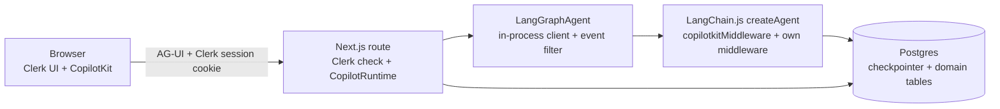

# v2 Migration Plan: single LangChain.js agent + Clerk + conversations + memory

2026-09-30 · Spikes done, see [v2-spike-findings.md](./v2-spike-findings.md). Parked variant: `v2-migration-plan-python.md` (referenced earlier, not in the repo).

## 1. Goal and scope

| # | Goal | Notes |
| --- | --- | --- |
| G1 | Replace the AI SDK `BuiltInAgent` agent with a LangChain.js `createAgent` supervisor, subagents as tools | One engine only. No switch, no second agent |
| G2 | Clerk authentication | Clerk UI in the browser; the Next.js backend does the authoritative check |
| G3 | Multiple conversations | Sidebar, resume, rename, delete |
| G4 | Short-term memory | Checkpointer + summarisation |
| G5 | Long-term memory | Profile, concepts, topics, Memory panel |

Out of scope: FastAPI/Python, dual engines, pgvector, Playwright, rewriting the canvas or A2UI UI.

## 2. What exists today (facts from the code)

| Area | Today |
| --- | --- |
| Runtime | `CopilotRuntime` in `apps/web/app/api/copilotkit/[[...slug]]/route.ts`, agent id `learning`, A2UI middleware on, `injectA2UITool: false` |
| Agent | `LearningSupervisorAgent extends AbstractAgent` wrapping `BuiltInAgent` (AI SDK 6, `gpt-5.4-mini`, low reasoning), in `apps/agent` |
| Subagents | `research`, `makeMaterial`, `simplify`, `generateQuiz`, `evaluate`: each one `streamText` + `Output.object` via `generateStructured` |
| Other server tools | Chat cards, `renderSurface` (validated per catalog), `readBoardSurface`, `updateBoardSurface`, `deleteBoardSurface` |
| Frontend tools | `setTheme`, `setLayout`, `setLearningSettings`, `confirmNewTopic` (HITL), chat cards |
| App context | `useAgentContext` in `apps/web/hooks/use-display-context.ts`; the agent drops CopilotKit's A2UI entries (`dropA2UIContext`) |
| State | `LearningState` (zod, `packages/shared`); server writes via wrapper `STATE_DELTA`, client writes via `agent.setState` |
| Streaming | `draft` / `boardDraft` from partial structured output, throttled 120 ms |
| Quiz | Answer key AES-GCM-sealed in state; Submit = `forwardedProps.a2uiAction`, graded in code |
| Settings / key | Settings in localStorage → provider `properties` → `forwardedProps.settings`. BYOK OpenAI key sealed, sent as header `x-openai-key-sealed`, opened in the Next route |
| Auth / DB | None |
| AI SDK workarounds in the wrapper | `repairToolHistory`, `closeLostToolCalls`, `muteRepliesAfterCards`, `explainRunErrors`, `traceTurn` |

## 3. Target architecture

**Clerk model.** Clerk is used on both sides, and the backend is the authority:

| Side | Role |
| --- | --- |
| Browser | `ClerkProvider`, sign-in UI, user button. Only for UX; nothing in the browser is trusted |
| Next.js backend | `clerkMiddleware` plus `auth()` in every route handler and in the runtime route. It derives `userId` from the verified session, never from a request body or header the client sent |
| Agent | Receives `userId` from the Next backend only, as run `context` set by the in-process client after everything the client sent |

**Where the agent runs: H1, decided by S1.**

| Option | How | Result |
| --- | --- | --- |
| **H1 (chosen)** | In-process in the Next route. `LangGraphAgent` from `@ag-ui/langgraph` with a custom `client` that runs the compiled graph in this process | Works end to end. One auth check. Client cannot forge config or context (verified) |
| H2 | Separate LangGraph server via `LangGraphAgent({ deploymentUrl, graphId })` | Works, but browser `forwardedProps.config` overrides server config and `x-*` headers become config keys; production needs LangSmith Deployment or its self-hosted image; needs a newer langgraph than the runtime |
| H3 | Own Node service exposing the graph over AG-UI | H1's adapter behind HTTP; no gain |

**What the route adds around the agent** (all verified in the spikes):

| Piece | Why |
| --- | --- |
| In-process client (`assistants`, `threads`, `runs`: 11 methods) | H1. Picks `settings` / `a2uiAction` from the payload and puts them, the verified `userId` and the app context into run `context`. Cancels by thread for Stop |
| `input_schema` / `output_schema` keys reported by that client | Client may write only client-owned keys; sees only client-visible keys (S4) |
| AG-UI middleware on the agent: drop `RAW`, strip `rawEvent` | Otherwise all graph state and model inputs reach the browser (F-1) |
| `forwardHeaders: { deny: ["authorization"], denyPrefixes: ["x-"] }` on the runtime | Keeps browser headers out of the graph config (S8) |
| `runner: CheckpointRunner` on the runtime | Reload after a restart rebuilds messages and state from the checkpoint (S9) |

## 4. Decisions (recommendation first)

| # | Question | Recommendation |
| --- | --- | --- |
| D1 | OpenAI key | Keep BYOK, stored encrypted per Clerk user, resolved server-side by `userId`. Build `ChatOpenAI` per request with the key in the instance. **Never put the key in run `context` or `configurable`: context is recorded in every LLM trace (S8).** Or one server key if BYOK can go |
| D2 | Long-term memory storage | Typed tables written by code (matches the "drop mem0" decision). `PostgresStore` exists in JS if free-form memories are ever needed |
| D3 | Subagent shape | Each is one structured-output call inside a tool, streamed as raw text with `response_format: json_schema` + partial-JSON parsing (`withStructuredOutput` does not stream partials) |
| D4 | Answer key | Keep AES-GCM sealing in state. Safe in checkpoints and in `STATE_SNAPSHOT`; relies on the `RAW`/`rawEvent` filter for everything else |
| D5 | New topic | New conversation (design Q34); drop the `confirmNewTopic` card |
| D6 | Migration style | Replace `apps/agent` internals in place on a branch; delete the AI SDK code when parity is reached. The in-process client and route pieces live in `apps/agent` (or `apps/web`), not in a new app |
| D7 | Existing sessions | Nothing to migrate: v1 keeps no persisted data |
| D8 | Short-term memory | Accepted: two states, full `messages` plus `summary` for agent context (E1) |
| D9 | Hosting | H1, single instance (or sticky by thread): `/connect` replay and `/stop` use in-process runner memory (F-10) |
| D10 | State ownership | Split `LearningState` into client-owned top-level keys (quiz answers, material edits and view, reflection) and server-owned keys; the schema whitelists are per top-level key, so nested client fields (today `quiz.answers`) must move up. **Done in M3, without moving fields up.** The in-process client never writes a browser key as it is: it takes the server's state from the checkpoint and applies only the edits the browser may make (`applyClientEdits`: `quiz.answers` for the quiz the server holds, the learning material's text and view, the reflection), each with what follows from it (an edit clears the quiz, changed answers on a graded quiz are a retake). The browser runs the same functions on its own copy at once (`@repo/shared/utils/client-edits`), so the canvas hooks did not change. The adapter's whitelist (`quiz`, `material`, `reflection`) only cuts the input down before that |

## 5. Work breakdown

### Spikes (done)

| # | Question | Result |
| --- | --- | --- |
| S1 | Which of H1/H2/H3 works with CopilotKit 1.72? | H1 |
| S2 | Does `copilotkitMiddleware` with JS `createAgent` work in our versions? | Yes, except `useAgentContext` never reaches the model (A12) |
| S3 | How do tools stream drafts mid-tool? | `dispatchCustomEvent("manually_emit_state", fullState)`; not `copilotkitEmitState` |
| S4 | Client `agent.setState` vs checkpoint? | Client state overwrites; fixed by schema key whitelists (D10) |
| S5 | Where do `forwardedProps` arrive? | Only via our in-process client, into run `context` |
| S6 | `a2ui_operations` from a LangChain tool? Reuse `validateA2UIComponents`? | Yes, yes |
| S7 | Change model messages without writing state? | Yes, `wrapModelCall` with a declared `stateSchema` |
| S8 | Config values in checkpoints or traces? | Run `context` is in traces; key in the model instance is not |
| S9 | `PostgresSaver`, JS store? | Both work; reload needs `CheckpointRunner` |

Exit status: a tool that streams a draft, updates state and survives reload works through the real runtime handler. **Not yet verified: Clerk** (needs B1 keys) and the React client against this adapter; do both first in M1.

### A. Agent (`@repo/agent`, rewritten in place)

| # | Task |
| --- | --- |
| A1 | `generateStructured` on LangChain: `ChatOpenAI` gpt-5.4-mini, low reasoning, `useResponsesApi: true`; raw stream with `response_format: json_schema`, partial-JSON parse, zod-validate the final; abort via signal; inner calls tagged `emit-messages: false`, `emit-tool-calls: false`. **Done in M2**, same signature, so the five subagents already call it (181 partials on the research schema against the real model) |
| A2 | Supervisor `createAgent`: state schema from `LearningState` (D10 split), `SUPERVISOR_PROMPT` kept, tool names unchanged so renderers keep working. Route pieces from §3: in-process client, schema whitelists, event filter, header deny-list, `CheckpointRunner`. **Done in M2** (`apps/agent/src/services/graph`), with no server tools yet (A3, A6) and `MemorySaver` until C2. The graph is built per request (the model holds the user's key); see "Found in M2" below |
| A3 | Five subagent tools with prerequisites and state effects (stage, what each clears, `status.error`/`failed`); each returns `Command` with a `ToolMessage`. Parallel tool calls off (two writes to one key kill the run, F-7). **Done in M3** (`services/graph/tools`). The `ToolMessage` is a short summary (`ToolSummarySchemas`), not the result: the result goes to state only, so the thread no longer carries the research, the material and the quiz into every later model call |
| A4 | Quiz: keep sealing; port the quiz-security tests; no correct answer in any state or event before Submit. **Done in M3**: route-level tests search the whole event stream and the checkpoint |
| A5 | Submit routing from `a2uiAction` in run `context`: grade in code, model only explains failures. Decide what to do with the synthetic `ai`+`tool` pair the A2UI middleware appends (it holds the answers and stays in history). **Done in M3** (`quiz-submit.ts`): the first model call of a Submit run is answered by a model that only calls `evaluate`; a graded quiz ends the run there. The synthetic pair is dropped before it reaches the thread |
| A6 | Chat cards, `renderSurface`, Board read/update/delete, catalog validation, `a2ui_operations` results (verified pattern) |
| A7 | Card-only replies; `toolErrorMiddleware` so a failing tool does not end the run; readable run errors (`explainRunErrors` stays). Keep `repairToolHistory` (Stop leaves unanswered tool calls that OpenAI rejects). Delete only the workarounds that stop being needed. **Done in M3**: replies after a card are dropped from the stream and from message snapshots (the thread keeps them); open tool calls are answered for the model only (`answerOpenToolCalls`). The AI SDK workarounds are still in the tree, unused, until A11 |
| A8 | Draft streaming for every stage (manual state emit, throttled 120 ms) and the Board (from `TOOL_CALL_ARGS`; try a `STATE_DELTA` for `boardDraft` from the route middleware). **Stages done in M3; the Board part moves to M4 with its tools (A6)** |
| A9 | Call limit (`modelCallLimitMiddleware`), Stop (tools honour `config.signal`), retries. **Done in M3**: 8 model calls per run, then the run ends; Stop ends the run without an error and saves nothing of the step. Retries are the OpenAI client's defaults plus the quiz and feedback-surface retries that were already there |
| A10 | LangSmith tracing with `thread_id` and the current turn names; nothing secret in `context` |
| A11 | Remove `ai`, `@ai-sdk/openai`, `BuiltInAgent` wrapper, and its tests when parity is confirmed |
| A12 | App context: the in-process client passes `useAgentContext` entries as run context; the context builder renders them without CopilotKit's A2UI entries. **Done in M2**: `supervisorContextMiddleware` appends the entries and the trimmed state to the system message on each model call, and writes nothing to the thread |

**Found in M2** (all covered by route-level tests in `apps/agent/src/services/graph/__tests__`):

| # | Finding | What the code does |
| --- | --- | --- |
| M2-1 | The adapter builds each `STATE_SNAPSHOT` from the `values` chunks it has seen. The spike client sent one only at the end, so every snapshot before it held just the keys a node had written: the canvas would go blank during each run | The in-process client sends the state the run starts from first, then the graph's own `values` stream |
| M2-2 | The adapter always adds `messages` (raw LangChain messages, with provider metadata) and `tools` to the output keys, and sends a snapshot at every graph step: 17 for one chat turn | The event filter keeps only the `LearningState` keys and drops a snapshot equal to the last one sent: 1 per turn while nothing changes |
| M2-3 | The spike client passed the browser's `forwardedProps.command` on as a LangGraph `Command`, so `command.update` could write any state key, and spread `forwardedProps.config` into the run config | The client ignores `command`, `config` and `context`; it reads only `settings` and the `useAgentContext` entries |
| M2-4 | With input whitelists the adapter also drops `copilotkit` (frontend tools) and `ag-ui` (context entries) from the run input | Both are listed as input keys next to the client-writable state keys |
| M2-5 | After a `RUN_ERROR` the adapter still sends snapshots and `RUN_FINISHED` (F-9) | The event filter ends the stream at `RUN_ERROR`, after a readable chat message |
| M2-6 | Reload needs a graph to read the checkpoint, but `/connect` has no request, so no user key | The runner builds a read-only graph with a placeholder key; its model is never called |

**Found in M3**:

| # | Finding | What the code does |
| --- | --- | --- |
| M3-1 | The adapter's input whitelist is per top-level key, but nothing forces the in-process client to write what passes it | The client builds the run input itself (`createRunInput`), so client fields can stay nested (D10) and a forged key is ignored even if the whitelist lets it through |
| M3-2 | LangGraph's default of 25 steps per run counts every middleware hook; research → material → quiz hit it | `recursionLimit` 150; the cap on model calls is what bounds a run |
| M3-3 | A tool's mid-run state reaches the browser twice: as a snapshot and as a `CUSTOM` event with the same state | The event filter drops the `CUSTOM` copy |
| M3-4 | A snapshot sent mid-tool keeps being shown until the graph reports the saved state, so a draft could outlive its result | Snapshots are sent one after another, and the last one a tool sends is the state it is about to save |
| M3-5 | Stop surfaced as a run error ("This operation was aborted") when it landed during a model call | The in-process client ends a stopped run without an error event; the adapter then sends what was saved |
| M3-6 | A run error right after a successful card left its chat message muted in the next message snapshot | The mute skips the message a failed run leaves |
| M3-7 | The model trusted an old `evaluate` result in the thread over the state after the student edited the material | The state section now says it outranks earlier messages |
| M3-8 | Confirming a new topic cleared only the browser's copy of the state | The run that starts with the card's confirmed result starts from the initial state |

### B. Clerk (Next.js backend is the authority)

| # | Task |
| --- | --- |
| B1 | Clerk app and env vars (`NEXT_PUBLIC_CLERK_PUBLISHABLE_KEY`, `CLERK_SECRET_KEY`, webhook secret) |
| B2 | `ClerkProvider`, sign-in/sign-up pages, user button in Header |
| B3 | `proxy.ts` (Next 16's name for middleware) runs `clerkMiddleware()` only to make the session readable; it checks nothing (Clerk now advises against route protection there and deprecated `createRouteMatcher`). Pages call `requireSignedInUser`, route handlers go through `withSignedInUser` (401), server actions check `getSignedInUserId` |
| B4 | The runtime route builds the agent per request with the verified `userId` as trusted run context; the client cannot supply or override it |
| B5 | ~~Agent service reachable only from Next~~ Not needed with H1 |
| B6 | Lazy user row on first request; Clerk webhook `user.deleted` (signature verified) cascades conversations, checkpoints, memory, stored key |
| B7 | Thread ownership: look up a client `thread_id` in `conversations` for this user before any run, `/connect`, `/stop`, read or delete. Never trust it as is. **Interim done in M1** (`features/threads`): the runtime's own thread endpoints (list, messages, events, state, `/connect`, `/stop`, and `threads/clear`, which wiped every user's threads) knew no users; runtime hooks now keep an in-memory owner per thread, answer 404 for anyone else and filter the list. M5 swaps the in-memory owners for `conversations` |
| B8 | Rate limits per user id |
| B9 | Decide the BYOK page's fate (D1) |
| B10 | Auth tests: no session → 401 on every route, other user's thread → 404, deleted user |

### C. Persistence and conversations

| # | Task |
| --- | --- |
| C1 | Postgres + migrations (drizzle or similar). Tables from design.md: `users`, `user_settings`, `conversations`, `research`, `material`, `quiz_attempts`, `reflections` |
| C2 | Checkpointer tables via `PostgresSaver.setup()` (idempotent, run at boot) |
| C3 | Domain rows written by tool bodies when a stage completes, from the tool's own output, never from round-tripped client state |
| C4 | Route handlers: `GET/POST/PATCH/DELETE /api/conversations`, `/conversations/[id]/state`, `/messages`, `/attempts`, `PATCH /attempts/[id]/answers` (debounced, no agent run). Reload of the open thread goes through `/connect` + `CheckpointRunner` |
| C5 | Auto-title; status rules (active, completed, abandoned computed on read) |
| C6 | Delete: rows cascade + `checkpointer.deleteThread(id)`, then recompute memory |
| C7 | Settings move to `user_settings`; localStorage stays as first-paint cache |

### FE. Frontend

| # | Task |
| --- | --- |
| FE1 | Conversation sidebar with search, rename, delete confirmation, status and score badges |
| FE2 | Switching conversation: `threadId`, load state and messages, resume banner |
| FE3 | Remove `confirmNewTopic` HITL; "New topic" creates a conversation |
| FE4 | Re-check hooks against the D10 state split: Submit, material edits, reflection, suggestions |
| FE5 | Memory panel; History/Progress page last |

### E. Memory

| # | Task |
| --- | --- |
| E1 | Two message states per thread. `messages`: full history, append only, never trimmed (UI, resume, memory extraction). `summary` + `summarizedUpTo`: rolling summary of older messages, used only to build the agent's context; server-only (not in the output keys) |
| E1a | Context builder in `wrapModelCall` (declares `summary`/`summarizedUpTo` in its `stateSchema`): system prompt + `summary` + messages after `summarizedUpTo` verbatim + trimmed state + app context; repairs unanswered tool calls. Does not write back to `messages`. Not the built-in summarisation middleware, which removes messages |
| E1b | Summariser: runs after the turn when unsummarised tokens pass a budget; small model; folds the old summary and the new chunk into one; never cuts between a tool call and its results; keeps the current turn whole |
| E1c | Summary is data: excludes quiz answers (including the synthetic Submit messages), prompt marks it as a record, not instructions |
| E2 | Long-term profile (level, style, language): extracted after a run, user-editable |
| E3 | Concepts and topics: written by code after each submitted attempt |
| E4 | Read once per turn, rendered into the prompt within a token cap; stored memory treated as data, not instructions |
| E5 | Memory panel API, delete, recompute on conversation delete |
| E6 | Tests: no cross-user leakage; deleted memory never reaches the prompt; `messages` is never mutated by summarising; boundary never splits a tool call from its result; summary is idempotent when rerun |

### F. Testing and docs

| # | Task |
| --- | --- |
| F1 | Vitest with a scripted fake chat model for the agent (pattern in `spikes/v2/src/scripted-model.ts`; stream tool name and args in separate chunks) |
| F2 | Keep pure-logic tests (scoring, sealing, state rules); rewrite wrapper-level tests; drop tests that only guarded AI SDK quirks |
| F3 | Update design.md v2 section and decision log; README setup for Clerk and Postgres |
| F4 | Route-level tests from the spikes: no `RAW`/`rawEvent`/server-only keys in the stream, client cannot write server keys, no key in traces |

## 6. Suggested order

| Milestone | Contains | Done when |
| --- | --- | --- |
| M0 | Spikes, decisions D1–D10 | Done except Clerk (findings in v2-spike-findings.md) |
| M1 | B1–B4, B10 | Sign-in required; every route checks the session on the backend |
| M2 | A1–A2, A12 | A chat message runs through the LangChain agent end to end, in the browser. **Done.** Until M3 the Supervisor has only the frontend tools: research, learning material, the quiz, cards and the Board are off on this branch |
| M3 | A3–A5, A7–A9 | Research → Score works with quiz security and streaming. **Done**, in the browser too: research, learning material, quiz, Submit, score and feedback, retake, an edit of the material, a new topic, Stop. Cards and the Board are still off (M4) |
| M4 | A6, A10 | Cards, Board, tracing at parity; then A11 removes the AI SDK code |
| M5 | C1–C7, FE1–FE3, B6–B8 | Multiple conversations, resume, delete |
| M6 | E1–E6 | Short- and long-term memory |
| M7 | FE4–FE5, F | History page, tests, docs |

## 7. Risks

| Risk | Impact | Mitigation |
| --- | --- | --- |
| The in-process client is our code against `@ag-ui/langgraph` internals (11 SDK methods, event shapes) | An adapter upgrade can break the agent | Pin `@ag-ui/langgraph`; route-level tests (F4); keep the client small |
| `useAgentContext` does not reach the model via `copilotkitMiddleware` | Agent blind to what is on screen | A12 |
| No dual engine means no fallback if parity is late | Regression for users | Work on a branch; merge only at parity; keep the old code in git history |
| Full-state `STATE_SNAPSHOT` on every draft emit (no deltas) | Bigger streams as Board and material grow | Throttle; keep drafts small. Measured in M3 against the real model: research → material → quiz in one run sent 45 snapshots, about 260 KB with the adapter's duplicate `CUSTOM` events, which are now dropped (not re-measured; roughly half). If the Board makes this too big in M4, send deltas from the event filter |
| A stale browser overwrites newer learning material (a dropped stream, then an edit) | A simplify result lost, the quiz cleared | The browser's material is taken as an edit whenever its text differs. Add a revision the browser must echo if this shows up |
| Browser receives all graph state via `RAW`/`rawEvent` | Server-only data and model inputs leak | Route filter (verified); F4 test |
| Client state overwrites the checkpoint | Edits lost or server keys forged | D10 + schema whitelists (verified) |
| Reload and Stop bound to one process | Blank thread or ignored Stop on another instance | D9; `CheckpointRunner` for reload |
| Full history grows in the checkpoint and in each `MESSAGES_SNAPSHOT` | Larger checkpoints and streams over time | Fine at this scale; cap or archive old threads later |
| Summary drifts or drops facts | Agent forgets earlier details | Rolling summary refreshed from the old summary plus the new chunk; recent messages stay verbatim |
| Cross-user thread access (the runtime's thread endpoints are unscoped) | Data leak | Interim B7 guard (M1, tested with two users) → `conversations` in M5; B10 |
| User key in traces | Secret leak | D1: key only inside the model instance (verified not in traces) |
| Two copies of `@ag-ui/langgraph` (0.0.42 via sdk-js, 0.0.43 via runtime) | Subtle mismatches | Align versions when adding `@copilotkit/sdk-js`; pnpm override if needed |
| LangSmith trace cap already hit once | No tracing | Sample the traces |

## 8. Design doc changes this implies

- Add decisions Q47+ for D1–D10.
- Replace "LangGraph + FastAPI" in the v2 section with "LangChain.js `createAgent` run in-process in the Next route via `LangGraphAgent` + own client; Next.js backend as the Clerk authority".
- Q30/Q34: new topic always creates a new conversation.
