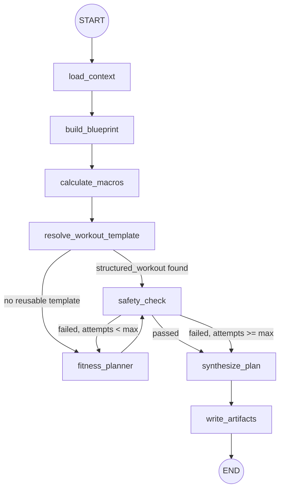

# Fitness Subgraph — Architecture (Hybrid Deterministic + LLM Planner)

> **Status:** Architecture reference  
> **Scope:** `src/core/subgraphs/fitness/` — blueprint, macro calculation, template reuse, LLM workout planning, safety validation  
> **Date:** 2026-07-08

**Related:** [Workflow](./workflow.md) · [Supervisor](./supervisor.md) · [Planning](./planning-subgraph.md) · [Research](./research-subgraph.md) · [Verification](./verification-subgraph.md)

---

## Executive Summary

The Fitness subgraph combines **deterministic blueprint and macro calculation** with **workout template reuse** and an **LLM Fitness Planner** (STANDARD tier) that produces a structured workout plan. A **safety validation loop** can retry the planner up to `max_planner_attempts` (default 2) when deterministic checks fail.

The subgraph loads upstream context from VFS (profile, execution plan, research findings, verification feedback, revision feedback), writes artifacts to `fitness/`, and always routes to **Verification** (not back to Supervisor) after completion.

---

## 1. Graph Architecture

### 1.1 Nodes

| Node | Responsibility |
|------|----------------|
| `load_context` | Load profile, execution plan, research findings, verification feedback from VFS |
| `build_blueprint` | Build deterministic `PlanBlueprint` from GoalSpec |
| `calculate_macros` | Rate-aware BMR/TDEE/macro targets and training constraints |
| `resolve_workout_template` | Lookup reusable workout template by fingerprint |
| `fitness_planner` | LLM structured workout generation via `generate_structured_workout()` |
| `safety_check` | Deterministic validation of macros + structured workout |
| `synthesize_plan` | Render markdown draft plan from blueprint + macros + structured workout |
| `write_artifacts` | Persist workout, blueprint, calculations, safety flags, and final plan to VFS |

### 1.2 Execution Flow



`max_planner_attempts` comes from settings (`max_planner_attempts`, default 2). On `FIX_REASONING` reruns, `fix_reasoning_planner_attempts` (default 1) applies instead. After max attempts, synthesis proceeds with safety warnings embedded in the draft plan.

### 1.3 Template reuse

`resolve_workout_template` checks, in order:

1. **Per-run reuse** on `FIX_REASONING` when a cacheable workout already exists in the run workspace
2. **Cross-run reuse** via `TemplateRegistry` keyed by workout fingerprint

Fingerprint includes: `template_family`, `days_per_week`, `equipment`, `session_duration_bucket`, `experience_level`.

Timeline and exact target weight are **excluded** from the workout fingerprint.

Template reuse is **disabled** when `plan/revision_feedback.json` exists on VFS.

### 1.4 State (`FitnessState`)

| Field | Set by |
|-------|--------|
| `profile`, `execution_plan`, `structured_findings`, `evidence_summary`, `verification_feedback` | `load_context` |
| `plan_blueprint` | `build_blueprint` |
| `macro_targets`, `training_constraints` | `calculate_macros` |
| `template_fingerprint`, `workout_source`, `reused_workout`, `structured_workout` | `resolve_workout_template` or `fitness_planner` |
| `planner_attempts` | `fitness_planner` |
| `safety_result`, `planner_feedback` (on retry) | `safety_check` |
| `draft_plan` | `synthesize_plan` |
| `max_planner_attempts`, `is_verification_rerun` | Seeded from orchestration in `to_fitness_state()` |

---

## 2. Context Loading

`load_fitness_context()` in [`utils.py`](../../core/subgraphs/fitness/utils.py) reads:

| VFS path | Usage |
|----------|-------|
| `plan/profile.json` | User profile |
| `plan/execution_plan.json` | Research task alignment for planner |
| `research/findings.json` | `structured_findings` (preferred) or `evidence_summary` |
| `verify/verification_v1.json` | `verification_feedback` from prior verification run |

When `structured_findings.consensus` is present, a formatted evidence summary is derived for the markdown draft.

On `FIX_REASONING` reruns (`is_verification_rerun=true`), prior safety feedback from `fitness/safety_flags.json` is loaded into `planner_feedback`.

---

## 3. Deterministic Blueprint

`build_plan_blueprint()` in [`blueprint.py`](../../core/subgraphs/fitness/blueprint.py) derives a `PlanBlueprint` from GoalSpec fields:

- `goal`, `goal_archetype`, `horizon_weeks`, `weekly_rate_kg`, `feasibility_level`
- `template_family` (e.g. `fat_loss_3day_gym`)
- Phased prescription: calorie adjustment, protein g/kg, training emphasis, volume modifier per phase

The blueprint drives macro rate adjustments and is included in the synthesized markdown draft.

---

## 4. Deterministic Macro Calculation

`calculate_macros_data()` — no LLM involved.

| Step | Method |
|------|--------|
| BMR | Mifflin-St Jeor (sex-adjusted) |
| TDEE | BMR × activity multiplier |
| Calories | Goal adjustment (uses blueprint rate when available) |
| Floor/ceiling | Min 1200 (F) / 1500 (M) kcal; max 4500 kcal |
| Protein | 1.8–2.4 g/kg by goal and `high_protein` constraint |
| Fat / carbs | 25% fat calories; remainder to carbs |

**Training constraints** derived alongside macros:

- `days_per_week` — from profile, constraints, or activity level pattern
- `session_duration_minutes` — from constraints (default 60)
- `equipment` — `gym` | `home` | `bodyweight`
- `goal` — from profile

---

## 5. LLM Fitness Planner

Implementation: [`planner.py`](../../core/subgraphs/fitness/planner.py)

| Aspect | Detail |
|--------|--------|
| Model tier | STANDARD (`invoke_standard_structured_output`) |
| Output schema | `StructuredWorkout` — [`schema.py`](../../core/subgraphs/fitness/schema.py) |
| System prompt | [`prompts.py`](../../core/subgraphs/fitness/prompts.py) |
| Test override | `configure_fitness_planner(override)` |

### 5.1 Planner Input Payload

`build_planner_payload()` sends JSON with:

- `profile`, `constraints`
- `macro_targets`, `training_constraints` (engine-computed — planner must not recalculate)
- `execution_plan` (tasks + rationale from Planning stage)
- `structured_findings` (from Research)
- `planner_feedback` (from failed safety checks)
- `verification_feedback` (from prior Verification run)
- `revision_feedback` (from `plan/revision_feedback.json` when present)

### 5.2 StructuredWorkout Schema

```python
StructuredWorkout:
  split: str
  goal: str
  days: list[WorkoutDay]       # 1–6 days
  weekly_sets: int             # Must equal sum of all exercise sets
  progression: str | None
  substitutions: list[str]
  notes: list[str]
  evidence_applied: list[str]

WorkoutDay:
  name, focus, exercises: list[WorkoutExercise]

WorkoutExercise:
  name, sets (1–10), reps, notes?
```

Generated workouts are adapted to the blueprint via `adapt_workout_to_blueprint()` and stored in the template registry when a fingerprint is available.

---

## 6. Safety Validation Loop

`validate_workout_safety_data()` — deterministic, no LLM.

### 6.1 Macro Checks

| Flag | Condition |
|------|-----------|
| `calories_below_safe_minimum` | Below sex-based floor |
| `calories_above_recommended_maximum` | Above 4500 kcal |
| `aggressive_calorie_deficit` | Below 75% of TDEE |
| `protein_intake_too_high` | Above 3.0 g/kg |

### 6.2 Workout Checks

| Flag | Condition |
|------|-----------|
| `training_day_count_mismatch` | Days ≠ `days_per_week` |
| `training_frequency_too_high` | More than 6 training days |
| `weekly_sets_mismatch` | Declared ≠ computed sum |
| `weekly_training_volume_too_high` | Weekly sets > 120 |
| `invalid_set_count` | Sets outside 1–10 per exercise |
| `duplicate_exercise` | Same exercise twice in one day |
| `equipment_mismatch` | Exercise incompatible with equipment setting |
| `empty_exercises` | Day has no exercises |
| `invalid_workout_schema` | Pydantic validation failure |

On failure with attempts remaining, safety feedback is merged into `planner_feedback`, `structured_workout` is cleared, and the planner re-runs.

---

## 7. Plan Synthesis & VFS Artifacts

### 7.1 Draft Plan

`synthesize_plan_data()` renders markdown including program blueprint, macro targets, training plan, progression, evidence applied, verification feedback, and safety warnings.

### 7.2 VFS Writes

`write_fitness_artifacts()` persists:

| Path | Content |
|------|---------|
| `fitness/blueprint.json` | Deterministic `PlanBlueprint` |
| `fitness/template_fingerprint.json` | Workout template fingerprint + source |
| `fitness/workout.json` | Full `StructuredWorkout` JSON |
| `fitness/calculations.json` | `macro_targets` + `workout_summary` |
| `fitness/safety_flags.json` | List of safety feedback strings |
| `fitness/final_plan.md` | Markdown draft plan |

---

## 8. Orchestration Integration

`invoke_fitness_subgraph()` returns `{ "current_node": "fitness" }`. Main graph routes `fitness → verification` directly.

On verification failure, Supervisor may route `FIX_REASONING` back to Fitness; planner reloads `verify/verification_v1.json` feedback from VFS on next run.

---

## 9. Module Layout

```
src/core/subgraphs/fitness/
├── blueprint.py        # PlanBlueprint generation from GoalSpec
├── template_registry.py # Fingerprinting, registry lookup/store
├── schema.py           # StructuredWorkout, SafetyResult
├── prompts.py          # Fitness planner system prompt
├── planner.py          # LLM agent + configure override
├── graph.py            # LangGraph (8 nodes + retry loop)
├── state.py            # FitnessState
├── utils.py            # Macros, safety, VFS, synthesis
├── tools.py            # LangChain tool wrappers
└── agent.py            # Facade for orchestration
```

---

## 10. Downstream Consumers

| Consumer | Reads |
|----------|-------|
| Verification | `fitness/final_plan.md`, `fitness/blueprint.json`, `fitness/workout.json`, `fitness/calculations.json`, `fitness/safety_flags.json` |
| Persist | `fitness/final_plan.md` → `final/final_plan.md` |
| Fitness (rerun) | `verify/verification_v1.json` on `FIX_REASONING` loop |

---

## 11. Key File Reference

| File | Role |
|------|------|
| `blueprint.py` | Deterministic plan blueprint from GoalSpec |
| `template_registry.py` | Workout fingerprinting and cross-run reuse |
| `planner.py` | Core LLM fitness planner |
| `graph.py` | Subgraph wiring + safety retry loop |
| `utils.py` | Macro math, safety rules, VFS I/O |
