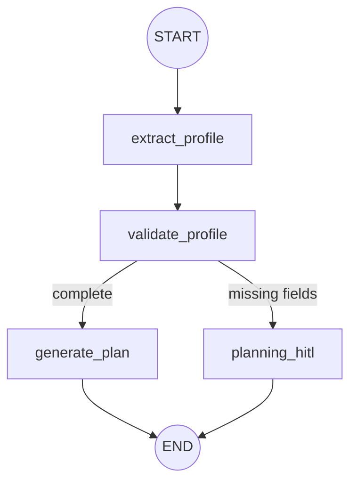

# Planning Subgraph — Architecture (LLM Planning Agent)

> **Status:** Architecture reference  
> **Scope:** `src/core/subgraphs/planning/` — profile extraction, validation, execution plan generation  
> **Date:** 2026-07-01

**Related:** [Workflow](./workflow.md) · [Supervisor](./supervisor.md) · [Research](./research-subgraph.md) · [Fitness](./fitness-subgraph.md)

---

## Executive Summary

The Planning subgraph is the **first domain stage** in the default pipeline. It extracts and validates the user fitness profile, then generates a structured **execution plan** of research-oriented tasks via an LLM Planning Agent (XHIGH tier).

When required profile fields are missing, the subgraph routes to HITL and returns a user-friendly prompt — orchestration sets `waiting_for_user: true`. On success, artifacts are persisted to the VFS under `plan/` and downstream Research reads `plan/execution_plan.json` as its gate input.

---

## 1. Graph Architecture

### 1.1 Nodes

| Node | Responsibility |
|------|----------------|
| `extract_profile` | Merge query, `user_profile`, and `constraints` into a unified profile |
| `validate_profile` | Check required fields; set `missing_fields` and `requires_hitl` |
| `generate_plan` | Invoke Planning Agent; persist execution plan to VFS |
| `planning_hitl` | Format missing-field prompt for user input |

### 1.2 Execution Flow



### 1.3 State (`PlanningState`)

| Field | Set by |
|-------|--------|
| `profile` | `extract_profile` |
| `missing_fields`, `requires_hitl` | `validate_profile` |
| `todos`, `execution_plan`, `planning_output`, `requires_hitl: false` | `generate_plan` |
| `planning_output`, `requires_hitl: true` | `planning_hitl` |

Input fields (`query`, `user_profile`, `constraints`, `request_type`, `workspace_path`) are seeded from `OrchestrationState` via `to_planning_state()`.

---

## 2. Profile Extraction & Validation

### 2.1 Extraction — [`utils.py`](../../core/subgraphs/planning/utils.py)

`build_profile()` merges three sources:

1. Structured `user_profile` from orchestration state
2. `constraints` (equipment, session duration, etc.)
3. LLM/heuristic extraction from `query` via `extract_profile_from_query()`

### 2.2 Validation

`validate_profile_data()` checks:

- **Required profile fields** — age, height, weight, sex, goal, activity level (`REQUIRED_PROFILE_FIELDS`)
- **Goal-specific fields** — additional fields per goal type (`GOAL_REQUIRED_FIELDS`)

When `missing_fields` is non-empty, routing goes to `planning_hitl`, which uses `format_missing_profile_prompt()` from [`labels.py`](../../core/profile/labels.py).

---

## 3. LLM Planning Agent

Implementation: [`planning_agent.py`](../../core/subgraphs/planning/planning_agent.py)

| Aspect | Detail |
|--------|--------|
| Model tier | XHIGH (`invoke_xhigh_structured_output`) |
| Output schema | `ExecutionPlan` — [`schema.py`](../../core/subgraphs/planning/schema.py) |
| Task count | 3–10 distinct, non-overlapping research tasks |
| Test override | `configure_planning_agent(override)` |

### 3.1 ExecutionPlan Schema

```python
ExecutionPlan:
  plan_rationale: str   # Overall rationale (min 20 chars)
  tasks: list[PlanTask] # 3–10 tasks, ordered
  plan_markdown: str    # Human-readable summary

PlanTask:
  order: int            # 1-based execution order
  task: str             # Actionable research task
  rationale: str        # Why this task matters
```

### 3.2 Agent Rules (system prompt)

- Tailor every task to the user's goal, activity level, and constraints
- Tasks must be **research-oriented** (evidence retrieval), not final coaching advice
- Include source credibility / evidence-quality verification when relevant
- For `macro_calculation` request type, include macro-calculation research tasks
- Order tasks logically: foundational evidence first, verification last
- Do not invent profile fields not present in the input

`normalize_execution_plan()` sorts tasks by `order` and re-indexes to a contiguous 1..N sequence before persistence.

---

## 4. VFS Artifacts

Written by `persist_execution_plan()` in [`utils.py`](../../core/subgraphs/planning/utils.py):

| Path | Content |
|------|---------|
| `plan/execution_plan.json` | Canonical `ExecutionPlan` JSON (primary downstream contract) |
| `plan/plan.md` | `plan_markdown` human-readable summary |
| `plan/profile.json` | Validated user profile snapshot |
| `plan/todos.json` | Deprecated compatibility shim — derived task strings |

`execution_plan_to_todo_strings()` extracts ordered `task` strings. Research subgraph's `todos_gate` reads `execution_plan.json` directly.

---

## 5. Orchestration Integration

`invoke_planning_subgraph()` in [`graph.py`](../../core/subgraphs/planning/graph.py):

1. Maps `OrchestrationState` → `PlanningState`
2. Runs the subgraph
3. Syncs profile back via `profile_to_orchestration_updates()`
4. Sets `waiting_for_user: true` when `requires_hitl`

| Returned update | Condition |
|-----------------|-----------|
| `current_node: "planning"` | Always |
| `user_profile`, `constraints` | Merged from extracted profile |
| `waiting_for_user: true` | Profile incomplete (HITL path) |

---

## 6. Test & Benchmark Utilities

| Function | Purpose |
|----------|---------|
| `build_default_execution_plan()` | Deterministic fallback plan (no LLM) |
| `seed_execution_plan()` | Seed VFS artifacts for tests/benchmarks |
| `has_execution_plan()` | Check if `plan/execution_plan.json` exists |
| `load_execution_plan()` | Load canonical plan from VFS |

---

## 7. Module Layout

```
src/core/subgraphs/planning/
├── schema.py           # ExecutionPlan, PlanTask
├── planning_agent.py   # LLM agent + configure override
├── graph.py            # LangGraph (4 nodes)
├── state.py            # PlanningState
├── utils.py            # Profile build/validate, VFS persistence
├── tools.py            # LangChain tool wrappers
└── agent.py            # Facade for orchestration
```

---

## 8. Downstream Consumers

| Consumer | Reads |
|----------|-------|
| Research (`todos_gate`) | `plan/execution_plan.json`, `plan/profile.json` |
| Fitness (`load_context`) | `plan/profile.json`, `plan/execution_plan.json` (optional) |
| Verification | `plan/profile.json` for consistency checks |

---

## 9. Key File Reference

| File | Role |
|------|------|
| `planning_agent.py` | Core LLM planning agent |
| `graph.py` | Subgraph wiring + orchestration bridge |
| `utils.py` | Profile logic and VFS writes |
