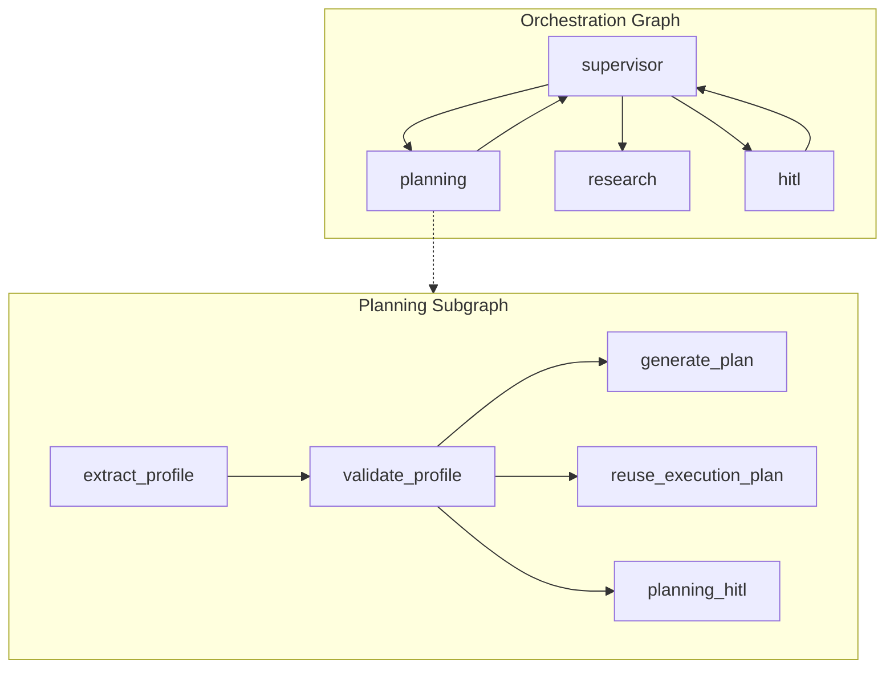
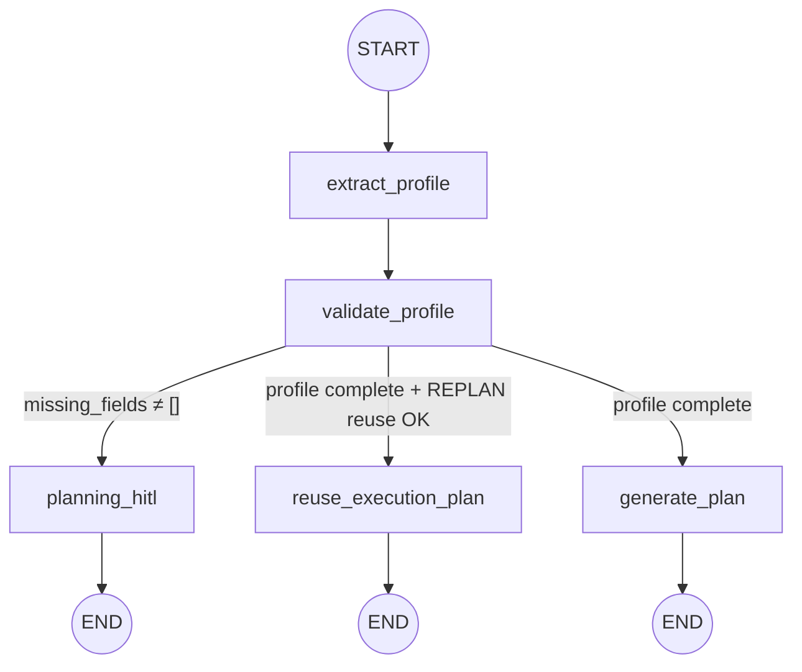

# Planning Subgraph — Architecture (LLM Planning Agent)

> **Status:** Architecture reference  
> **Scope:** `src/core/subgraphs/planning/` — profile extraction, validation, execution plan generation  
> **Date:** 2026-07-08

**Related:** [Workflow](./workflow.md) · [Supervisor](./supervisor.md) · [Research](./research-subgraph.md) · [Fitness](./fitness-subgraph.md)

> **⚠ Staleness note (2026-07-22):** Profile extraction/validation (§6-§7, §10) was relocated
> to the **User subgraph** (`src/core/subgraphs/user/`) before this refactor — Planning is
> actually a fixed **2-node** graph (`generate_plan` / `reuse_execution_plan`) with no
> `extract_profile`/`validate_profile`/`planning_hitl` nodes of its own; see
> `tests/test_user_subgraph.py` and `core/subgraphs/user/graph.py` for the current profile
> flow. Separately, `user_profile`/`constraints` were removed from `OrchestrationState`/
> `PlanningState` entirely (profile now lives only on VFS `plan/profile.json`, loaded via
> `core/profile/store.py:load_run_profile`) — see `docs/reports/orchestration_profile_vfs_plan.md`.
> The two specific fixes below correct the field tables most directly affected by that second
> change; the broader node-structure staleness above predates it and needs its own pass.

---

## Executive Summary

The Planning subgraph is the **first domain stage** in the default pipeline (`planning → research → fitness → verification`). It is **not a ReAct agent** — it is a **fixed-flow LangGraph StateGraph** that invokes three LangChain tools in sequence, with up to two LLM calls (profile extraction + execution plan generation).

Responsibilities:

1. Extract and merge the user fitness profile from `query`, `user_profile`, `constraints`, and optional `revision_feedback`
2. Validate required profile fields; route to HITL when incomplete
3. Generate a structured **execution plan** via deterministic templates or the LLM Planning Agent (XHIGH tier)
4. Persist artifacts to the VFS under `plan/` — the **source of truth** for downstream subgraphs

When required profile fields are missing, the subgraph routes to `planning_hitl` and orchestration sets `waiting_for_user: true`. On success, Research reads `plan/execution_plan.json` as its gate input.

---

## 1. Module Layout

```
src/core/subgraphs/planning/
├── state.py            # PlanningState (scoped TypedDict)
├── graph.py            # StateGraph (5 nodes) + orchestration bridge
├── tools.py            # 3 LangChain @tool wrappers
├── planning_agent.py   # LLM XHIGH → ExecutionPlan
├── templates.py        # Deterministic execution plan templates
├── schema.py           # Pydantic: PlanTask, ExecutionPlan
├── utils.py            # Profile build/validate, VFS I/O, REPLAN reuse, revision feedback
└── agent.py            # Facade: PlanningAgent.run()
```

### External dependencies

| Module | Role in Planning |
|--------|-----------------|
| [`core/profile/extraction.py`](../../core/profile/extraction.py) | LLM standard-tier profile extraction from natural language |
| [`core/profile/normalize.py`](../../core/profile/normalize.py) | Merge three sources → flat profile dict |
| [`core/profile/schema.py`](../../core/profile/schema.py) | Required fields, enums, `ExtractedProfile` |
| [`core/profile/goal_spec.py`](../../core/profile/goal_spec.py) | Goal archetype, horizon, feasibility fields |
| [`core/profile/labels.py`](../../core/profile/labels.py) | User-facing missing-field prompts |
| [`core/llm/contracts.py`](../../core/llm/contracts.py) | Validate LLM payloads (forbid duplicate keys) |
| [`core/llm/serializers.py`](../../core/llm/serializers.py) | `compact_profile_for_llm()` |
| [`core/graph/routing.py`](../../core/graph/routing.py) | When supervisor routes back to planning |
| [`core/agents/rerun.py`](../../core/agents/rerun.py) | `REPLAN` decision + structural issue markers |
| [`core/vfs/`](../../core/vfs/) | Persist run artifacts |

---

## 2. Position in Orchestration Graph



Planning is invoked when:

- **First run:** `supervisor` → `resolve_next_subgraph()` → first domain in `DOMAIN_ORDER` = `"planning"`
- **Partial rerun:** `route_decision = "REPLAN"` after verification fails with structural consistency issues
- **User revision:** `approval_status = "revision_requested"` with `revision_feedback` persisted
- **Not invoked** when `waiting_for_user = true` (supervisor routes directly to `hitl`)

Entry point in the main graph: [`core/graph/builder.py`](../../core/graph/builder.py) wraps `invoke_planning_subgraph` as the `planning` node.

---

## 3. Graph Architecture

### 3.1 Nodes

| Node | Responsibility |
|------|----------------|
| `extract_profile` | Merge query, `user_profile`, `constraints`, and `revision_feedback` into a unified `profile` |
| `validate_profile` | Check required fields; set `missing_fields` and `requires_hitl` |
| `generate_plan` | Invoke template or Planning Agent (XHIGH); persist execution plan to VFS |
| `reuse_execution_plan` | Skip XHIGH on REPLAN when stored plan still fits profile and covers structural issues |
| `planning_hitl` | Flag missing-field HITL path (actual prompt rendered by orchestration `hitl` node) |

### 3.2 Execution Flow



### 3.3 Routing functions

**After `validate_profile`** (`_route_after_validate`):

- `requires_hitl` → `planning_hitl`
- `should_reuse_execution_plan(...)` → `reuse_execution_plan`
- otherwise → `generate_plan`

### 3.4 Pipeline step tracking

Steps are appended to orchestration `steps` via `merge_subgraph_updates()`:

```
planning:extract_profile
planning:validate_profile
planning:generate_plan          # or reuse_execution_plan / planning_hitl
```

---

## 4. State

### 4.1 `PlanningState` (scoped subgraph state)

Defined in [`state.py`](../../core/subgraphs/planning/state.py):

| Field | Type | Description |
|-------|------|-------------|
| `query` | `str` | User query (input, seeded from orchestration) |
| `request_type` | `str \| None` | Classified request type (input) |
| `workspace_path` | `str` | Run workspace VFS path (input) |
| `route_decision` | `RouteDecision \| None` | Drives REPLAN reuse (input) |
| `revision_feedback` | `str \| None` | User revision text from HITL resume (input) |
| `reused_execution_plan` | `bool` | Whether plan was reused from VFS (set by `reuse_execution_plan`) |

**No profile fields in state** — `PlanningState` has no `user_profile`/`constraints`/`profile` field at all. Nodes load the current profile from VFS directly (`load_run_profile(state["workspace_path"])`), and `generate_plan`'s own `persist_execution_plan` re-writes `plan/profile.json` with a goal-spec-enriched copy. **Seeded from orchestration** via `to_planning_state()` — output/intermediate fields reset to defaults on each invocation. `revision_feedback` is loaded from orchestration state or `plan/revision_feedback.json` on VFS.

### 4.2 What is NOT in state (intentional design)

Execution plan data is **not duplicated in state**. VFS is the source of truth.

| Deprecated / removed field | Current source of truth |
|---------------------------|------------------------|
| `execution_plan` | VFS: `plan/execution_plan.json` |
| `todos` | Derived from execution plan via `execution_plan_to_todo_strings()` |
| `planning_output` | Not used |
| `plan_markdown` in downstream LLM payloads | VFS: `plan/plan.md` only |

### 4.3 State updates per node

| Node | Fields written to `PlanningState` | Side effects |
|------|-----------------------------------|--------------|
| `extract_profile` | `profile`; clears `user_profile`, `constraints` on success | May call LLM extraction; applies `revision_feedback` overrides |
| `validate_profile` | `missing_fields`, `requires_hitl` | — |
| `generate_plan` | (no plan fields in state) | Writes 3 VFS files |
| `reuse_execution_plan` | `reused_execution_plan=true` | Reads VFS, no LLM |
| `planning_hitl` | `requires_hitl=true` | Subgraph ends |

### 4.4 Orchestration state mapping

`invoke_planning_subgraph()` maps results back to `OrchestrationState`:

| Orchestration update | Condition |
|---------------------|-----------|
| `current_node: "planning"` | Always |
| `steps` | Appended via `merge_subgraph_updates()` |

Planning never touches `user_profile`/`constraints` on `OrchestrationState` — those fields don't exist there anymore (`profile_to_orchestration_updates()` was deleted, confirmed to have zero production callers). Profile-gating (`waiting_for_user`, the missing-fields HITL prompt) is entirely the User subgraph's responsibility now, not Planning's — see the staleness note at the top of this doc.

---

## 5. Tools

Three LangChain tools in [`tools.py`](../../core/subgraphs/planning/tools.py). Exported as `PLANNING_TOOLS`.

| Tool | Input | Output | Calls LLM? | Writes VFS? |
|------|-------|--------|------------|-------------|
| `extract_profile` | `query`, `user_profile`, `constraints`, `revision_feedback?` | `{ "profile": dict }` | Yes (if profile incomplete) | No |
| `validate_profile` | `profile` | `{ "missing_fields", "requires_hitl" }` | No | No |
| `generate_plan` | `profile`, `query`, `request_type`, `workspace_path`, `revision_feedback?` | `{ "requires_hitl": false }` | Template or XHIGH | Yes (3 files) |

Graph nodes call tools directly — there is no LLM-driven tool selection loop.

---

## 6. Node: `extract_profile`

### 6.1 Node logic

1. Determine `used_llm_extraction` via `should_use_llm_profile_extraction()`
2. Invoke `extract_profile` tool → `build_profile()` (applies `revision_feedback` overrides when present)
3. On success → clear `user_profile` and `constraints` in planning state (orchestration sync happens in bridge)

### 6.2 When LLM extraction is skipped

```python
# utils.py — skip when orchestration profile is already complete
candidate = {**user_profile, **constraints}
skip = not validate_profile_data(candidate)["requires_hitl"]
```

If the API sends a complete `user_profile`, LLM extraction is **not called** — saving tokens and latency.

### 6.3 Profile merge pipeline (`build_profile`)

```
1. If profile complete → ExtractedProfile() (empty)
2. Else → extract_profile_from_query(resolve_extraction_query(query, user_profile))
3. merge_profile_sources(query, user_profile, constraints, extracted)
4. apply_revision_overrides(profile, revision_feedback) when feedback present
```

### 6.4 Merge priority (`merge_profile_sources`)

Defined in [`core/profile/normalize.py`](../../core/profile/normalize.py):

```
1. query           → profile["query"] = raw query string
2. constraints     → lowest conflict priority
3. LLM extracted   → overwrites constraints
4. user_profile    → WINS (highest priority)
5. _sync_activity_and_days() → keep days_per_week ↔ activity_level consistent
```

### 6.5 HITL resume — latest query segment

`resolve_extraction_query()` uses only the **last line** of a multi-line query when `user_profile` is non-empty. This avoids re-parsing the full conversation history on HITL clarification resume.

---

## 7. Node: `validate_profile`

### 7.1 Required fields

From [`core/profile/schema.py`](../../core/profile/schema.py):

**`REQUIRED_PROFILE_FIELDS`:** `age`, `sex`, `height_cm`, `current_weight_kg`, `activity_level`, `goal`

**`GOAL_REQUIRED_FIELDS`:**

| Goal | Additional required fields |
|------|---------------------------|
| `fat_loss` | `target_weight_kg` |

### 7.2 Missing-field prompt

When routed to `planning_hitl`, orchestration `hitl` node calls `format_missing_profile_prompt()` from [`core/profile/labels.py`](../../core/profile/labels.py).

---

## 8. Node: `generate_plan`

### 8.1 Tool flow

```
generate_plan tool
  → enrich profile with GoalSpec fields (derive_goal_spec_fields)
  → build_template_execution_plan() when archetype matches and no revision_feedback
  → else generate_execution_plan()     # LLM XHIGH
  → normalize_execution_plan()         # sort + re-index tasks
  → persist_execution_plan()           # write VFS
  → return { "requires_hitl": false }
```

### 8.2 Template shortcut

[`templates.py`](../../core/subgraphs/planning/templates.py) provides deterministic `ExecutionPlan` objects for common goal archetypes (e.g. `fat_loss_moderate`). Used when:

- A matching template exists for the enriched profile
- `feasibility_level != "unsafe"`
- Planning agent is not overridden in tests
- No `revision_feedback` is present

Template plans include a `template_id` field on `ExecutionPlan`.

### 8.3 LLM call

Implementation: [`planning_agent.py`](../../core/subgraphs/planning/planning_agent.py)

| Aspect | Detail |
|--------|--------|
| Model tier | XHIGH (`invoke_xhigh_structured_output`) |
| Output schema | `ExecutionPlan` |
| Messages | `SystemMessage(_PLANNING_SYSTEM_PROMPT)` + `HumanMessage(compact_json(payload))` |
| Metrics node | `planning_agent` |
| Langfuse span | `"Planning"` or `"partial_rerun_REPLAN"` |
| Test override | `configure_planning_agent(override)` |

When `revision_feedback` is present, it is included in the LLM payload and the system prompt instructs the agent to address every user concern.

### 8.4 `ExecutionPlan` schema

Defined in [`schema.py`](../../core/subgraphs/planning/schema.py):

```python
class PlanTask(BaseModel):
    order: int          # ≥1, 1-based execution order
    task: str           # ≥10 chars, actionable research task
    rationale: str      # ≥10 chars, why this task matters

class ExecutionPlan(BaseModel):
    plan_rationale: str       # ≥20 chars
    tasks: list[PlanTask]     # 3–5 tasks (validated)
    plan_markdown: str        # ≥50 chars, human-readable summary
    template_id: str | None   # Set when generated from a deterministic template
```

---

## 9. Node: `reuse_execution_plan` — REPLAN optimization

When verification fails with **structural consistency issues**, the supervisor sets `route_decision = "REPLAN"` (max `MAX_REPLAN_COUNT = 1`).

### 9.1 Reuse conditions (`should_reuse_execution_plan`)

All must be true:

1. `route_decision == "REPLAN"`
2. No `plan/revision_feedback.json` on VFS
3. `plan/execution_plan.json` exists on VFS
4. Current profile matches `plan/profile.json`
5. `execution_plan_covers_issues(plan, structural_issues)` — every issue has keyword match in task text

If profile changed, revision feedback exists, or plan lacks coverage → `generate_plan` runs (template or full XHIGH call).

---

## 10. HITL Path — Missing profile fields

**This is no longer Planning's responsibility.** Missing-profile HITL is handled entirely by
the User subgraph's dynamic `interrupt()` in `_form_node`
(`src/core/subgraphs/user/graph.py`), resumed via `Command(resume=form_data)` — see
`RunOrchestrator.start_profile_form_resume` in `core/graph/service.py` and
`tests/test_user_subgraph.py`. `route_from_supervisor`'s profile gate
(`core/graph/routing.py`) redirects any profile-gated node (planning/research/fitness) into
`"user"` whenever `profile_complete`/`profile_valid` is false, so Planning only ever runs
once the User subgraph has already produced a complete, valid `plan/profile.json`.

---

## 11. VFS Artifacts

Written by `persist_execution_plan()` in [`utils.py`](../../core/subgraphs/planning/utils.py):

| Path | Content | Consumers |
|------|---------|-----------|
| `plan/execution_plan.json` | Canonical `ExecutionPlan` JSON | Research `todos_gate`, Fitness |
| `plan/plan.md` | `plan_markdown` human-readable summary | UI, debug |
| `plan/profile.json` | Compact validated profile snapshot | Research, Fitness, Verification |
| `plan/revision_feedback.json` | User revision text | Planning, Fitness (disables reuse shortcuts) |

---

## 12. Downstream Consumers

### Research (`todos_gate`)

Loads `plan/execution_plan.json` and `plan/profile.json`. Blocks when execution plan is missing.

### Fitness (`load_fitness_context`)

Reads `plan/profile.json`, optionally `plan/execution_plan.json`, and `plan/revision_feedback.json`.

### Verification

Loads `plan/profile.json` for consistency checks against the synthesized plan.

---

## 13. Test & Benchmark Utilities

| Function | Purpose |
|----------|---------|
| `build_default_execution_plan(profile?)` | Deterministic 4-task plan (no LLM) |
| `seed_execution_plan(workspace, profile, plan?)` | Write VFS artifacts without LLM |
| `configure_planning_agent(override)` | Mock LLM planning agent in tests |
| `configure_profile_extractor(override)` | Mock LLM profile extraction in tests |

Integration tests: [`tests/test_planning_subgraph.py`](../../../tests/test_planning_subgraph.py)

---

## 14. Key File Reference

| File | Role |
|------|------|
| [`planning_agent.py`](../../core/subgraphs/planning/planning_agent.py) | Core LLM planning agent + normalize |
| [`templates.py`](../../core/subgraphs/planning/templates.py) | Deterministic execution plan templates |
| [`graph.py`](../../core/subgraphs/planning/graph.py) | Subgraph wiring (5 nodes) + orchestration bridge |
| [`utils.py`](../../core/subgraphs/planning/utils.py) | Profile logic, VFS I/O, REPLAN reuse, revision feedback |
| [`schema.py`](../../core/subgraphs/planning/schema.py) | `ExecutionPlan`, `PlanTask` Pydantic models |
