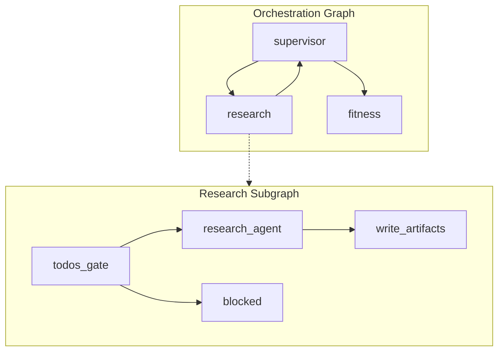
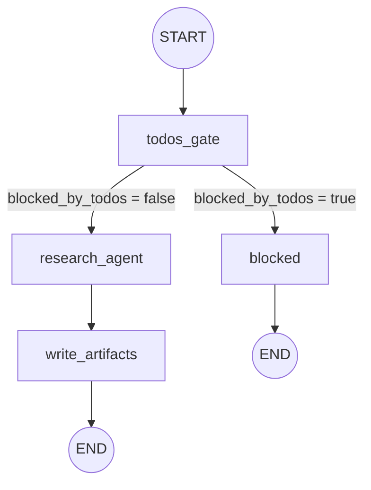
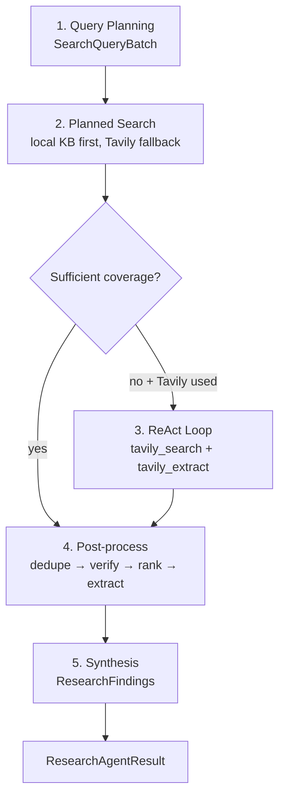

# Research Subgraph — Architecture (LLM Research Agent)

> **Status:** Architecture reference  
> **Scope:** `src/core/subgraphs/research/` and integrations (local knowledge base, Tavily MCP, Planning VFS, downstream consumers)  
> **Date:** 2026-07-08

**Related:** [Workflow](./workflow.md) · [Supervisor](./supervisor.md) · [Planning](./planning-subgraph.md) · [Fitness](./fitness-subgraph.md)

---

## Executive Summary

The Research subgraph is a **LangGraph wrapper** around the **LLM Research Agent** (STANDARD tier). The graph handles high-level transitions (`todos_gate` → `research_agent` → `write_artifacts`); the agent owns reasoning, query planning, local KB + Tavily retrieval, optional ReAct refinement, and structured evidence synthesis.

Deterministic post-processing (dedupe, whitelist verification, hybrid ranking, rank-then-extract) runs **inside the agent** after retrieval. VFS artifacts are `research/sources.json` and `research/findings.json`; `structured_findings` is the primary payload for downstream consumers.

Research is **blocked** when `plan/execution_plan.json` does not exist — the subgraph sets `blocked_by_todos` and surfaces `waiting_for_user` to orchestration **without** writing VFS artifacts.

---

## 1. Position in Orchestration Graph



Research is invoked when:

- **Default pipeline:** planning completes → supervisor → `resolve_next_subgraph()` → next domain = `"research"`
- **Partial rerun:** `route_decision = "RERESEARCH"` after verification detects evidence gaps
- **Not invoked** when `waiting_for_user = true` (supervisor routes directly to `hitl`)

Entry point: [`core/graph/builder.py`](../../core/graph/builder.py) wraps `invoke_research_subgraph` as the `research` node.

### Local Knowledge Base (preferred retrieval)

Research prefers curated local evidence from `src/core/knowledge/` before calling Tavily.

Per execution-plan task:

1. Retrieve ranked local documents via `LocalKnowledgeRetriever`
2. If coverage is sufficient, use local sources/evidence only
3. Otherwise fall back to Tavily for uncovered tasks
4. Merge, dedupe, verify, rank, and synthesize as before

Settings:

| Setting | Default | Purpose |
|---------|---------|---------|
| `local_kb_enabled` | `true` | Enable local KB retrieval |
| `local_kb_path` | `""` | Override corpus path |
| `local_kb_top_k` | `3` | Documents per task |
| `local_kb_min_documents` | `1` | Minimum docs for sufficient coverage |
| `local_kb_min_trust_score` | `0.85` | Minimum average trust score |

Local sources use `provider: "local_kb"` and are excluded from Tavily extract calls.

---

## 2. Graph Architecture

### 2.1 Nodes

| Node | Function | Responsibility |
|------|----------|----------------|
| `todos_gate` | `_todos_gate_node` | Load `execution_plan.json` + `profile.json`; set `blocked_by_todos` |
| `research_agent` | `_research_agent_node` | Call `run_research_agent()` — full agent pipeline |
| `write_artifacts` | `_write_artifacts_node` | Write `sources.json` and `findings.json` to VFS |
| `blocked` | `_blocked_node` | Passthrough when plan is missing (no VFS writes) |

### 2.2 Execution Flow



### 2.3 Routing

**After `todos_gate`** (`_route_after_todos_gate`):

- `blocked_by_todos = true` → `blocked`
- otherwise → `research_agent`

### 2.4 Pipeline step tracking

```
research:todos_gate
research:blocked              # when blocked
research:research_agent       # when successful
research:write_artifacts
```

---

## 3. State

### 3.1 `ResearchState`

Defined in [`state.py`](../../core/subgraphs/research/state.py):

| Field | Type | Description |
|-------|------|-------------|
| `query` | `str` | User query (input) |
| `request_type` | `str \| None` | Classified request type (input) |
| `workspace_path` | `str` | Run workspace VFS path (input) |
| `profile` | `dict` | Validated profile (set by `todos_gate`) |
| `execution_plan` | `dict` | Compact execution plan from `todos_gate` (no `plan_markdown`) |
| `evidence` | `list[dict]` | Extracted document content (set by `research_agent`) |
| `sources` | `list[dict]` | Ranked search results (set by `research_agent`) |
| `structured_findings` | `dict \| None` | Serialized `ResearchFindings` |
| `evidence_summary` | `str \| None` | Backward-compat summary string |
| `blocked_by_todos` | `bool` | Gate flag — missing execution plan |
| `agent_iterations` | `int` | ReAct loop iterations completed |
| `is_reresearch` | `bool` | `true` when `route_decision = "RERESEARCH"` |

**Seeded from orchestration** via `to_research_state()` — output fields reset on each invocation.

### 3.2 State updates per node

| Node | Fields written | Side effects |
|------|----------------|--------------|
| `todos_gate` | `profile`, `execution_plan`, `blocked_by_todos` | Reads VFS `plan/*` |
| `research_agent` | `sources`, `evidence`, `structured_findings`, `evidence_summary`, `agent_iterations` | Local KB + Tavily + LLM calls |
| `write_artifacts` | — | Writes `research/sources.json`, `research/findings.json` |
| `blocked` | `evidence_summary` (passthrough) | No VFS writes |

### 3.3 Orchestration mapping

`invoke_research_subgraph()` updates:

| Field | Condition |
|-------|-----------|
| `current_node: "research"` | Always |
| `waiting_for_user: true` | When `blocked_by_todos` |

Research does **not** sync `sources`, `evidence`, or `structured_findings` to `OrchestrationState`. Downstream reads from VFS.

---

## 4. Research Agent — Internal Pipeline

`run_research_agent()` in [`research_agent.py`](../../core/subgraphs/research/research_agent.py) is a multi-phase LLM pipeline.



### 4.1 Phase 1 — Query Planning

| Aspect | Detail |
|--------|--------|
| LLM node | `research_query_planning` |
| Schema | `SearchQueryBatch` → `list[TaskQueryPlan]` |
| Prompt | `QUERY_PLANNING_SYSTEM_PROMPT` |
| Input | `build_research_context_payload(query, request_type, profile, execution_plan)` |

Each `TaskQueryPlan` has `task_order`, `task`, and `queries` (1–3 search strings).

### 4.2 Phase 2 — Planned Search (deterministic)

`_run_planned_searches()` executes per task:

1. `LocalKnowledgeRetriever.retrieve_for_task()` — if sufficient coverage, add local sources/evidence and skip Tavily for that task
2. Otherwise run planned Tavily queries (respecting `research_max_total_searches`, default 3)

Returns `used_tavily=True` when any task required Tavily fallback.

### 4.3 Phase 3 — ReAct Loop (conditional)

Runs only when Tavily was used **and** `has_sufficient_research_coverage()` is still false.

| Aspect | Detail |
|--------|--------|
| LLM node | `research_react_loop` |
| Model | `get_standard_llm().bind_tools(RESEARCH_AGENT_TOOLS)` |
| Tools | `tavily_search`, `tavily_extract` |
| Max iterations | `research_max_search_iterations` (default 2) |
| Prompt | `REACT_SYSTEM_PROMPT` |

The ReAct loop includes inline evidence evaluation and optional refined Tavily searches when coverage is insufficient.

Extract budget: `research_max_total_extracts` (default 5). Local KB URLs are skipped in `tavily_extract`.

### 4.4 Phase 4 — Post-process (deterministic)

`post_process_sources(sources, evidence)` in [`utils.py`](../../core/subgraphs/research/utils.py):

```
sources + evidence
    → dedupe_sources_by_url()
    → verify_sources_data()       # whitelist + authority tier
    → rank_sources_data()         # hybrid composite score
    → extract top-K URLs not yet in evidence
    → merge evidence by URL
```

`extract_top_k` = `research_extract_top_k` (default 8).

### 4.5 Phase 5 — Synthesis

| Aspect | Detail |
|--------|--------|
| LLM node | `research_synthesis` |
| Schema | `ResearchFindings` |
| Prompt | `SYNTHESIS_SYSTEM_PROMPT` |
| Input | `evidence` (top N docs) + `source_catalog` (compact URLs without evidence, max 5) |

`evidence_summary` = `derive_evidence_summary(structured_findings)` for backward compatibility.

### 4.6 RERESEARCH shortcut

When `is_reresearch=true` and existing VFS research has sufficient coverage (`load_existing_research()`), the agent reuses prior sources/evidence and skips Tavily retrieval.

### 4.7 Test override

```python
configure_research_agent(override: Callable[..., ResearchAgentResult] | None)
```

---

## 5. Tools

### 5.1 ReAct tools

Defined in [`tools.py`](../../core/subgraphs/research/tools.py):

| Tool | MCP method | Input | Output to LLM |
|------|------------|-------|---------------|
| `tavily_search(query)` | `tavily_search` | `str` | JSON: `query`, `source_count`, compact `sources[:5]` |
| `tavily_extract(urls)` | `tavily_extract` | `list[str]` | JSON: `document_count`, `evidence` with `content_preview` |

`RESEARCH_AGENT_TOOLS = [tavily_search, tavily_extract]`

### 5.2 Legacy tools (unit tests only)

| Tool | Purpose |
|------|---------|
| `rank_sources(sources)` | Wrapper for `rank_sources_data()` |
| `verify_sources(sources)` | Wrapper for `verify_sources_data()` |

### 5.3 Tavily MCP adapter

[`utils.py`](../../core/subgraphs/research/utils.py):

| Function | Description |
|----------|-------------|
| `search_tavily_data(query)` | MCP search → `normalize_search_results()` |
| `extract_tavily_data(urls)` | MCP extract → `normalize_extract_results()` |

MCP client: [`tavily_client.py`](../../core/mcp/tavily_client.py). Mock via `configure_tavily_client()` or `MOCK_RESEARCH=true`.

---

## 6. Schemas

Defined in [`schema.py`](../../core/subgraphs/research/schema.py):

### `TaskQueryPlan`

| Field | Validation |
|-------|------------|
| `task_order` | `ge=1` |
| `task` | `min_length=5` |
| `queries` | 1–3 non-empty strings |

### `EvidenceEvaluation`

| Field | Notes |
|-------|-------|
| `sufficient` | `bool` |
| `gaps` | Coerced from prose if LLM returns text |
| `refined_queries` | Max 3 items |

### `ResearchFindings`

| Field | Validation |
|-------|------------|
| `consensus` | `min_length=20` |
| `key_findings` | At least 1 item |
| `conflicting_evidence` | List (coerced from prose) |
| `limitations` | List (coerced from prose) |
| `recommended_sources` | List (coerced from prose) |

---

## 7. Ranking & Verification

### 7.1 Hybrid ranking — [`ranking.py`](../../core/subgraphs/research/ranking.py)

| Component | Weight | Source |
|-----------|--------|--------|
| Tavily relevance | 0.40 | `source.score` |
| Authority | 0.30 | `authority_score` from verification |
| Source type | 0.20 | Keyword match in title/snippet |
| Freshness | 0.10 | Year extraction from title/snippet |

### 7.2 Whitelist verification — [`verification.py`](../../core/subgraphs/research/verification.py)

Default trusted domains: PubMed, NIH, WHO, CDC, ACSM, ISSN, NSCA.

Override via env `RESEARCH_TRUSTED_DOMAINS`.

Authority tiers: `whitelist` (1.0), `government_edu` (0.6), `fitness_keyword` (0.2), `unverified` (0.2).

---

## 8. LLM Payload Contract

`build_research_context_payload()` in [`utils.py`](../../core/subgraphs/research/utils.py):

```python
payload = {
    "profile": compact_profile_for_llm(profile),
    "query": stripped_query,           # if non-empty
    "request_type": request_type,      # omitted when same as profile.goal
    # + compact_execution_plan_for_llm(execution_plan) when present
}
validate_research_context_payload(payload)
```

Forbidden keys enforced by [`core/llm/contracts.py`](../../core/llm/contracts.py): `plan_markdown`, duplicate `query` inside `profile`.

---

## 9. VFS Artifacts

### Input (from Planning)

| Path | Required | Description |
|------|----------|-------------|
| `plan/execution_plan.json` | **Yes** (gate) | `ExecutionPlan` — research task list |
| `plan/profile.json` | No | Validated profile — fallback `{}` |

### Output

#### `research/sources.json`

Ranked sources with `verified`, `authority_tier`, `composite_score`, `rank`, and `provider` (`tavily` or `local_kb`).

#### `research/findings.json`

```json
{
  "structured_findings": { "consensus": "...", "key_findings": [], ... },
  "evidence_summary": "...",
  "evidence": [{ "document_id": "...", "url": "...", "content": "...", "provider": "..." }],
  "source_count": 5
}
```

---

## 10. Downstream Consumers

| Consumer | Reads | Usage |
|----------|-------|-------|
| **Fitness** | `research/findings.json` | Prefers `structured_findings`; fallback `evidence_summary` |
| **Fitness planner** | `ResearchFindings` compact | `consensus` + top key findings + limitations |
| **Verification** | `research/sources.json`, `research/findings.json` | Citation + faithfulness checks |

---

## 11. Configuration

| Setting | Default | Env var | Purpose |
|---------|---------|---------|---------|
| `research_max_search_iterations` | `2` | `RESEARCH_MAX_SEARCH_ITERATIONS` | Max ReAct iterations |
| `research_max_total_searches` | `3` | `RESEARCH_MAX_TOTAL_SEARCHES` | Total Tavily search budget |
| `research_max_total_extracts` | `5` | — | Total Tavily extract budget |
| `research_extract_top_k` | `8` | `RESEARCH_EXTRACT_TOP_K` | Top-ranked URLs to extract |
| `research_synthesis_evidence_limit` | `5` | — | Max evidence docs for synthesis |
| `mock_research` | `false` | `MOCK_RESEARCH` | Use mock Tavily client |

---

## 12. Module Layout

```
src/core/subgraphs/research/
├── state.py            # ResearchState TypedDict
├── schema.py           # Pydantic structured outputs
├── prompts.py          # System prompts (4 phases)
├── tools.py            # LangChain @tool definitions
├── utils.py            # MCP adapters, VFS I/O, post-process, payload helpers
├── ranking.py          # Hybrid composite ranking
├── verification.py     # Whitelist + authority classification
├── research_agent.py   # Core agent pipeline
├── graph.py            # LangGraph (4 nodes) + orchestration bridge
└── agent.py            # Facade: ResearchAgent.run()
```

---

## 13. Testing

| File | Coverage |
|------|----------|
| [`tests/test_research_agent.py`](../../../tests/test_research_agent.py) | Schema, ranking, verification, agent override |
| [`tests/test_research_subgraph.py`](../../../tests/test_research_subgraph.py) | Graph flow, todos gate, VFS writes |
| [`tests/test_local_knowledge.py`](../../../tests/test_local_knowledge.py) | Local KB retrieval and coverage |
| [`tests/helpers/research.py`](../../../tests/helpers/research.py) | `configure_research_agent` override |

---

## 14. Key File Reference

| File | Role |
|------|------|
| `graph.py` | LangGraph wiring + orchestration bridge |
| `research_agent.py` | Core LLM agent pipeline |
| `utils.py` | Tavily I/O, post-process, VFS writes, context builder |
| `ranking.py` | Hybrid composite ranking |
| `verification.py` | Authority whitelist verification |
