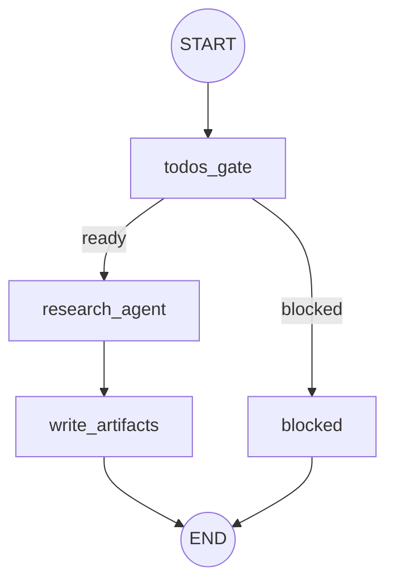
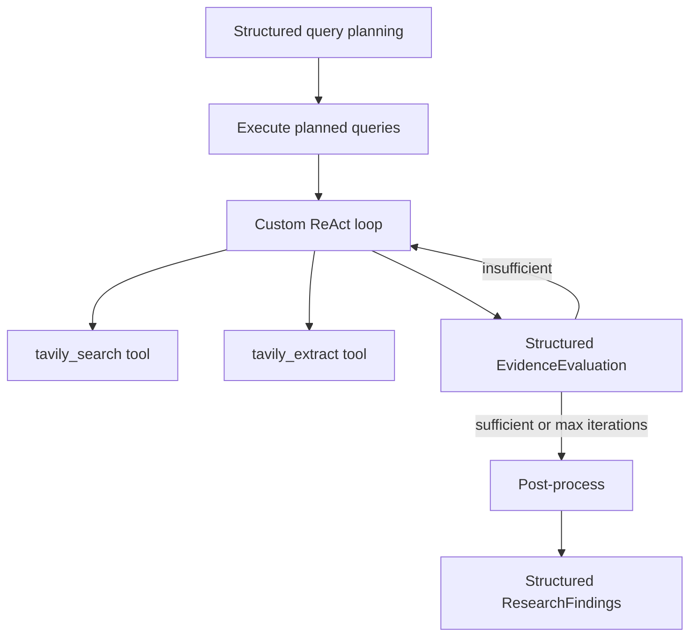

# Research Subgraph — Architecture (LLM Research Agent)

> **Status:** Post-refactor architecture reference  
> **Scope:** `src/core/subgraphs/research/` and integrations (Tavily MCP, Planning VFS, downstream consumers)  
> **Date:** 2026-07-01

**Related:** [Workflow](./workflow.md) · [Supervisor](./supervisor.md) · [Planning](./planning-subgraph.md) · [Fitness](./fitness-subgraph.md)

---

## Executive Summary

The Research subgraph is a **LangGraph wrapper** around an **LLM-driven Research Agent** (STANDARD tier). The graph handles high-level transitions (`todos_gate` → `research_agent` → `write_artifacts`); the agent owns reasoning, query planning, iterative Tavily retrieval, and structured evidence synthesis.

Deterministic post-processing (dedupe, whitelist verification, hybrid ranking, rank-then-extract) runs inside the agent after the ReAct loop. VFS artifacts are `research/sources.json` and `research/findings.json`, with `structured_findings` as the primary downstream payload.

Research is **blocked** when `plan/execution_plan.json` is missing — the subgraph sets `blocked_by_todos` and surfaces `waiting_for_user` to orchestration without writing VFS artifacts.

---

## 1. Graph Architecture

### 1.1 Nodes

| Node | Responsibility |
|------|----------------|
| `todos_gate` | Load `execution_plan.json` + `profile.json`; derive `todos` gate; set `blocked_by_todos` |
| `research_agent` | Run `run_research_agent()` — full LLM agent pipeline |
| `write_artifacts` | Persist `sources.json` and `findings.json` to VFS |
| `blocked` | Passthrough when plan missing (no VFS writes) |

### 1.2 Execution Flow



### 1.3 Research Agent Internal Pipeline



Phases in [`research_agent.py`](../../core/subgraphs/research/research_agent.py):

1. **Query planning** — `SearchQueryBatch` (2–5 queries per task) via `invoke_standard_structured_output`
2. **Initial search** — execute all planned queries via Tavily MCP
3. **ReAct loop** — `bind_tools([tavily_search, tavily_extract])`, max `research_max_search_iterations` (default 3)
4. **Evidence evaluation** — `EvidenceEvaluation` after each round; inject `refined_queries` if insufficient
5. **Post-process** — dedupe → verify → hybrid rank → extract top-K (`research_extract_top_k`, default 8)
6. **Synthesis** — `ResearchFindings` structured output

Search budget: `research_max_total_searches` (default 5) caps total Tavily calls per run.

### 1.4 State (`ResearchState`)

| Field | Set by |
|-------|--------|
| `profile`, `execution_plan`, `todos`, `blocked_by_todos` | `todos_gate` |
| `sources`, `evidence`, `structured_findings`, `evidence_summary`, `agent_iterations` | `research_agent` |
| VFS artifacts | `write_artifacts` |

### 1.5 Orchestration Integration

`invoke_research_subgraph()` maps `OrchestrationState` → `ResearchState`, runs the subgraph, and returns:

| Update | Condition |
|--------|-----------|
| `current_node: "research"` | Always |
| `waiting_for_user: true` | When `blocked_by_todos` (missing execution plan) |

---

## 2. LLM Agent

| Aspect | Detail |
|--------|--------|
| Model tier | STANDARD (`get_standard_llm()` / `invoke_standard_structured_output`) |
| Prompts | [`prompts.py`](../../core/subgraphs/research/prompts.py) |
| Schemas | [`schema.py`](../../core/subgraphs/research/schema.py) |
| Test override | `configure_research_agent(override)` |
| Tool calling | Custom ReAct loop; agent decides when to call Tavily tools |

---

## 3. Tools & Tavily MCP

| Tool | MCP method | Used by |
|------|------------|---------|
| `tavily_search(query)` | `tavily_search` | Research Agent ReAct loop |
| `tavily_extract(urls)` | `tavily_extract` | Research Agent ReAct loop |

MCP adapter: [`tavily_client.py`](../../core/mcp/tavily_client.py). Mock via `MOCK_RESEARCH` / `configure_tavily_client()`.

---

## 4. Ranking & Verification (Deterministic)

### Hybrid ranking — [`ranking.py`](../../core/subgraphs/research/ranking.py)

Composite score weights: Tavily 0.40, authority 0.30, source type 0.20, freshness 0.10.

### Whitelist verification — [`verification.py`](../../core/subgraphs/research/verification.py)

Default trusted domains: PubMed, NIH, WHO, CDC, ACSM, ISSN, NSCA. Override via `RESEARCH_TRUSTED_DOMAINS` env var.

Authority tiers: `whitelist` | `government_edu` | `fitness_keyword` | `unverified`.

---

## 5. VFS Artifacts

### `research/sources.json`

Ranked sources with `composite_score`, `rank`, `verified`, `authority_tier`, `authority_score`.

### `research/findings.json`

```json
{
  "structured_findings": {
    "consensus": "...",
    "key_findings": [],
    "conflicting_evidence": [],
    "limitations": [],
    "recommended_sources": []
  },
  "evidence_summary": "<derived backward-compat string>",
  "evidence": [],
  "source_count": 0
}
```

---

## 6. Downstream Consumers

| Consumer | Reads |
|----------|-------|
| Fitness | `structured_findings` (preferred) or `evidence_summary` fallback |
| Verification | `sources.json`, `findings.evidence` |

---

## 7. Configuration

| Setting | Default | Purpose |
|---------|---------|---------|
| `RESEARCH_MAX_SEARCH_ITERATIONS` | `3` | ReAct + evaluation loop cap |
| `RESEARCH_MAX_TOTAL_SEARCHES` | `5` | Total Tavily search budget per run |
| `RESEARCH_EXTRACT_TOP_K` | `8` | Post-rank document extraction |
| `RESEARCH_TRUSTED_DOMAINS` | `""` | Comma-separated hostname override |

---

## 8. Module Layout

```
src/core/subgraphs/research/
├── schema.py           # Pydantic models
├── prompts.py          # LLM prompts
├── research_agent.py   # Agent + ReAct loop + configure override
├── ranking.py          # Hybrid ranking
├── verification.py     # Whitelist verification
├── graph.py            # LangGraph (3 nodes + blocked)
├── state.py            # ResearchState
├── utils.py            # MCP adapters, VFS, post-process
├── tools.py            # LangChain tool definitions
└── agent.py            # Facade for orchestration
```

---

## 9. Key File Reference

| File | Role |
|------|------|
| `research_agent.py` | Core LLM agent |
| `graph.py` | Subgraph wiring |
| `utils.py` | Tavily I/O, post-process, VFS writes |
| `tests/helpers/research.py` | Deterministic test override |
