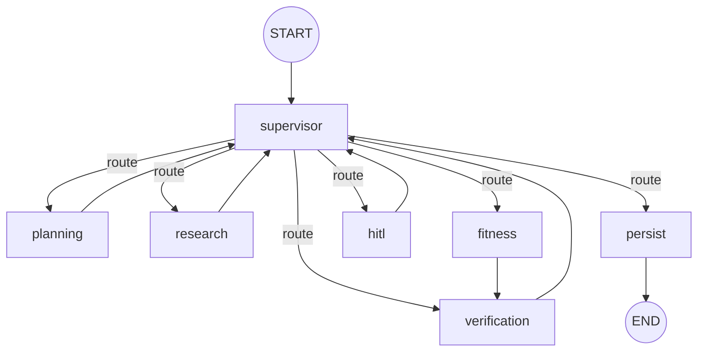
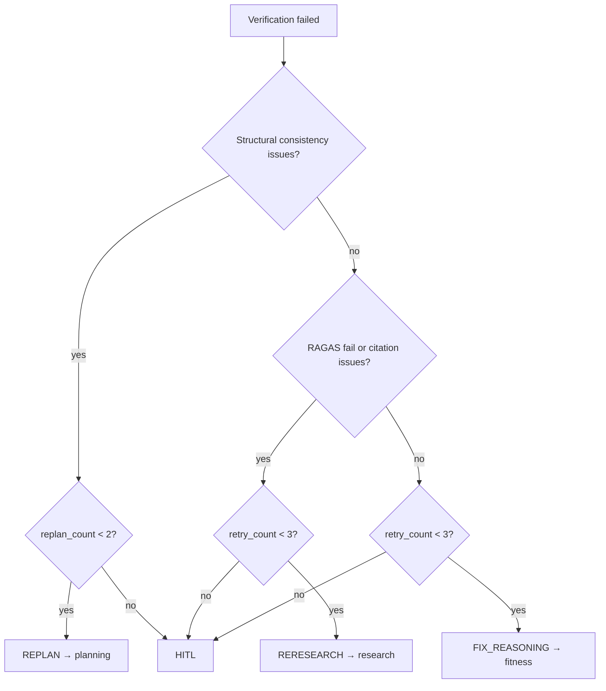

# Supervisor — Architecture (Orchestration Layer)

> **Status:** Architecture reference  
> **Scope:** `src/core/agents/`, `src/core/graph/` — top-level LangGraph orchestration  
> **Date:** 2026-07-01

**Related:** [Workflow](./workflow.md) · [Planning](./planning-subgraph.md) · [Research](./research-subgraph.md) · [Fitness](./fitness-subgraph.md)

---

## Executive Summary

The Supervisor is the **central orchestration node** in the PT AI multi-agent pipeline. It classifies incoming requests, interprets verification outcomes, selects partial-rerun targets, and prepares state updates that drive conditional routing to subgraphs.

The main graph is built in [`builder.py`](../../core/graph/builder.py). Every subgraph (except Fitness → Verification) returns to the Supervisor before the next step is dispatched.

---

## 1. Main Graph Architecture

### 1.1 Nodes

| Node | Responsibility |
|------|----------------|
| `supervisor` | Classify request, handle verification rerun logic, set `route_decision` / `waiting_for_user` |
| `planning` | Profile extraction, validation, execution plan generation |
| `research` | Evidence retrieval and synthesis |
| `fitness` | Macro calculation, LLM workout planning, safety checks |
| `verification` | Consistency, citation, and RAGAS checks on draft plan |
| `hitl` | Human-in-the-loop pause / resume (`interrupt_before`) |
| `persist` | Final artifact persistence after user approval |

### 1.2 Execution Flow



### 1.3 Default Pipeline Order

When no explicit `route_decision` is set, the Supervisor advances through `affected_domains` in canonical order:

```
planning → research → fitness → verify (verification) → hitl
```

Defined in [`routing.py`](../../core/graph/routing.py) as `DOMAIN_ORDER`.

Fitness always routes directly to Verification so the draft plan is validated immediately after synthesis.

---

## 2. Supervisor Node

Implementation: [`supervisor.py`](../../core/agents/supervisor.py)

### 2.1 Responsibilities

| Phase | Action |
|-------|--------|
| **Request classification** | If `request_type` is `None`, invoke `classify_request` to set `request_type` and `affected_domains` |
| **Post-verification routing** | When `current_node == "verification"`, load verification report and invoke `partial_rerun_decision` |
| **Completion gating** | When `route_decision == "COMPLETE"` and `approval_status != "approved"`, set `waiting_for_user: true` |
| **Audit logging** | Append decision to `logs/supervisor_decisions.jsonl` on verification failure |

### 2.2 Request Classification

`classify_request` uses keyword matching (not LLM) to assign one of:

| `request_type` | Trigger keywords (examples) |
|----------------|----------------------------|
| `fat_loss` | lose weight, fat loss, cutting |
| `muscle_gain` | muscle gain, bulk, hypertrophy |
| `macro_calculation` | macro, calories, protein |
| `strength` | strength, powerlifting, 1rm |
| `endurance` | endurance, marathon, cardio |
| `training_plan` | training plan, workout plan |
| `general_fitness` | default fallback |

`affected_domains` defaults to `["planning", "research", "fitness", "verify"]` for all request types.

---

## 3. Routing Decisions

`route_from_supervisor()` in [`routing.py`](../../core/graph/routing.py) maps `OrchestrationState` to the next graph node.

| `route_decision` | Next node | Guard |
|------------------|-----------|-------|
| *(none — default)* | Next domain in `affected_domains` order | — |
| `HITL` | `hitl` | — |
| `FIX_REASONING` | `fitness` | `retry_count < MAX_RETRY_COUNT` (3), else `hitl` |
| `REPLAN` | `planning` | `replan_count < MAX_REPLAN_COUNT` (2), else `hitl` |
| `RERESEARCH` | `research` | `retry_count < MAX_RETRY_COUNT` (3), else `hitl` |
| `COMPLETE` | `persist` if `approval_status == "approved"`, else `hitl` | — |
| `waiting_for_user` | `hitl` | Takes precedence over `route_decision` |

---

## 4. Partial Rerun Logic

After a failed verification, `partial_rerun_decision_data()` in [`rerun.py`](../../core/agents/rerun.py) selects the rerun target:



**Structural issue markers** (trigger REPLAN): `missing_macro_targets`, `missing_training_plan`, `draft_missing`, `training_day_count_mismatch`.

**Evidence issue markers** (trigger RERESEARCH): RAGAS `pass_fail == false`, or citation issues containing `"source"`.

**Default fallback** (trigger FIX_REASONING): fitness planner revision without full replan or re-research.

---

## 5. Orchestration State

`OrchestrationState` in [`state.py`](../../core/agents/state.py) is the global checkpointer state.

| Field group | Fields |
|-------------|--------|
| Identity | `run_id`, `thread_id`, `user_id`, `workspace_path` |
| Request | `query`, `user_profile`, `constraints`, `request_type`, `affected_domains` |
| Routing | `current_node`, `route_decision`, `retry_count`, `replan_count` |
| Verification | `verification_passed`, `faithfulness_score` |
| HITL | `waiting_for_user`, `approval_status`, `user_response` |
| Output | `final_artifact_path` |

---

## 6. Supervisor Tools

Defined in [`tools.py`](../../core/agents/tools.py):

| Tool | Purpose |
|------|---------|
| `read_global_state` | Snapshot orchestration state |
| `classify_request` | Keyword-based `request_type` + `affected_domains` |
| `partial_rerun_decision` | Select rerun target after verification failure |
| `hitl_control` | HITL pause / resume helpers |
| `persist_trigger` | Gate final persistence on approval |

---

## 7. Observability & Audit

| Artifact / span | Location |
|-----------------|----------|
| Langfuse supervisor span | `supervisor_span_context()` in [`langfuse.py`](../../core/observability/langfuse.py) |
| Decision audit log | `logs/supervisor_decisions.jsonl` via [`supervisor_log.py`](../../core/agents/supervisor_log.py) |
| Subgraph traces | `wrap_traced_subgraph_node()` per subgraph in `builder.py` |

---

## 8. Module Layout

```
src/core/
├── agents/
│   ├── supervisor.py       # supervisor_node
│   ├── supervisor_log.py   # VFS audit log
│   ├── tools.py            # LangChain supervisor tools
│   ├── rerun.py            # Partial rerun decision logic
│   └── state.py            # OrchestrationState
└── graph/
    ├── builder.py          # Main StateGraph compile
    ├── routing.py          # route_from_supervisor
    ├── checkpointer.py     # Memory checkpointer
    └── run.py              # Graph invocation entry
```

---

## 9. Key File Reference

| File | Role |
|------|------|
| `graph/builder.py` | Compile supervisor-orchestrated LangGraph |
| `agents/supervisor.py` | Supervisor node implementation |
| `graph/routing.py` | Conditional edge routing |
| `agents/rerun.py` | Verification failure → rerun target |
