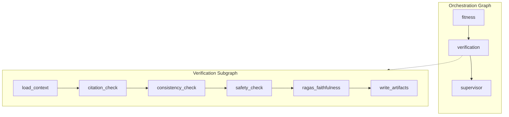
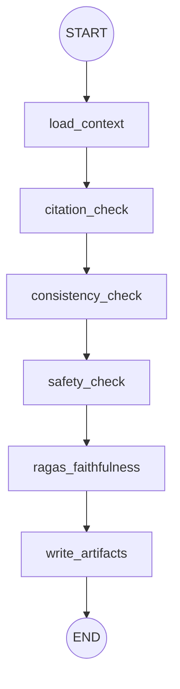

# Verification Subgraph — Architecture (Deterministic Checks)

> **Status:** Architecture reference  
> **Scope:** `src/core/subgraphs/verification/` — citation, consistency, safety, and faithfulness validation  
> **Date:** 2026-07-08

**Related:** [Workflow](./workflow.md) · [Supervisor](./supervisor.md) · [Fitness](./fitness-subgraph.md) · [Research](./research-subgraph.md)

---

## Executive Summary

The Verification subgraph validates the Fitness draft plan against upstream artifacts using **four deterministic checks** run in a fixed sequence. No LLM is invoked — faithfulness scoring uses a **heuristic evidence-grounding proxy** (Ragas SDK is not used at runtime due to optional dependency constraints).

On completion, the subgraph writes `verify/verification_v1.json` and `verify/ragas.json`, sets `verification_passed` and `faithfulness_score` on orchestration state, and returns control to the **Supervisor** for rerun routing or HITL approval.

---

## 1. Position in Orchestration Graph



Fitness routes **directly** to Verification (bypassing Supervisor). Verification always returns to Supervisor.

Entry point: [`core/graph/builder.py`](../../core/graph/builder.py) wraps `invoke_verification_subgraph` as the `verification` node.

---

## 2. Graph Architecture

### 2.1 Nodes

| Node | Responsibility |
|------|----------------|
| `load_context` | Load draft plan, sources, evidence, macros, workout, profile, safety flags, blueprint from VFS |
| `citation_check` | Verify draft references research sources |
| `consistency_check` | Verify macros, training sessions, and blueprint appear in draft |
| `safety_check` | Verify no critical safety flags or unsafe language in prescription sections |
| `ragas_faithfulness` | Compute heuristic faithfulness score from evidence overlap |
| `write_artifacts` | Persist `verify/verification_v1.json` and `verify/ragas.json` |

### 2.2 Execution Flow



All checks run sequentially; the final report aggregates all four results.

### 2.3 Pipeline step tracking

```
verification:load_context
verification:citation_check
verification:consistency_check
verification:safety_check
verification:ragas_faithfulness
verification:write_artifacts
```

---

## 3. State

### 3.1 `VerificationState`

Defined in [`state.py`](../../core/subgraphs/verification/state.py):

| Field | Type | Description |
|-------|------|-------------|
| `workspace_path` | `str` | Run workspace VFS path (input) |
| `draft_plan` | `str` | Loaded from `fitness/final_plan.md` |
| `sources` | `list[dict]` | From `research/sources.json` |
| `evidence` | `list[dict]` | From `research/findings.json` |
| `macro_targets` | `dict` | From `fitness/calculations.json` |
| `training_plan` | `dict` | Workout summary from `fitness/workout.json` or calculations |
| `profile` | `dict` | From orchestration (seeded) / `plan/profile.json` |
| `constraints` | `dict` | From orchestration (seeded) |
| `safety_flags` | `list[str]` | From `fitness/safety_flags.json` |
| `plan_blueprint` | `dict` | From `fitness/blueprint.json` |
| `verification_report` | `dict` | Built incrementally across check nodes; `feedback` and `ragas.pass_fail` live nested inside this dict |
| `faithfulness_score` | `float \| None` | From ragas check |

### 3.2 Orchestration mapping

`invoke_verification_subgraph()` updates:

| Field | Value |
|-------|-------|
| `current_node` | `"verification"` |
| `verification_passed` | `report["passed"]` |
| `faithfulness_score` | From ragas check |

The Supervisor reads the VFS report on the next visit to determine partial rerun routing.

---

## 4. Context Loading

`load_verification_context()` in [`utils.py`](../../core/subgraphs/verification/utils.py) reads:

| VFS path | Field |
|----------|-------|
| `fitness/final_plan.md` | `draft_plan` |
| `research/sources.json` | `sources` |
| `research/findings.json` → `evidence` | `evidence` |
| `fitness/workout.json` | `training_plan` (via `build_workout_summary`) |
| `fitness/calculations.json` | `macro_targets`, fallback `training_plan` |
| `plan/profile.json` | `profile` |
| `fitness/safety_flags.json` | `safety_flags` |
| `fitness/blueprint.json` | `plan_blueprint` |

---

## 5. Check Details

### 5.1 Citation Check

`citation_check_data(draft_plan, sources)`:

- Matches source `url` or `title` against draft text
- Local KB sources (`provider == "local_kb"`) match on title
- Fallback: if draft mentions "evidence" or "research", counts as cited when sources exist
- **Fail:** `no_sources_referenced_in_draft` when sources exist but none are referenced

### 5.2 Consistency Check

`consistency_check_data(draft_plan, macro_targets, training_plan, plan_blueprint)`:

| Issue | Condition |
|-------|-----------|
| `missing_macro_targets` | No macro targets loaded |
| `missing_training_plan_summary` | No training plan summary |
| `missing_plan_blueprint` | Blueprint expected but empty |
| `draft_missing_calorie_target` | Calorie value not in draft |
| `draft_missing_protein_target` | Protein value not in draft |
| `training_day_count_mismatch` | `### Day N` headers ≠ expected sessions |

Structural issues in this list trigger **REPLAN** routing in the Supervisor.

### 5.3 Safety Check

`safety_check_data(draft_plan, profile, constraints, safety_flags)`:

**Critical flags** (from fitness safety validation):

- `calories_below_safe_minimum`
- `aggressive_calorie_deficit`
- `training_frequency_too_high`
- `weekly_training_volume_too_high`

**Unsafe language scan** runs only on prescription sections (excludes Evidence Summary, Safety Warnings, etc.):

- Terms: `unsafe`, `extreme deficit`, `excessive volume`

### 5.4 Faithfulness Check

`heuristic_faithfulness_data(draft_plan, evidence)`:

| Aspect | Detail |
|--------|--------|
| Method | `heuristic_evidence_grounding` |
| Threshold | `0.90` (`FAITHFULNESS_PASS_THRESHOLD`) |
| Algorithm | Token overlap between evidence content and draft + section bonus |

This is a deterministic proxy, not the Ragas SDK. The score and method are persisted in `verify/ragas.json`.

**Pass:** `faithfulness_score >= 0.90`

---

## 6. Report Assembly

`build_verification_report(citation, consistency, safety, ragas)`:

```python
passed = (
    citation["passed"]
    and consistency["passed"]
    and safety["passed"]
    and ragas["pass_fail"]
)
```

Aggregated `feedback` string combines issues from all failed checks. This feedback is consumed by Fitness on `FIX_REASONING` reruns via `verify/verification_v1.json`.

---

## 7. VFS Artifacts

### Output

#### `verify/verification_v1.json`

```json
{
  "citation": { "passed": true, "issues": [], "cited_source_count": 3 },
  "consistency": { "passed": true, "issues": [] },
  "safety": { "passed": true, "issues": [] },
  "ragas": {
    "faithfulness_score": 0.92,
    "pass_fail": true,
    "method": "heuristic_evidence_grounding",
    "threshold": 0.90
  },
  "passed": true,
  "feedback": null
}
```

#### `verify/ragas.json`

Faithfulness details only (subset of the report `ragas` field).

---

## 8. Supervisor Rerun Routing

After verification fails, `partial_rerun_decision_data()` in [`rerun.py`](../../core/agents/rerun.py) selects the target:

| Priority | Condition | Route | Counter |
|----------|-----------|-------|---------|
| 1 | Structural consistency issues | `REPLAN` → planning | `replan_count++` (max 1) |
| 2 | Faithfulness fail or citation source issues | `RERESEARCH` → research | `retry_count++` (max 2) |
| 3 | Other failures | `FIX_REASONING` → fitness | `retry_count++` (max 2) |
| — | Counter at max | `HITL` | — |

**Structural markers:** `missing_macro_targets`, `missing_training_plan`, `draft_missing`, `training_day_count_mismatch`

---

## 9. Module Layout

```
src/core/subgraphs/verification/
├── state.py            # VerificationState TypedDict
├── graph.py            # LangGraph (6 nodes) + orchestration bridge
├── tools.py            # LangChain tool wrappers for each check
├── utils.py            # Check logic, report builder, VFS I/O
├── agent.py            # Facade for orchestration
└── hitl.py             # Verification-specific HITL helpers
```

---

## 10. Downstream Consumers

| Consumer | Reads | Usage |
|----------|-------|-------|
| **Supervisor** | `verify/verification_v1.json` | Rerun routing, audit log |
| **HITL** | `verify/verification_v1.json` | Approval prompt context |
| **Persist** | `verification_passed`, `faithfulness_score` | Gate before final copy |
| **Fitness (rerun)** | `verify/verification_v1.json` → `feedback` | Planner revision input |

---

## 11. Key File Reference

| File | Role |
|------|------|
| `graph.py` | Subgraph wiring + orchestration bridge |
| `utils.py` | All check implementations, report builder, VFS writes |
| `tools.py` | LangChain tool wrappers (`citation_check`, `consistency_check`, etc.) |
