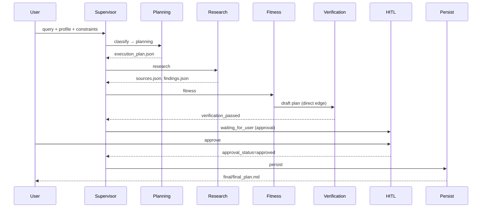
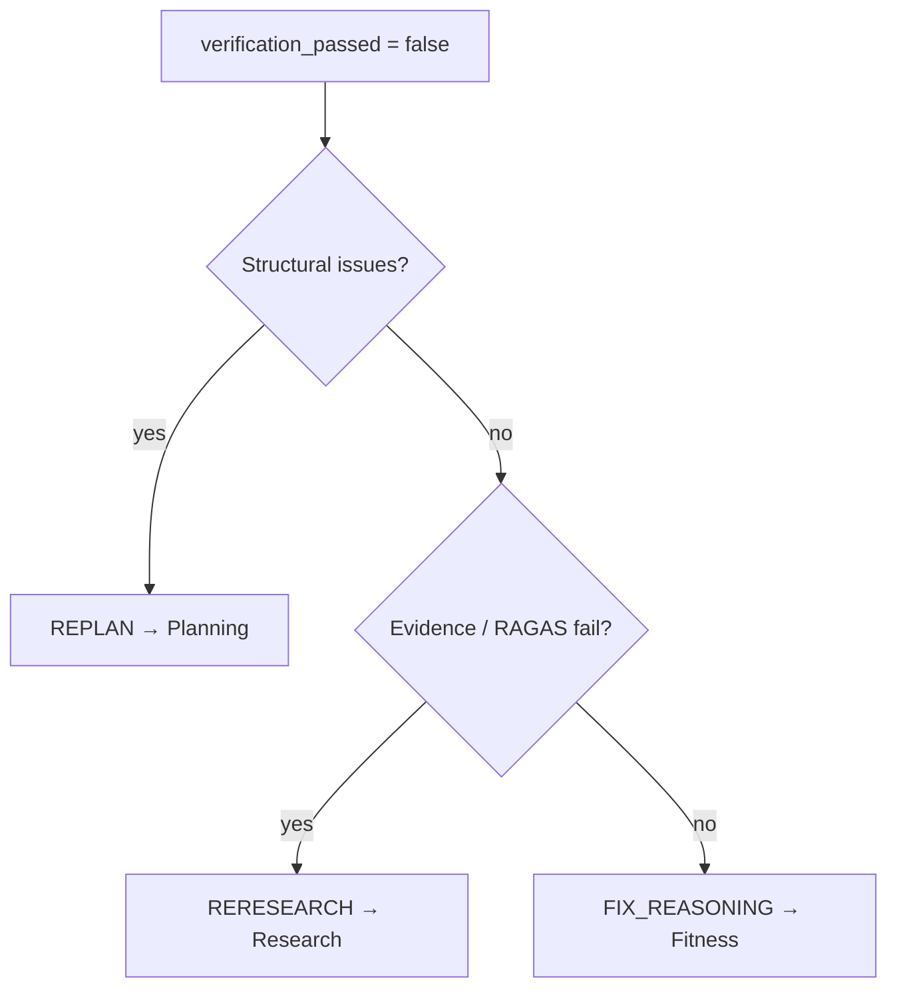

# Agent & Subgraph Workflow

> **Status:** End-to-end workflow reference  
> **Scope:** Supervisor orchestration + Planning, Research, Fitness, Verification, HITL, Persist  
> **Date:** 2026-07-01

**Related:** [Supervisor](./supervisor.md) · [Planning](./planning-subgraph.md) · [Research](./research-subgraph.md) · [Fitness](./fitness-subgraph.md)

---

## 1. Overview

The PT AI pipeline is a **supervisor-orchestrated LangGraph** where each domain stage writes artifacts to a per-run VFS workspace. The Supervisor classifies the request, advances the default pipeline, and handles **partial reruns** after verification failure.

### 1.1 Default Happy-Path Sequence



### 1.2 Pipeline Order & Direct Edges

| Step | Node | Returns to | Notes |
|------|------|------------|-------|
| 0 | `supervisor` | — | Entry; classifies request |
| 1 | `planning` | `supervisor` | Profile + execution plan |
| 2 | `research` | `supervisor` | Evidence retrieval |
| 3 | `fitness` | `verification` | **Skips supervisor** |
| 4 | `verification` | `supervisor` | Pass/fail + rerun decision |
| — | `hitl` | `supervisor` | `interrupt_before` |
| — | `persist` | `END` | Final artifact copy |

Canonical domain order: `planning → research → fitness → verify`.

---

## 2. Global Input & Output

### 2.1 Run Bootstrap

| Input | Source | Required |
|-------|--------|----------|
| `run_id`, `thread_id` | Caller | Yes |
| `query` | User message | Yes |
| `user_profile` | Session | No (defaults `{}`) |
| `constraints` | Session | No (defaults `{}`) |

| Output | Description |
|--------|-------------|
| `workspace_path` | Initialized VFS run directory |
| `OrchestrationState` | Counters at zero; `current_node = "supervisor"` |

### 2.2 Final Output (Persist)

| Artifact | Path | Condition |
|----------|------|-----------|
| Final plan | `final/final_plan.md` | Verified + faithfulness ≥ 0.90 + user approved |
| Run snapshot | `logs/run_snapshot.json` | On successful persist |
| Metrics | `logs/metrics.json` | On successful persist |

### 2.3 Counters & Limits

| Counter | Max | Triggers |
|---------|-----|----------|
| `retry_count` | 3 | `FIX_REASONING`, `RERESEARCH` |
| `replan_count` | 2 | `REPLAN` |
| `planner_attempts` (Fitness internal) | 3 | Safety check retry loop |

Exceeded limits → `route_decision = "HITL"`, `waiting_for_user = true`.

---

## 3. Supervisor

### Input

| Field | When read |
|-------|-----------|
| `query`, `user_profile`, `constraints` | Every visit |
| `request_type` | Classified on first visit if `None` |
| `current_node`, `verification_passed` | Post-verification rerun |
| `approval_status` | Completion gating |

### Output

| Field | When set |
|-------|----------|
| `request_type`, `affected_domains` | First visit |
| `route_decision` | After verification failure or pass |
| `retry_count`, `replan_count` | Incremented on partial rerun |
| `waiting_for_user` | `COMPLETE` without approval, or limits hit |

### Happy Case

1. `classify_request` sets `request_type` and full `affected_domains`.
2. Default routing advances planning → research → fitness → verification.
3. Verification passes → `route_decision = "COMPLETE"`, `waiting_for_user = true`.
4. User approves → `persist` → `final/final_plan.md`.

### Edge Cases

| Scenario | Behavior |
|----------|----------|
| `waiting_for_user = true` | Route to `hitl` regardless of `route_decision` |
| Verification passed, not approved | `COMPLETE` → `hitl` (not `persist`) |
| `retry_count >= 3` on FIX/RERESEARCH | Force `hitl` |
| `replan_count >= 2` on REPLAN | Force `hitl` |

---

## 4. Planning Subgraph

### Input

`query`, `user_profile`, `constraints`, `request_type`, `workspace_path` from orchestration.

### Output

| Artifact / state | Happy path | HITL path |
|------------------|------------|-----------|
| `plan/execution_plan.json` | ✓ | ✗ |
| `plan/profile.json` | ✓ | Partial |
| `plan/plan.md` | ✓ | ✗ |
| `waiting_for_user` | `false` | `true` |

### Happy Case

```
extract_profile → validate_profile (complete) → generate_plan → END
```

Profile complete → Planning Agent (XHIGH) produces 3–10 research tasks → VFS persisted.

### Edge Cases

| Scenario | Behavior |
|----------|----------|
| Missing required fields | `planning_hitl` → user prompt via `format_missing_profile_prompt()` |
| User supplies fields on resume | Re-enter planning; re-validate |
| `REPLAN` from supervisor | New `execution_plan.json`; Research re-reads plan |
| `replan_count >= 2` | Escalate to HITL |
| No execution plan downstream | Research blocked at `todos_gate` |

---

## 5. Research Subgraph

### Input

| Source | Required |
|--------|----------|
| `plan/execution_plan.json` | Yes (gate) |
| `plan/profile.json` | Yes |
| `query`, `request_type` | From orchestration |

### Output

| Artifact | Content |
|----------|---------|
| `research/sources.json` | Ranked, verified sources |
| `research/findings.json` | `structured_findings`, `evidence`, `evidence_summary` |

| Orchestration update | Condition |
|---------------------|-----------|
| `waiting_for_user = true` | `blocked_by_todos` (no plan) |

### Happy Case

```
todos_gate → research_agent → write_artifacts → END
```

Query planning → Tavily search/extract → ReAct loop → post-process → `ResearchFindings`.

### Edge Cases

| Scenario | Behavior |
|----------|----------|
| No `execution_plan.json` | `blocked` node; no VFS writes |
| `RERESEARCH` rerun | Full agent re-run; overwrites `research/*` |
| `retry_count >= 3` | Supervisor → HITL |
| `MOCK_RESEARCH` / test override | `configure_research_agent()` |
| Search budget exhausted | `research_max_total_searches` (default 5) caps Tavily calls |

---

## 6. Fitness Subgraph

### Input

| VFS / state | Source |
|-------------|--------|
| `plan/profile.json` | Planning |
| `plan/execution_plan.json` | Planning (fallback default if absent) |
| `research/findings.json` | Research |
| `verify/verification_v1.json` | Prior verification (on rerun) |

### Output

| Artifact | Content |
|----------|---------|
| `fitness/workout.json` | `StructuredWorkout` |
| `fitness/calculations.json` | Macros + workout summary |
| `fitness/safety_flags.json` | Safety feedback |
| `fitness/final_plan.md` | Markdown draft |

Routes directly to **Verification** (not Supervisor).

### Happy Case

```
load_context → calculate_macros → fitness_planner → safety_check (pass) → synthesize_plan → write_artifacts
```

Deterministic macros → LLM workout → safety pass → draft persisted.

### Edge Cases

| Scenario | Behavior |
|----------|----------|
| Safety fail, attempts < 3 | Re-run planner with `planner_feedback` |
| Safety fail, attempts ≥ 3 | Synthesize with safety warnings in draft |
| No research findings | Planner runs without `structured_findings` |
| `FIX_REASONING` rerun | Reloads `verification_feedback` from VFS |
| `retry_count >= 3` | Supervisor → HITL |

---

## 7. Verification Subgraph

### Input (from VFS)

| Artifact | Used for |
|----------|----------|
| `fitness/final_plan.md` | All checks |
| `research/sources.json` | Citation |
| `research/findings.json` | RAGAS faithfulness |
| `fitness/calculations.json` | Consistency (macros) |
| `fitness/workout.json` | Consistency (training) |
| `fitness/safety_flags.json` | Safety |

### Output

| Artifact | Content |
|----------|---------|
| `verify/verification_v1.json` | Full report + `passed` + `feedback` |
| `verify/ragas.json` | Faithfulness details |

### Happy Case

All four checks pass:

| Check | Pass condition |
|-------|----------------|
| Citation | Draft references sources or mentions evidence |
| Consistency | Macros + sessions match draft |
| Safety | No critical flags; no unsafe language |
| RAGAS | `faithfulness_score >= 0.90` |

→ Supervisor: `route_decision = "COMPLETE"`, `waiting_for_user = true`.

### Edge Cases & Rerun Routing



| Failure type | Example issues | Target | Counter |
|--------------|----------------|--------|---------|
| Structural | `missing_macro_targets`, `training_day_count_mismatch` | Planning | `replan_count++` |
| Evidence | RAGAS fail, citation `source` issues | Research | `retry_count++` |
| Reasoning | Other failures | Fitness | `retry_count++` |
| Limits exceeded | Any counter at max | HITL | — |

---

## 8. HITL (Human-in-the-Loop)

Graph compiled with `interrupt_before=["hitl"]`.

### Input / Output

| `hitl_type` | Trigger | User action |
|-------------|---------|-------------|
| `clarification` | Planning incomplete profile | Supply missing fields |
| `approval` | Verification passed | Approve / reject / request revision |

| `approval_status` | `user_response` |
|-------------------|-----------------|
| `approved` | approve / approved / yes |
| `rejected` | reject / rejected / no |
| `revision_requested` | Any other text |

### Happy Cases

**Clarification:** Planning HITL → interrupt → user supplies data → resume → Planning.

**Approval:** Verification pass → interrupt → user approves → Persist.

### Edge Cases

| Scenario | Behavior |
|----------|----------|
| User rejects | `approval_status = "rejected"`; no persist |
| Free-text revision | `revision_requested`; pipeline re-enters |
| Resume without response | Stays `waiting_for_user = true` |

---

## 9. Persist

### Gates

| Gate | Requirement |
|------|-------------|
| `verification_passed` | `true` |
| `faithfulness_score` | `>= 0.90` |
| `approval_status` | `"approved"` |

### Happy Case

All gates pass → `fitness/final_plan.md` copied to `final/final_plan.md` → `END`.

### Edge Cases

| Scenario | Behavior |
|----------|----------|
| Gate fails at persist | `waiting_for_user = true` → HITL |
| Missing `fitness/final_plan.md` | `FileNotFoundError` |

---

## 10. Rerun Scenarios (Worked Examples)

### REPLAN — Structural failure

```
Planning → Research → Fitness → Verification (missing_macro_targets)
  → Supervisor: REPLAN, replan_count=1 → Planning → Research → Fitness → Verification
```

### RERESEARCH — Evidence failure

```
... → Verification (RAGAS fail)
  → Supervisor: RERESEARCH, retry_count=1 → Research → Fitness → Verification
```

### FIX_REASONING — Planner revision

```
... → Verification (citation issues)
  → Supervisor: FIX_REASONING, retry_count=1 → Fitness → Verification
```

### Fitness internal safety retry

```
planner → safety_fail → planner (×3 max) → synthesize_plan (with warnings) → Verification
```

Does **not** increment orchestration `retry_count`.

### Escalation to HITL

```
... → FIX_REASONING at retry_count=3 → HITL, waiting_for_user=true
```

---

## 11. VFS Artifact Timeline

| After stage | Artifacts |
|-------------|-----------|
| Bootstrap | Empty workspace scaffold |
| Planning | `plan/*` |
| Research | `research/sources.json`, `research/findings.json` |
| Fitness | `fitness/workout.json`, `fitness/calculations.json`, `fitness/safety_flags.json`, `fitness/final_plan.md` |
| Verification | `verify/verification_v1.json`, `verify/ragas.json` |
| Supervisor (fail) | `logs/supervisor_decisions.jsonl` (append) |
| Persist | `final/final_plan.md`, `logs/run_snapshot.json`, `logs/metrics.json` |

---

## 12. Quick Reference

| Stage | Primary input | Primary output | Blocks pipeline? |
|-------|---------------|----------------|------------------|
| Supervisor | `OrchestrationState` | `route_decision` | No (routes) |
| Planning | query, profile | `plan/execution_plan.json` | Yes — HITL if incomplete |
| Research | `execution_plan.json` | `research/findings.json` | Yes — blocked if no plan |
| Fitness | profile, findings | `fitness/final_plan.md` | No (warns on safety fail) |
| Verification | upstream artifacts | `verify/verification_v1.json` | Yes — rerun or HITL |
| HITL | user response | `approval_status` | Yes — interrupt |
| Persist | approved + verified | `final/final_plan.md` | Yes — gate checks |

---

## 13. Test & Override Hooks

| Component | Override | Purpose |
|-----------|----------|---------|
| Planning Agent | `configure_planning_agent()` | Deterministic plans |
| Research Agent | `configure_research_agent()` | Mock Tavily / fixed findings |
| Fitness Planner | `configure_fitness_planner()` | Deterministic workouts |
| Tavily MCP | `configure_tavily_client()` | Mock search |
| Planning seed | `seed_execution_plan()` | Skip LLM in benchmarks |
