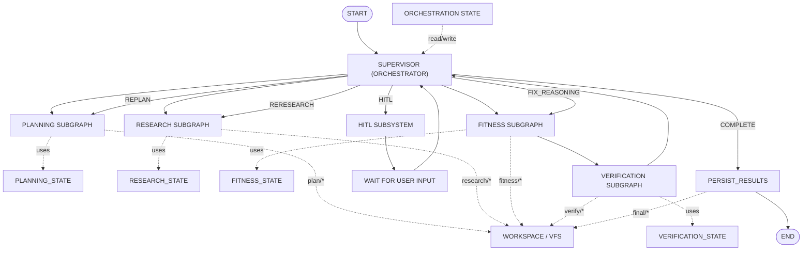

# PT AI Core Deep Researcher — Subgraph Orchestration Plan

## Architecture Diagram



---

## Design Principle

The system is a **supervisor-orchestrated subgraph architecture**:

* **Supervisor** — orchestrator only; reads/writes global state, routes subgraphs, triggers partial reruns and HITL
* **Subgraphs** — 4 intelligence units (Planning, Research, Fitness, Verification); each owns a scoped state + tools
* **VFS** — source of truth for reasoning artifacts; global state stores orchestration metadata only
* **HITL / Persist** — subsystems, not LLM agents

Product scope: **Training plans + Macro targets** only.

---

## Supervisor (Orchestrator)

Does not produce fitness intelligence. Controls graph execution via tools:

| Tool | Purpose |
| --- | --- |
| `read_global_state` | Read current orchestration state |
| `classify_request` | Determine `request_type` and `affected_domains` |
| `partial_rerun_decision` | Select FIX_REASONING / REPLAN / RERESEARCH target |
| `hitl_control` | Pause, resume, or reject based on HITL status |
| `persist_trigger` | Invoke `PERSIST_RESULTS` after COMPLETE + approval |

Tier: **STANDARD** (rule-based routing; reads structured verification output)

---

## Orchestration State (Global)

Stored in LangGraph checkpointer. Subgraph reasoning data must NOT live here.

```python
class OrchestrationState(TypedDict):
    run_id: str
    thread_id: str
    current_node: str

    query: str
    user_profile: dict
    constraints: dict

    request_type: str | None          # training_plan | macro_calculation | ...
    affected_domains: list[str]       # planning | research | fitness | verify

    route_decision: str | None        # FIX_REASONING | REPLAN | RERESEARCH | HITL | COMPLETE
    retry_count: int
    replan_count: int

    verification_passed: bool
    faithfulness_score: float | None

    waiting_for_user: bool
    approval_status: str | None
    user_response: str | None

    workspace_path: str
    final_artifact_path: str | None
```

---

## Subgraphs

### Planning Subgraph (XHIGH)

Tools:

* `extract_profile`
* `validate_profile`
* `write_todos`

Scoped state (`PLANNING_STATE`):

```python
class PlanningState(TypedDict):
    profile: dict
    missing_fields: list[str]
    todos: list[str]
    planning_output: str | None
```

VFS: `plan/plan.md`, `plan/todos.json`, `plan/profile.json`

---

### Research Subgraph (STANDARD)

Tools (MCP only for external retrieval):

* `search_evidence`
* `retrieve_documents`
* `rank_sources`
* `verify_sources`

Scoped state (`RESEARCH_STATE`):

```python
class ResearchState(TypedDict):
    research_questions: list[str]
    evidence: list[dict]
    sources: list[dict]
    evidence_summary: str | None
```

VFS: `research/research_notes.md`, `research/sources.json`, `research/findings.json`

---

### Fitness Subgraph (STANDARD)

Tools:

* `calculate_macros`
* `build_training_plan`
* `synthesize_plan`

Scoped state (`FITNESS_STATE`):

```python
class FitnessState(TypedDict):
    macro_targets: dict               # calories, protein, carbs, fat
    training_constraints: dict
    training_plan: dict | None
    draft_plan: str | None
    safety_flags: list[str]
```

VFS: `fitness/calculations.json`, `fitness/safety_flags.json`, `fitness/final_plan.md`

---

### Verification Subgraph (XHIGH)

Tools:

* `citation_check`
* `consistency_check`
* `safety_check`
* `ragas_faithfulness`

Scoped state (`VERIFICATION_STATE`):

```python
class VerificationState(TypedDict):
    verification_report: dict
    feedback: str | None
    faithfulness_score: float | None
    pass_fail: bool
```

VFS: `verify/verification_v1.json`, `verify/ragas.json`

---

## Execution Flow

### Happy Path

```text
START
  → SUPERVISOR (classify_request, route_from_supervisor)
  → PLANNING → RESEARCH → FITNESS → VERIFICATION
  → SUPERVISOR (COMPLETE)
  → HITL (request_approval)
  → WAIT → SUPERVISOR
  → PERSIST_RESULTS
  → END
```

### Partial Rerun Paths

Supervisor uses `partial_rerun_decision` to rerun only affected subgraphs:

| Route | Trigger | Rerun |
| --- | --- | --- |
| `FIX_REASONING` | Minor fitness/plan issues | FITNESS → VERIFICATION |
| `REPLAN` | Structural or profile issues | PLANNING → (downstream as needed) |
| `RERESEARCH` | Insufficient or weak evidence | RESEARCH → FITNESS → VERIFICATION |

```text
SUPERVISOR
  ├── FIX_REASONING → FITNESS → VERIFY → SUPERVISOR
  ├── REPLAN        → PLANNING → ... → SUPERVISOR
  ├── RERESEARCH    → RESEARCH → FITNESS → VERIFY → SUPERVISOR
  ├── HITL          → WAIT → SUPERVISOR
  └── COMPLETE      → PERSIST_RESULTS → END
```

Constraint: `retry_count < 3` for FIX_REASONING; exhausted → HITL.

---

## HITL Subsystem

Not an LLM agent. LangGraph interrupt + supervisor `hitl_control`.

Tools:

* `request_clarification` — missing profile, ambiguous goal
* `request_approval` — final plan approval before persist

Interrupt points:

* Missing profile fields (Planning subgraph)
* Conflicting or unsafe constraints
* `retry_count >= 3`
* Final approval before `PERSIST_RESULTS`

---

## PERSIST_RESULTS

Deterministic subsystem triggered by supervisor `persist_trigger`.

Tools:

* `save_run`
* `save_metrics`
* `save_artifacts`

Writes: `final/final_plan.md`, `logs/persist_result.json`

Only runs when:

```text
verification_passed = true
faithfulness_score >= 0.90
approval_status = approved
```

---

## VFS Workspace

```text
workspace/run_<id>/
├── plan/
│   ├── plan.md
│   ├── todos.json
│   └── profile.json
├── research/
│   ├── research_notes.md
│   ├── sources.json
│   └── findings.json
├── fitness/
│   ├── calculations.json
│   ├── safety_flags.json
│   └── final_plan.md
├── verify/
│   ├── verification_v1.json
│   └── ragas.json
├── final/
│   └── final_plan.md
└── logs/
    ├── supervisor_decisions.jsonl
    └── persist_result.json
```

Subgraphs write to their folder. Global state never stores artifact content.

---

## Reasoning Sandwich

| Subgraph | Tier |
| --- | --- |
| Planning | XHIGH |
| Verification | XHIGH |
| Supervisor | STANDARD (orchestrator) |
| Research | STANDARD |
| Fitness | STANDARD |

---

## LangGraph Implementation

```python
def build_graph() -> CompiledStateGraph:
    graph = StateGraph(OrchestrationState)

    graph.add_node("supervisor", supervisor_node)
    graph.add_node("planning", planning_subgraph)
    graph.add_node("research", research_subgraph)
    graph.add_node("fitness", fitness_subgraph)
    graph.add_node("verification", verification_subgraph)
    graph.add_node("hitl", hitl_subsystem)
    graph.add_node("persist", persist_results)

    graph.set_entry_point("supervisor")
    graph.add_conditional_edges("supervisor", route_from_supervisor)
    graph.add_edge("planning", "supervisor")
    graph.add_edge("research", "supervisor")
    graph.add_edge("fitness", "verification")
    graph.add_edge("verification", "supervisor")
    graph.add_edge("hitl", "supervisor")
    graph.add_edge("persist", END)

    return graph.compile(
        checkpointer=checkpointer,
        interrupt_before=["hitl"],
    )
```

```python
def route_from_supervisor(state: OrchestrationState) -> str:
    if state["waiting_for_user"]:
        return "hitl"

    decision = state["route_decision"]

    if decision == "FIX_REASONING":
        return "fitness"
    if decision == "REPLAN":
        return "planning"
    if decision == "RERESEARCH":
        return "research"
    if decision == "COMPLETE":
        if state["approval_status"] != "approved":
            state["waiting_for_user"] = True
            return "hitl"
        return "persist"

    # Initial or sequential dispatch via affected_domains
    return resolve_next_subgraph(state)
```

---

## LangFuse Trace Hierarchy

```text
Thread: thread_id
└── Trace: run_id
    ├── Supervisor span (orchestration tools)
    ├── Planning subgraph span (XHIGH)
    ├── Research subgraph span + MCP spans
    ├── Fitness subgraph span
    ├── Verification subgraph span (XHIGH)
    ├── Partial rerun spans (FIX_REASONING / REPLAN / RERESEARCH)
    ├── HITL subsystem span
    └── PERSIST_RESULTS span
```

---

## 2-Week Implementation Plan

| Day | Task |
| --- | --- |
| 1 | `OrchestrationState` + subgraph state schemas + VFS |
| 2 | Supervisor orchestrator + `read_global_state`, `route_from_supervisor` |
| 3 | Planning subgraph + `write_todos` gate |
| 4 | Research subgraph + MCP boundary |
| 5 | Fitness subgraph + macro + training plan synthesis |
| 6 | Verification subgraph + RAGAS |
| 7 | `partial_rerun_decision` — FIX_REASONING, REPLAN, RERESEARCH |
| 8 | HITL subsystem + checkpointer resume |
| 9 | `PERSIST_RESULTS` + approval gate |
| 10 | LangFuse tracing |
| 11–12 | Integration tests + RAGAS benchmark |
| 13–14 | Acceptance review |

---

## Acceptance Criteria

* Supervisor orchestrates via global state; subgraphs use scoped state
* Partial rerun: FIX_REASONING, REPLAN, RERESEARCH route to correct subgraph only
* `write_todos` before MCP retrieval
* MCP-only external data access
* Artifacts in VFS, not global state
* RAGAS faithfulness >= 0.90
* HITL approval before persist
* LangGraph checkpointer resume
* Product scope: training + macro only

---
